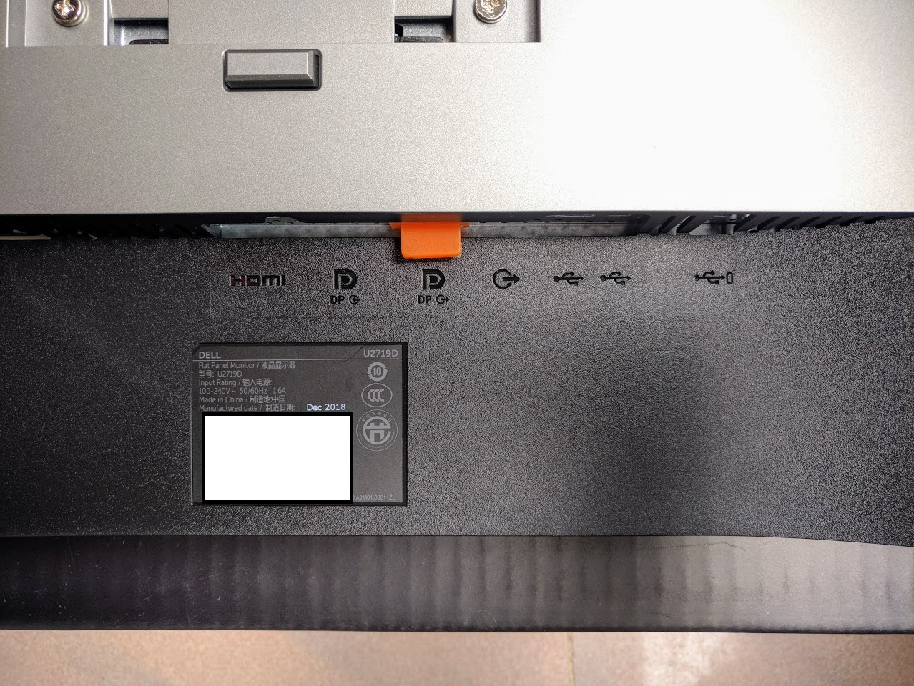

# 免费升级？Dell U2919D显示器开箱

# 写在前面

事情是这样的，Po主本来用的Dell U2715H显示器，谁料在前段时间清理桌面杂物的时候，稍微把显示器的线材整理了一下，擦了下上面的灰尘，放回去第二天他就炸了....

表现为切换信号源之后有残影，再过了几个小时正装恶化为插着信号线就无法开机。本着对我3年前入手这个显示器的毛爷爷的负责的态度，上京东查了下保修，差几天就过保了，赶紧申请售后单。

京东处理效率也算是高~隔天便把显示器取走了。开始了春节假期没显示器用的日子。

5天后，京东打电话来说：先生抱歉，我们这个U2715H已经停产了，所以可能没办法进行维修...

我内心OS：这要不给我换个良品的节奏？我当初花这么多钱买显示器保修期都没出就跪了，心情复杂。

（接上）我们这边给您申请更换新的U2719DS的呢。

不愧是京东~售后从未让我失望，好感度UP↑，过了两天，京东小哥把新显示器送到了。

正所谓，旧的不去，新的不来？

# 参数

虽然我觉得没人会看但我还是贴一下

# 开箱

外包装可以明显感觉到U2719DS的包装比U2715H的紧凑了许多。

正面

反面

箱子上有标明型号

属于Dell Ultrasharp系列

同时有标明正确的开箱方式

打开包装后从左到右分别是线材、支架、底座以及出厂校色报告

平均Delta E < 2

翻出U2715H的报告进行对比一下

线材部分附送了电源线、USB3.0以及DP三条

底座相比U2715H改款了，支架和底座分离，并且旋转的部分移到了支架上面，同时支架的理线孔位也变得更大了，更好穿线

底座和支架间用一颗螺丝固定

支架后面Dell的Logo

支架顶部的旋转部分，和前代一样配有Dell的快速卡扣

左右可旋转约45度左右（目测）。

包装最下面是屏幕本身，下面有纸皮缓冲

从左到右分别是电源，HDMI IN，DP IN，DP OUT，耳机插口，USB3.0HUB(最右边一个USB3.0貌似可以充电)

上支架。

# 细节部分

## 外观可调节角度

机器支持上下左右角度调整，并且可以旋转。

上下高度调整

相比前代收窄了下巴，Dell Logo变成了金属贴纸，四周黑边做到几乎一样宽度，感官体验和谐不少。

## IO

视频输入部分，相比上代，简配一个HDMI和mDP接口，多加了一个DP OUT

USB接口有两个移到了侧面，更好够到

附赠的数据线也从DP-mDP变成了DP-DP，并且从线材直径来说U2719DS的线材给人感觉结实不少。

## 按键操作

操作按钮改为了在屏幕下方的实体按键，个人更喜欢上代的虚拟触摸按键，更加直观。

其中电源键的手感比较微妙，我按了很多次都没法一次摸到电源键。

# 使用体验

初次开机会让你选择菜单语言，并且多了个自动输入源的选项（好评）。

开机~

下面是简单的校色

屏幕素质还算优秀，除灰阶的一项外其他部分Delta E < 1，屏幕素质尚算优秀。

标准预设下的色域：

自定义颜色（RGB均设置100%）下的色域：

看来自定义预设是有加成的。

其次，在菜单里面，新增了几个设置：

在显示预设里面，新增了多显示器组合的预设，这项功能并不能精确调整颜色，感觉是然并卵的功能。

其他选单里面可以看到快速服务代码，不用再到显示器后面摸瞎找快速服务代码了。

然后...使用体验就没了...

Dell U2719DS就是这么一款显示器，没有什么特别突出花哨功能，他没有HDR，没有144hz，没有各种电竞显示器胡里花销的功能，就只是一台普通的2k显示器，但是，简简单单才是真，不是嘛？

# 总结

升级前

升级后

相比U2715H，U2719DS在视频接口上有所减配，而价格也比当初U2715H 3000往上的性能更加亲民。

我觉得3k价位这个价格肯定有一部分的**“戴尔税”**，也肯定能买到参数比U2719DS更好的显示器，但是戴尔的三年保修，让我觉得，U2715H/U2719DS，值！

彩蛋：锁屏壁纸链接: https://pan.baidu.com/s/1J9qMDozVbJ0787s6kLPKNQ 提取码: 31xj 

# 下期预告

i1Pro 显示器较色仪初体验

