# 写在苹果发布会前：iPad Pro生活学习一年后有感以及iPad怎么买？

## 前言

之前曾经写过一篇iPad Pro 11'的评测，得到了广大值友的支持，其中1.4k收藏加上200+的评论数实在是让笔者受宠若惊，在这里先谢谢各位值友的支持。

转眼间一年过去了，iOS也升级成为iPadOS，宣传上看，生产力有了明显的加强，包括增强的截图UI，新的应用多开功能，新的文件管理等等，那么一年过去了，仍然还是这几个问题：

- iPad Pro 2018它够Pro嘛？
- 买了iPad Pro 2018后，我的学习生活有什么改变？
- 我后悔花这么多钱买iPad Pro 2018嘛？

本文依旧会是从娱乐、学习、生产力和日常生活中的碎碎念四个方面谈谈我对iPad Pro 2018的体验，如果你还没有看过我之前的iPad Pro体验，请务必去看一下，本文的内容将在之前文章的内容上继续延伸。

## 娱乐篇

首先我们来点轻松的，我适合拿iPad Pro娱乐吗？

正如我前篇体验提到的一样，娱乐一直是iOS的强项，要不然怎么会有“买钱生产力，买后爱奇艺”的调侃呢。就我个人，我是很少玩手游的，最大的娱乐莫过于学习网站bilibili和课前热身音游Cytus2了，以及闲暇时刻看一下漫画。鉴于这个是iPad本身的强项，这里就直接带过好了。

### A12x

虽然A13已经出来了，但是A12x还是依然强劲，因此完全不用担心使用iPad Pro拉不到最高特效，甚至有游戏直接将最高特效命名为iPad Pro，由此可见iPad Pro的CPU性能之强劲。

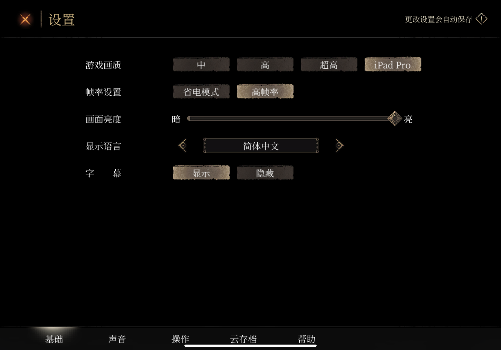

帕斯卡契约

### 屏幕

iPad Pro搭载120Hz的Pro Motion屏幕，流畅度方面不用担心，最近也有游戏开始支持iPad Pro的高刷新绿，例如Fornite，所以在iPad Pro上面网友洗觉得能获得很好的体验。

### 扬声器

iPad Pro搭载立体声扬声器，音频方面无需担心，绝对是上乘，或者你也可以搭配AirPods来玩Cytus2，音频延迟也非常不错，这边就不再赘述了～

## 学习篇

之前购买iPad Pro，最主要的剁手理由还是学习用，主要是记笔记、看课本，使用的APP为Goodnotes以及Notability。

### 实实在在减负

首先使用了iPad Pro作为上学的主力之后，最主要的改变就是书包真的变轻了，以往带一堆书上课，现在带一台iPad就能完全搞定了，下图是iPad Pro与计算机三级考试资料的对比，这还只是一科的书本量，正常上学来说一天有3科，减负的效果还是非常可观的。

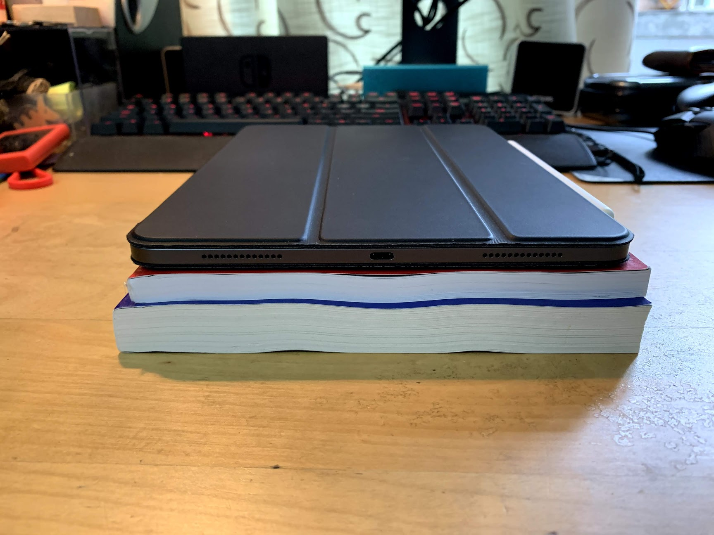

### 好用的Apple Pencil

第二，做笔记时候，不得不提的就是Apple Pencil 2代。相较于一代，基础的握持手感和充电连接方式有所提升，初次的体验我在一年前的文章中有提到过，这里就不再赘述了（没有看的赶快去看啊）。更新iPadOS后新增的功能中有几个我是很推的：一个是用Apple Pencil在左下角内滑截图

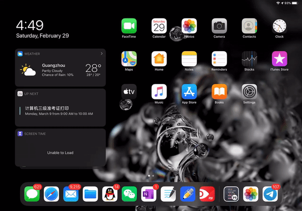

另一个是使用Apple Pencil在浮动键盘上可以通过滑动快速输入，虽然用手指也可以滑，但是最主要是用笔滑比较精确外加用笔滑就可以把笔一直拿在手上了，不需要打几个字就把笔放下。

至于说写惯了Apple Pencil之后，字体会不会变丑呢？其实还好，下面是一个学渣的笔记。

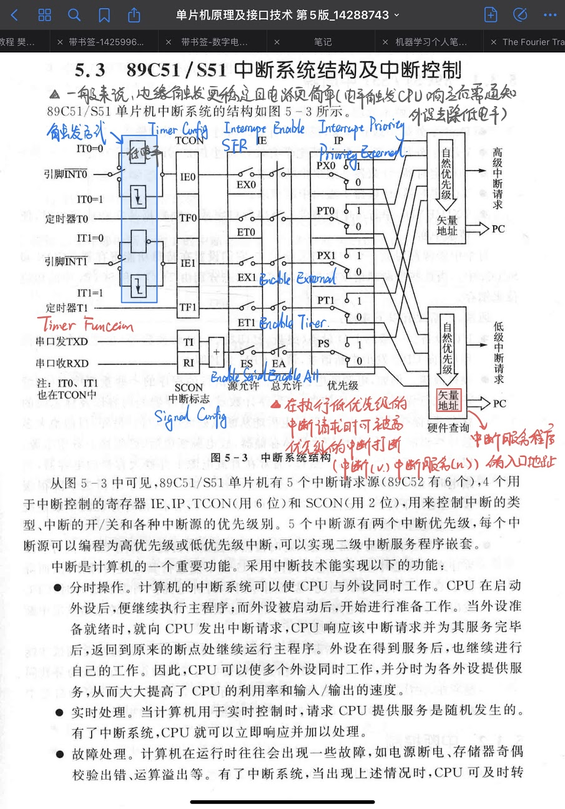

我还想谈谈拿iPad Pro做题的问题，iPad Pro做题尤其是理科需要频繁计算的题我觉得是勉强的。原因有几个：其一：我使用的iPad Pro还是太小了，如果要做题的话个人觉得不论是草稿还是答题纸都最好要A4尺寸；其二：iPad Pro的屏幕写起来还是很滑，对于复杂的算式辨识度可能会没有在纸上直接写的高，下面是一个简单的对比（请不要吐槽我的字难看，假期都没怎么拿笔）；其三：因为这玩意真的很贵，我怕有时候做题做嗨了大力戳爆屏幕了。

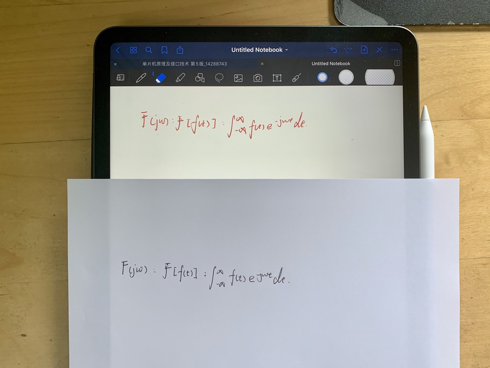

### 同屏多任务

其次要提的，便是iOS升级成iPadOS之后最有感的升级就是应用双开，悬浮以及同屏多窗口了。

应用多开：好用。相信在读书的各位都有遇到过文字与图刚好在一页纸的正反两面需要来回翻的窘境，之前iOS也出现过这个问题，当你的内容在一页显示不全的时候，有两种方法，一个是缩小页面但这样字体太小看得辛苦书写体验也不佳；二是来回滚动页面，这样稍微比第一种好一点，但是也很不爽。现在有了应用多开，可以同时看两个版面的内容了，非常舒适！目前测试下来Goodnotes支持应用多开，Notability不支持系统的应用多开而APP内置了不同笔记的同时浏览，但是有个小缺点就是不能打开两个相同的笔记。

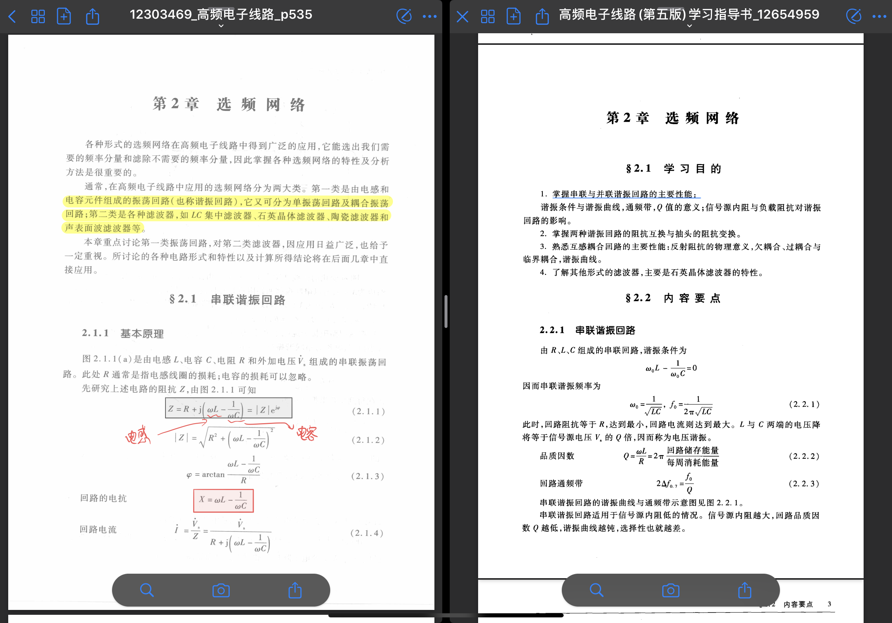

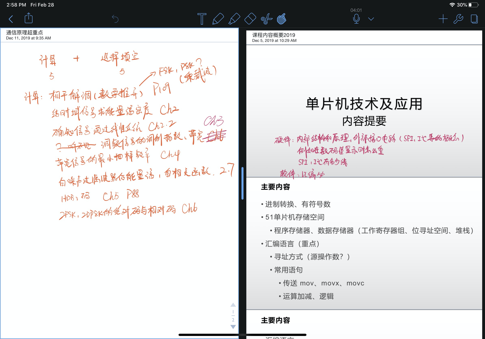

应用悬浮窗：好用。在课上如果需要临时查找一些资料的话还是非常舒适的，iPadOS相比之前的iOS悬浮窗口支持了多个程序，切换更方便。

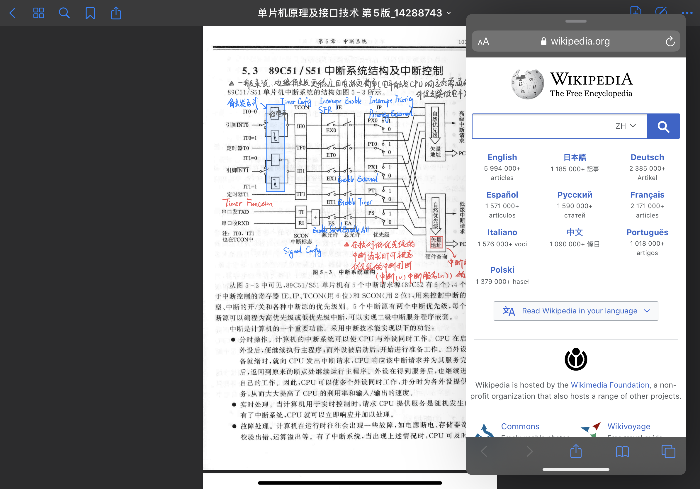

### 续航

第四：续航，iPad Pro的续航在经过我一年的高强度使用之后，不可避免的出现了衰减，以下是我一天中课堂亮屏使用的电池曲线。可以看到坚持一天（三大节）的课程勉强OK，不过因为有快充的支持，可以在午休的时候补给一下电量，所以基本不会有缺电关机的情况。

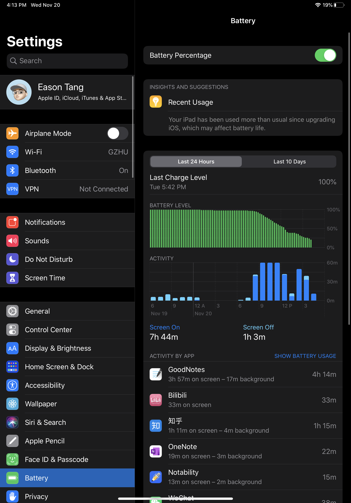

学习篇总结：从学习来看，iPad Pro仿佛是不二之选，但是学习的部分主要还是比较看软件支持，对硬件需求不高，iPad Pro能做的事情，iPad也能做。对于囊中羞涩的买家，如果你可以接受60Hz屏幕带来的一点点书写上的延迟和Apple Pencil一代的充电方式的话，其实标准款iPad或者iPad Air也并非不能接受，如果你手头宽裕的话，买Pro就好了，总没错的。

## 生产力篇

生产力的部分，作为一个工科学生，平常主要使用iPad Pro学习和做Presentation，主要用到的是投屏，写一些文稿，还有一些简单的代码工作。iPad Pro使用的Type-C接口，使得iPad Pro的外设选择更加的广泛。

### 投屏

在学校有时候做Pre懒得带电脑，就直接带上iPad Pro和C-HTML转接线就OK了，不过一般Screen Mirror的情况下，投屏是有黑边的，而且无法去掉。但是，在一些有专门做优化的App上则可以做到全屏显示。

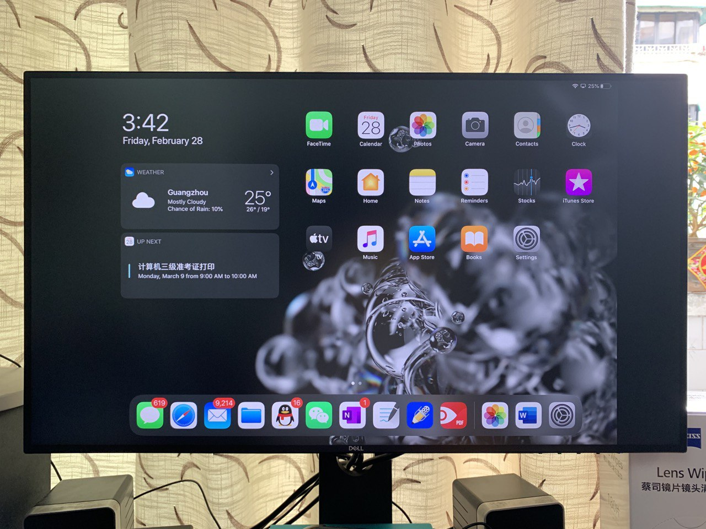

| 是否系统自带 | 软件名         | 投屏情况                         |
| ------------ | -------------- | -------------------------------- |
| 是           | 图库           | 可以全屏                         |
| 否           | 哔哩哔哩       | 可以全屏（显示为Airplay）        |
| 否           | 腾讯视频       | 可以全屏（显示为Airplay）        |
| 否           | Netflix        | 可以全屏（显示为正在电视上播放） |
| 否           | YouTube        | 不可以全屏（Screen Mirror）      |
| 否           | PDF Expert Pro | 不可以全屏（Screen Mirror）      |
| 否           | PowerPoint     | 可以全屏（有放映模式）           |

图库

哔哩哔哩

Netflix 

YouTube

腾讯视频

PowerPoint

PDF Expert Pro

从测试结果来看，Presentation部分Goodnotes发挥最好，自带了多种投屏的设定可以选择，PowerPoint投屏时自带演示者视图算式意料之中。

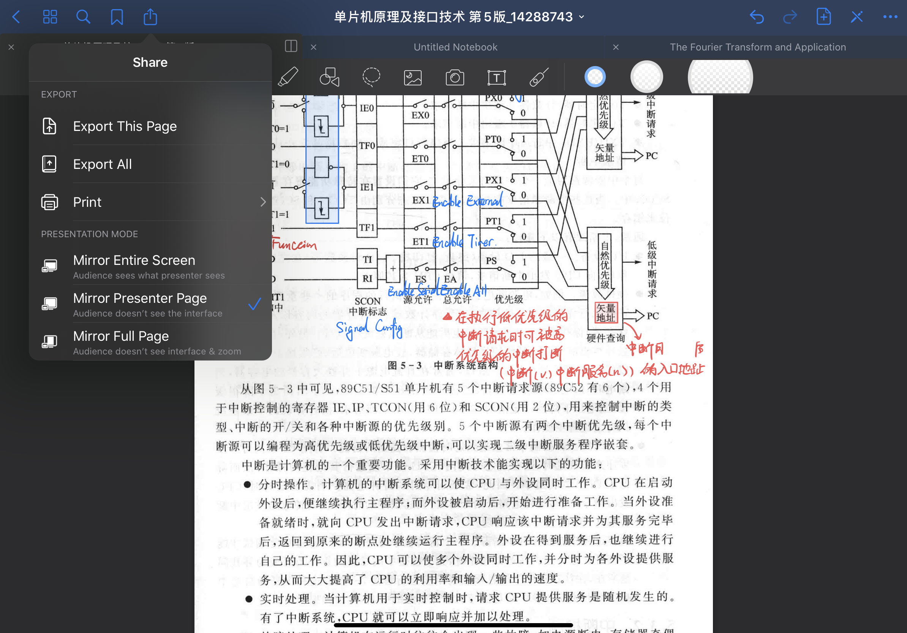

视频软件部分，基本上测试的所有视频软件都支持全屏，唯独YouTube不行让我比较吃惊。

彩弹：测试投屏的时候顺便看了下输出分辨率，发现可以以2k分辨率输出，好评。

### 文件管理

iPad OS中，文件管理作为一个呼声很高的功能终于被加入到iPad OS中，算是一点点进步。

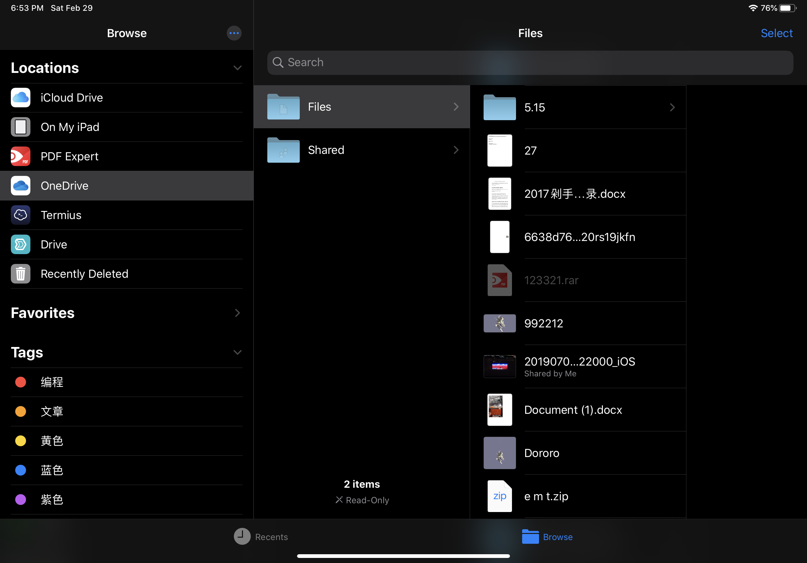

文件中集成了OneDrive文件夹，但是由于不论Mac还是iOS和iPadOS的文件App都没有刷新，因此使用文件管理OneDrive的时候对网速提出了很高的要求，网卡的话可能新文件就 没法显示了。

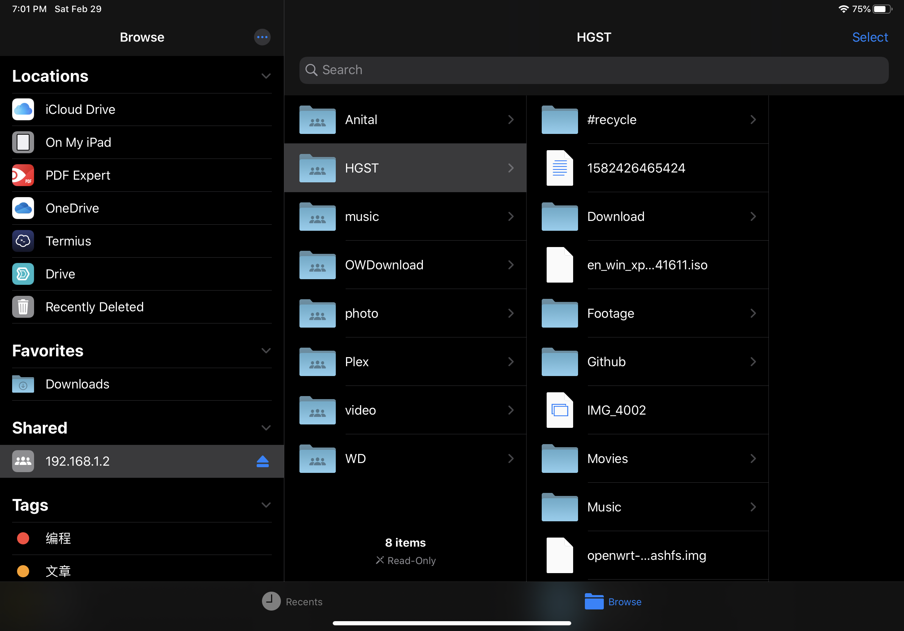

其次，文件中同样集成了SMB客户端，可以直接访问NAS的内容。

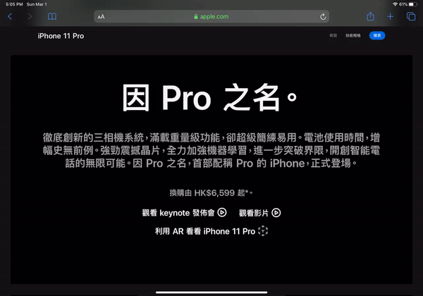

最后，iPadOS还为我们带来了下载功能，虽然我不常用iPad下载东西，但是新增的下载功能拿来应急还是可以的。

就文件App来说，我觉得是食之无味弃之可惜的，一方面由于iOS的沙盒机制，为了安全原因不允许应用之间数据互通，Lr修个图还需要先导入在导出比较麻烦；另一方面，确实能解依稀不时之需吧。

### 文书处理

文书处理部分最主要分正经文书例如Office和轻文书例如Markdown部分。

对于Office来说，我还是维持原判，iPad上的Office并不适合做正经工作，特别是在处理带格式的文件时显得特别的吃力。拿最常用的Word来举例我觉得已经给我造成很大不便的点：

- 没有格式刷
- 没有选择性粘贴
- 样式不能自定义
- 图片不能精准设定位置
- 经常出BUG

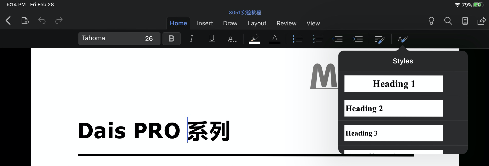

只能使用内置样式

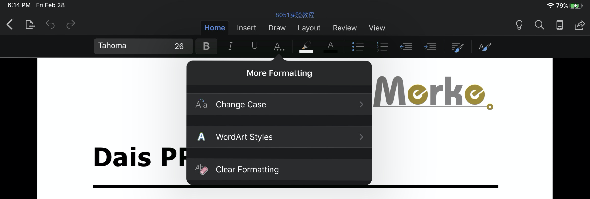

没有格式刷

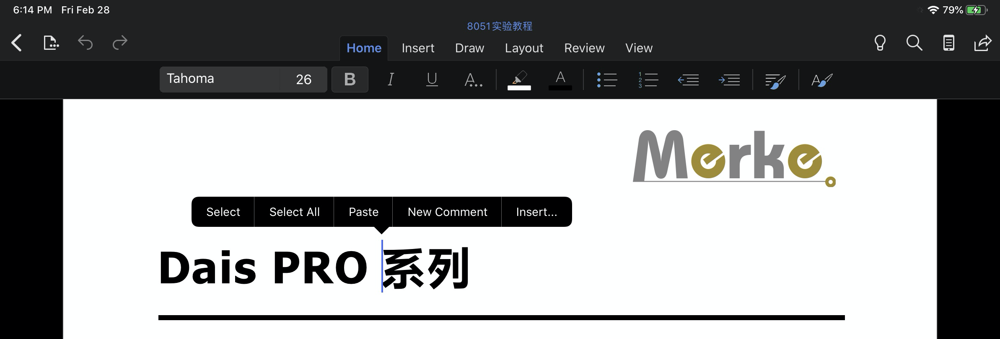

没有选择性粘贴

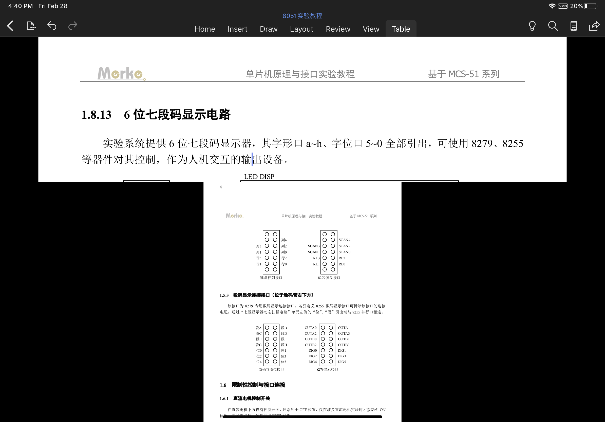

BUG

就以上几点，注定了我不会用它来处理一些稍微复杂一点点的文书工作，iPad就已经是死刑。

对于Markdown来说，情况就好了很多，得益于Markdown的特性：使用纯文本编辑文档并且进行自适应的排版。iPad Pro在使用Markdown编辑的时候，因为Markdown的特性：
- 我们不用担心排版，因为Markdown会帮我们自己排版
- 我们不用担心选择性粘贴，因为Markdown只支持纯文本
- 我们不用担心央视不能自定义，因为Markdown作为一种轻量级的标记语言压根就不给你自定义样式
- 我们不用担心图片不能精准设定位置，原因同上

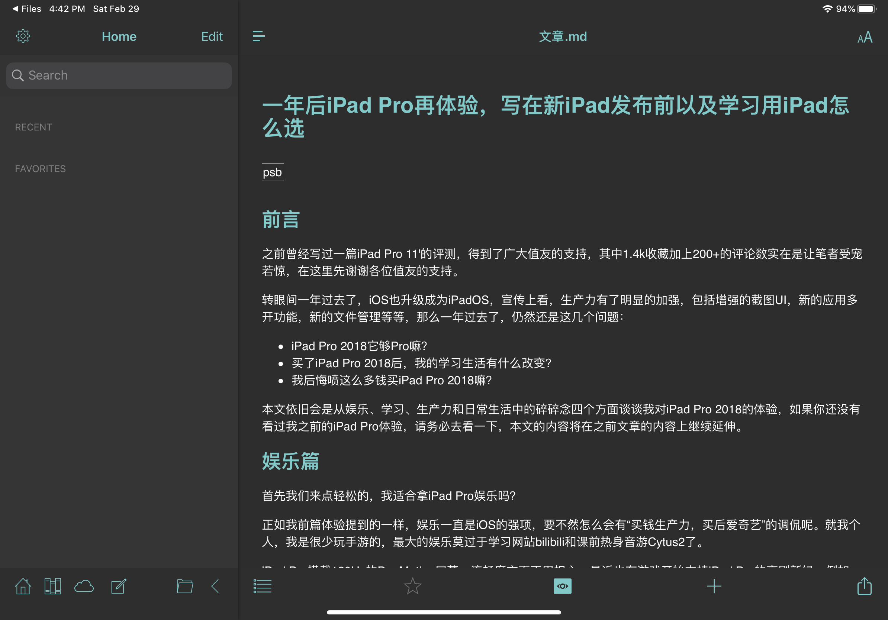

虽然貌似图片部分有一点点问题显示不出来，不过打脚本什麼的相比在Office点来点去还是轻松很多的。

综上所述，如果我需要在iPad Pro上面需要进行文字处理，首先我会找一块习惯的键盘，其次我会使用Markdown进行文字处理，绝对，绝对，绝对不会使用Office。

### 打码

作为一名工科学生，打码是家常便饭，目前最常使用的是Python进行编程。

我曾经试过使用Jupyter Lab配合Safari尝试在服务器上调试代码，说实话其实是勉强可以用的，但是小屏幕外加没有鼠标的指点操作，相信当代码量多了之后进行单步调试的话体验非常痛苦。

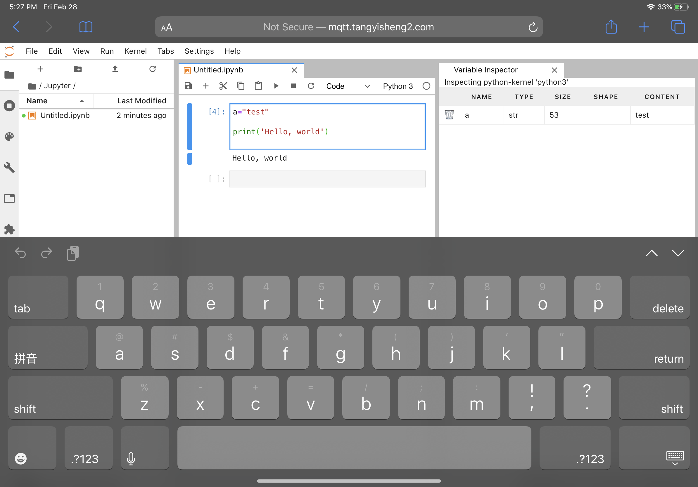

另外一点就是，如果你选择在iPad上打码，那么所有方便的快捷键都与你无缘，所以正确姿势该上电脑才对：

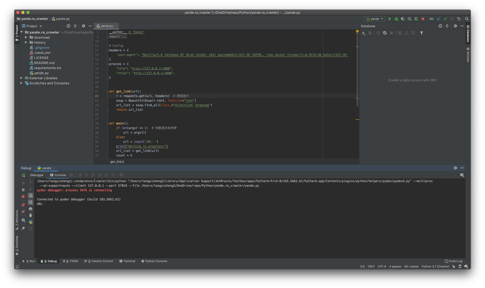

## 上网课iPad怎么选

今年春节是个不平凡的春节，疫情的发生使得很多人不得不改为网上听课，授课。今年的高三学生也是非常苦逼的一届，我高中老师曾经转了一个段子：这届高三学生，03年出生，中考刚好加分政策取消，今年又因为疫情无法回校安心复习（但是，作业大礼包已经准备好了 :D）。

咳咳，扯远了，那么如果要选择一台iPad上网课怎么选呢？

首先需要说明的是，买一台iPad和好好学习之间不是强相关的关系，能不能好好学习，靠个人自律不靠iPad。

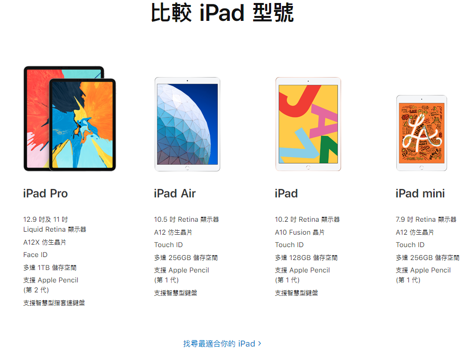

腰包宽裕的，直接上iPad Pro获取最好的体验。

腰包不宽裕的，则看你要不要在iPad上记录笔记：如果要的，可以选iPad Air 3搭配Apple Pencil；如果不需要则可以选择iPad Mini 5不加Pencil。首先两者都搭配了A12处理器，速度上有保证，其次iPad Air和iPad mini不同在于，iPadAir的10.5寸屏幕可以满足记笔记的需求，然后iPad mini的7.9寸屏幕对于记笔记来说比较吃力，但是小巧的机身可以更方便的带出门。PDD对这两款iPad都有开过车，老爷们可以搜索站内的好价，具体选购哪台看各位看官老爷的需求决定了。

## 碎碎念 及 总结

最后回到开始提出的问题：

iPad Pro 2018它够Pro嘛？维持原判，不够。就我的应用场景来说，他很方便，相比电脑来说便携性很高，但只适合Markdown类轻办公。正经干活iPad Pro还是无法胜任，就拿Office来说，排版功能基本残废，还有各种各样的BUG，难道我要在iPad Pro上码完字再去电脑上整一遍排版？这显然不现实，效率也很低。不过总能看到苹果的一点进步，包括文件管理的App，支持SMB，支持U盘，总归是好的，但纵使他的性能强悍，是比不上电脑方便吧。毕竟一只手能干的活总比一根手指多吧。

买了iPad Pro 2018后，我的学习生活有什么改变？最大的改变就是减负了，以及教材的无纸化，每天只带一台iPad Pro上课书包真的很轻，很爽。

我后悔花这么多钱买iPad Pro 2018嘛？不后悔，iPad Pro使用一年多，从来没有给我掉过链子（除了一些软件BUG），120Hz的屏幕在快速翻页的时候看着很疗愈，A12x在进行各种操作的时候也很顺畅，没有让我等待过。

最后个人觉得iPad Pro有点战未来的感觉？参考iPhone X时候推出的全面（刘海屏），从X一直沿用到Xs，11甚至可能是下一代机型？对于这种大的换代，其主要的外观和功能设计纵使会保持几代的，再加上A12x的性能保证，因此吃螃蟹就比较香了。

最后大胆预测一下苹果春季发布会iPad Pro的升级：首先，惯例升级处理器配置，支持WiFi6等的新协议，也有可能上U1 chip；其次，外观应该无太大变化，我觉得应该是屏幕，收窄边框或者扩大一点点尺寸，可能会从LCD换到miniLED；然后可能会升级摄像头（？），但是我觉得这个算是比较鸡肋的功能，因为我本人很少使用iPad Pro进行拍照；最后虽然不太可能但我希望iPad Pro能上Hapic Engine，iPhone上的震动真的很爽。

