# WordPress迁移教程

## 0x00：前言

虽然说是迁移教程，但其实新建一个博客也可以参考此教程，教程中一些需要导入备份文件的地方直接跳过即可

## 0x01：准备工作：


登陆仪表板，安装Updraft-Plus插件

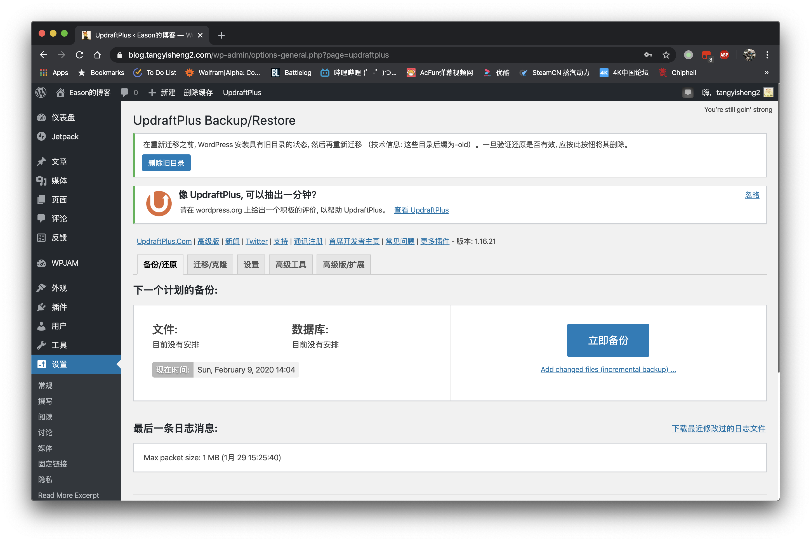

选择立即备份并备份网站目录下面的文件

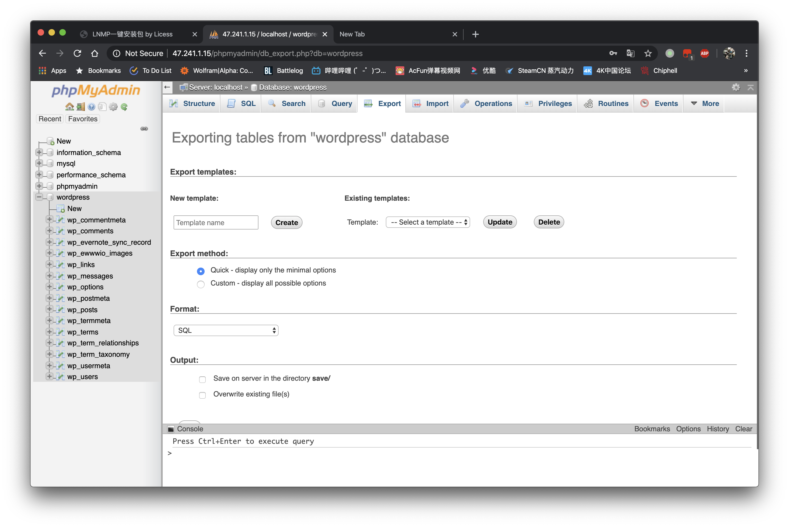

登陆旧服务器的phpmyadmin，选择wordpress库并且导出为sql，将sql下载到本地备用


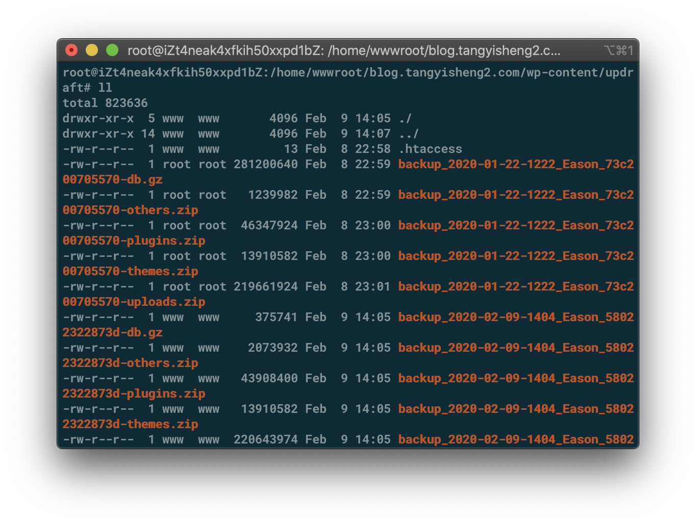

登陆服务器把需要备份的文件下载下来保存

```shell
cd /home/wwwroot/blog.tangyisheng2.com/wp-content/updraft/
tar -cvf wp.tar *. # 打包所有文件
scp root@blog.tangyisheng2.com:/home/wwwroot/blog.tangyisheng2.com/wp-content/updraft/wp.tar . # 把Wordpress文件下载到本地
scp root@blog.tangyisheng2.com:/usr/local/nginx/cert/* . # 将SSL证书备份（可选）
scp root@blog.tangyisheng2.com:/usr/local/nginx/conf/vhost/blog.tangyisheng2.com.conf . # 将网站的nginx配置进行备份
```

## 0x02：服务器新建环境

我们这里已经默认你安装了完整的lnmp环境，并且配置好了各种网络设定

### 设置域名解析

将原先的域名解析道你的新服务器上，因为那是域名部分的内容，这里不多赘述

### 登陆服务器新建lnmp环境


### 下载Wordpress核心文件：

```shell
cd /home/wwwroot/blog.tangyisheng2.com # 网站根目录
wget https://cn.wordpress.org/latest-zh_CN.tar.gz # 下载Wordpress文件
tar -zxvf latest-zh_CN.tar.gz # 解压
mv wordpress/* blog.tangyisheng2.com # 将Wordpress文件夹内容移入网站根目录
```


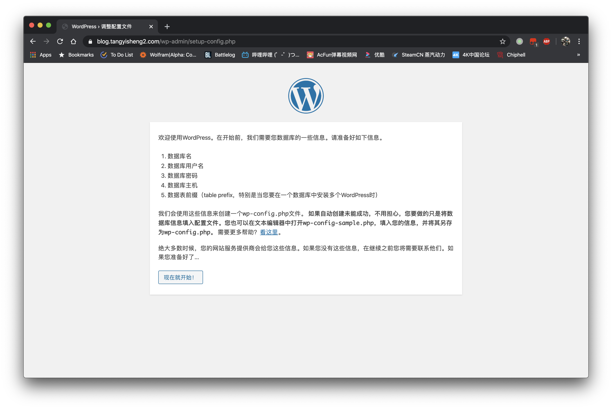

打开浏览器，输入网址看看是否能出现安装

### 首先设置好数据库：

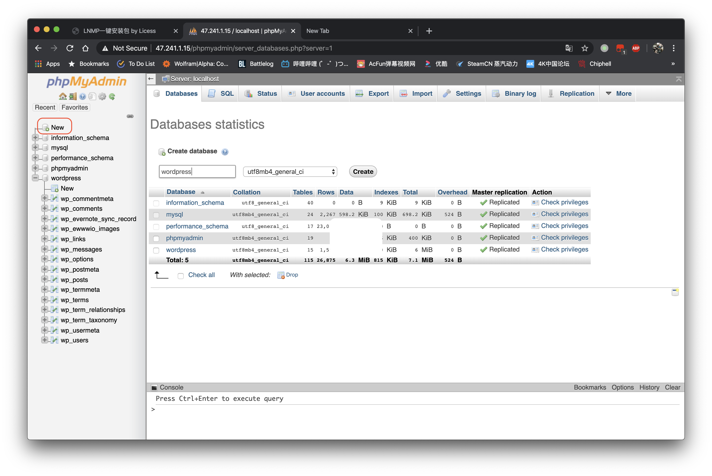

新建数据库，登陆phpmyadmin，在左边选择new，新建一个数据库，我们这里一样是用wordpress命名

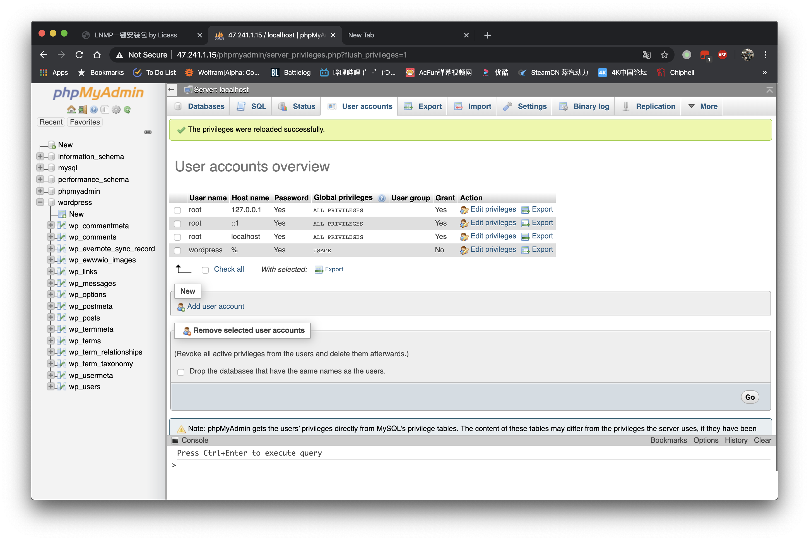

新建用户：回到phpmyadmin主页，选择User Accounts，点击Add user account

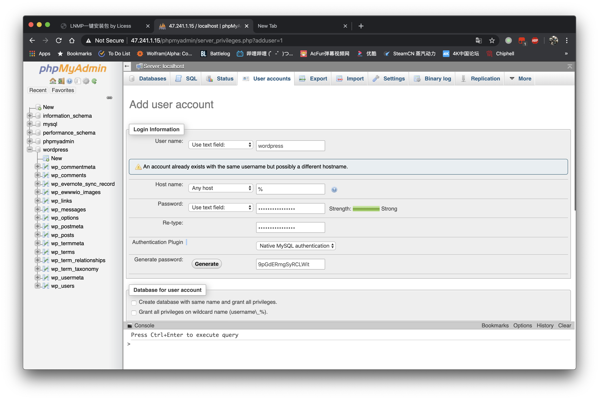

用户名这里我们写wordpress，这里我已经有一个wordpress用户所以会提示报错，密码我们直接generate高强度密码即可，在这里我们复制一份密码备用，填写完成后点Go应用。

### 授予权限：

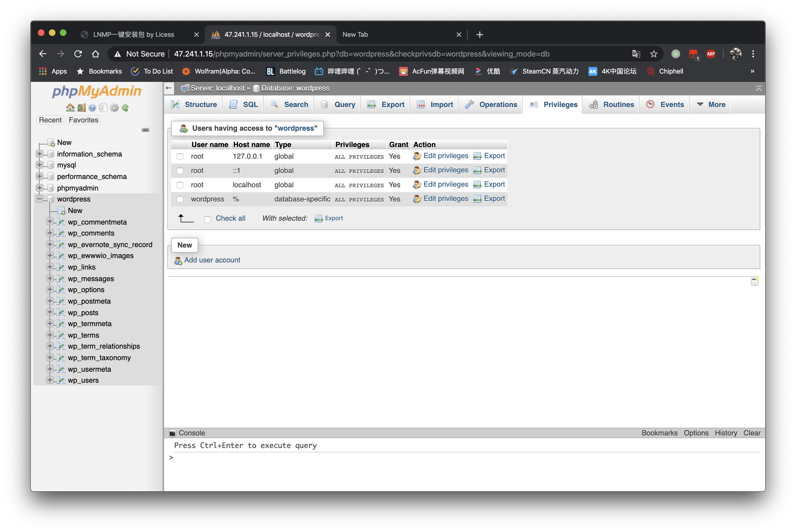

点击左侧菜单栏选择数据库wordpress，点击上面Privileges，下面选择wordpress用户后面的Edit privileges 


因为是个人博客的缘故这里直接选择所有权限，点Go应用

### 然后我们导入之前的sql备份：


选择import，上传之前的sql备份，上传完成之后数据库部分就完事了

### 配置：

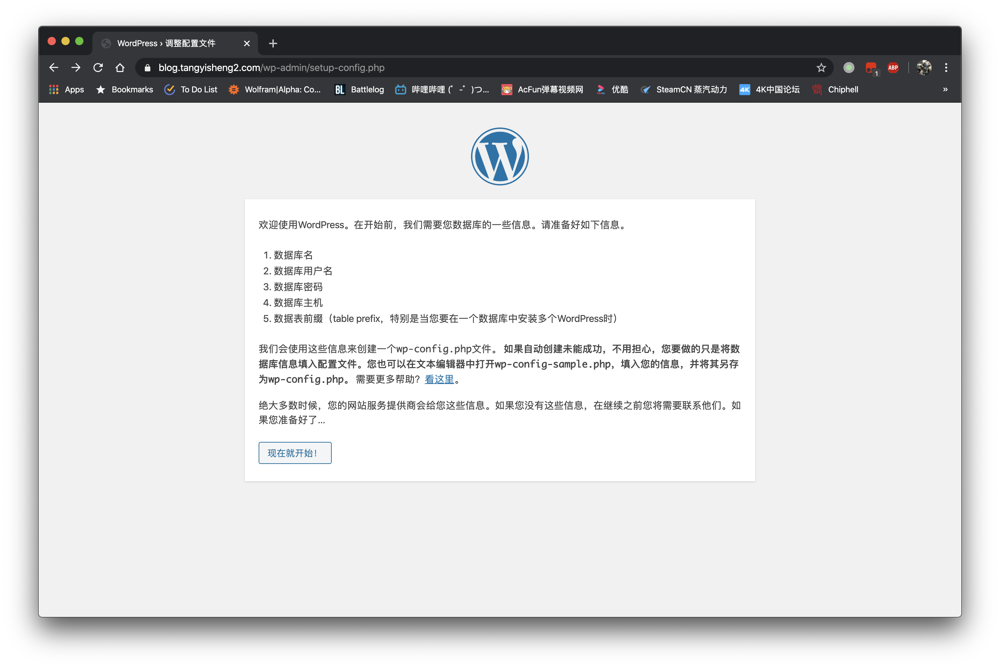

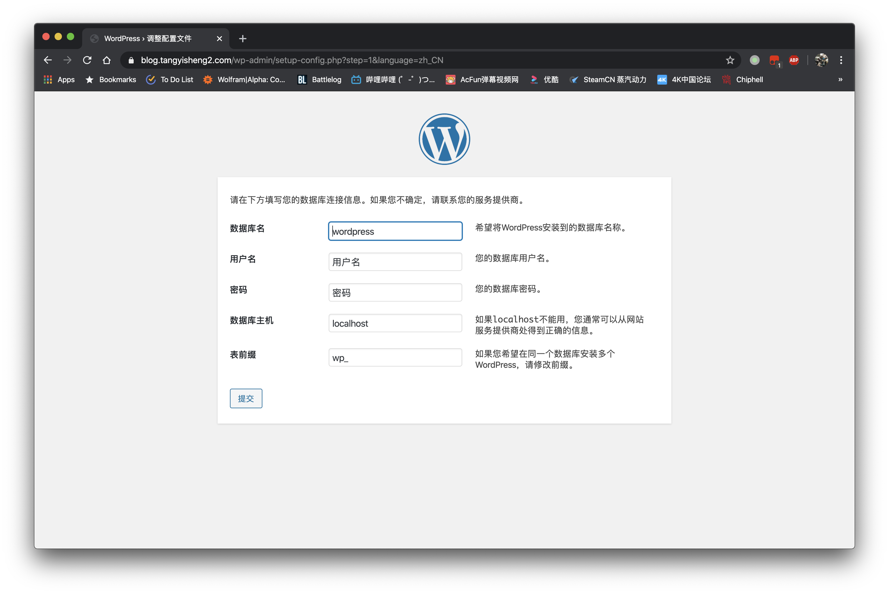


著名的五分钟安装，填入所需要的信息一路回车就可以

好了，现在我们的博客文章和留言设定什么的已经回来了

## 0x03：恢复备份

### 将备份文件上传回服务器

进入存放备份文件的目录

```shell
scp ./backup_* root@sgp.tangyisheng2.com:/home/wwwroot/blog.tangyisheng2.com/wp-content/updraft/ # 上传updraft备份文件
scp ./blog.tangyisheng2.com.conf blog.tangyisheng2.com:/usr/local/nginx/conf/vhost/ # 上传nginx配置文件
scp ./*.crt root@blog.tangyisheng2.com:/usr/local/nginx/cert/ # 上传证书
scp ./*.key root@blog.tangyisheng2.com:/usr/local/nginx/cert/
```

进入Wordpress的dashboard，依然安装Updraft备份插件


找到自己的备份，选择恢复


除了我们已经恢复过的数据库外，其他全部选上点击下一个就可以恢复完成

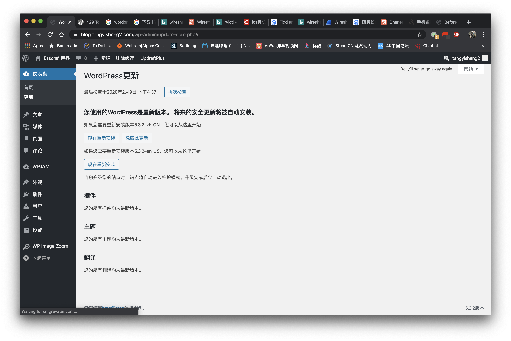

最后在仪表盘除检查是否有需要的更新稍微更新一下就可以了