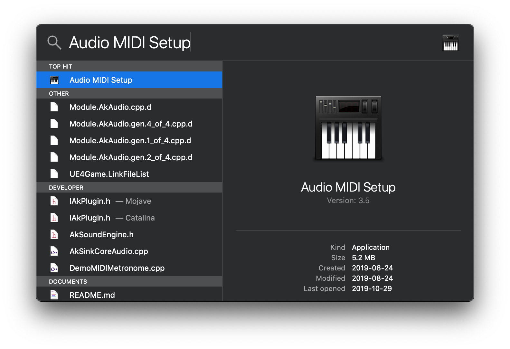
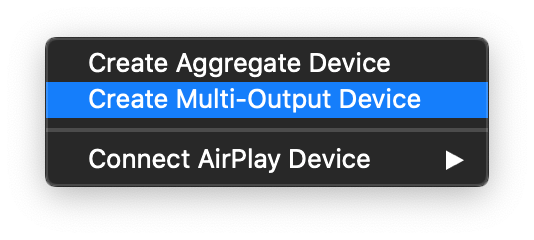
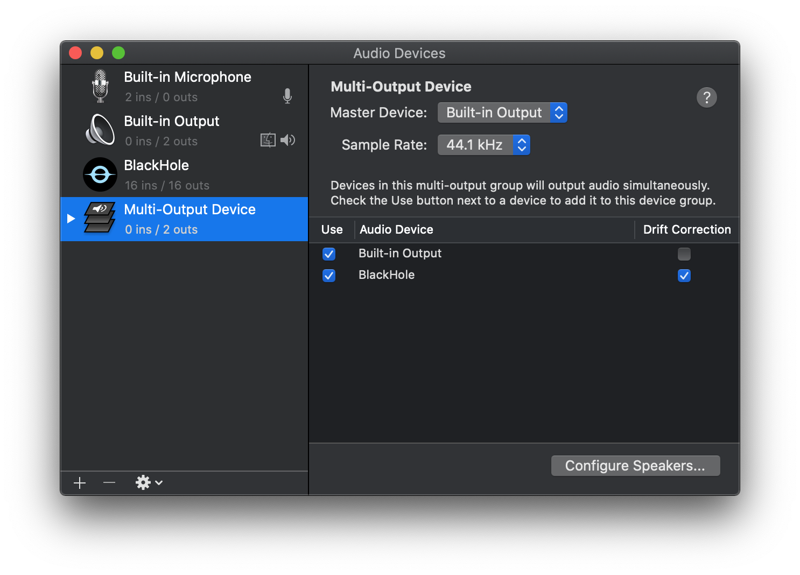
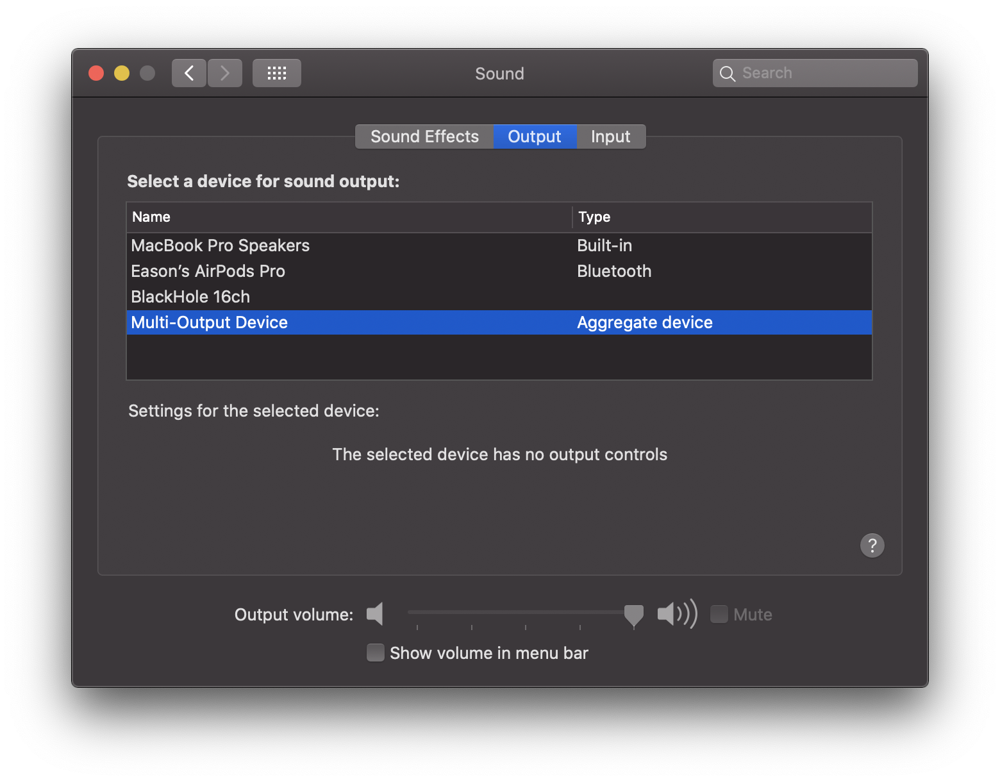
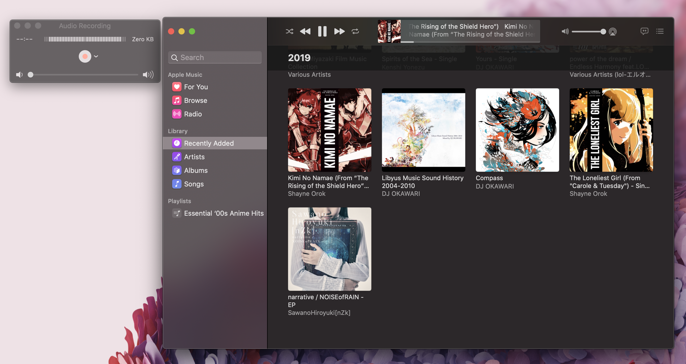

# MacOS 内录电脑声音

## 前言

因为一些众所周知的原因，MacOS的Screen Recording没有办法录制电脑扬声器发出的声音，需要第三方软件做一个pipe才可以（好菜啊），因此写文记录一下操作过程

软件的选择上有很多，本文选择的是BlackHole，除此之外还有Soundflower之类的。

## 软件安装

软件安装非常简单，在安装了Homebrew的Mac上，一条命令

```shell
brew cask install blackhole
```

## 软件配置

1. Spotlight搜索MINI，打开MIDI设置



2. 创建Multi-Output Device

左下角的 + 号，选择创建Multi-Output Device



3. 配置Multi-Output Device

如图所示，需要注意的是Mac的输出（Built-in Output）需要排在第一位，如果不是第一位则需要取消Use下的勾然后在选回去。

同时也强烈推荐选择Drift Correction



## 录制

注意：录制前请先把扬声器音量调节到合适位置以免外放声音过大。

1. 打开偏好设置 - 声音 - 输出，选择我们刚刚创建的Multi-Output Device。在选择之后我们无法再调节扬声器的音量。



2. 现在已经可以开始录制了，我这里使用QuickTime新建音频录制，随便挑一首歌，可以看到音量指示条已经会跳动，此时点击开始录制就可以内录Mac的声音了



3. 录制完成后，把输出设备调整回扬声器