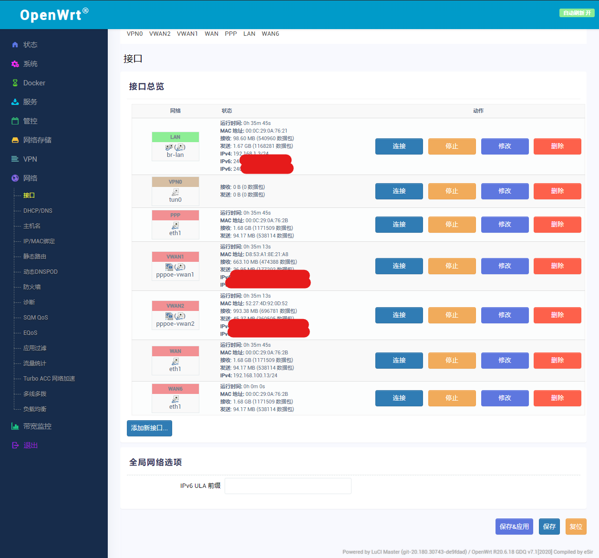
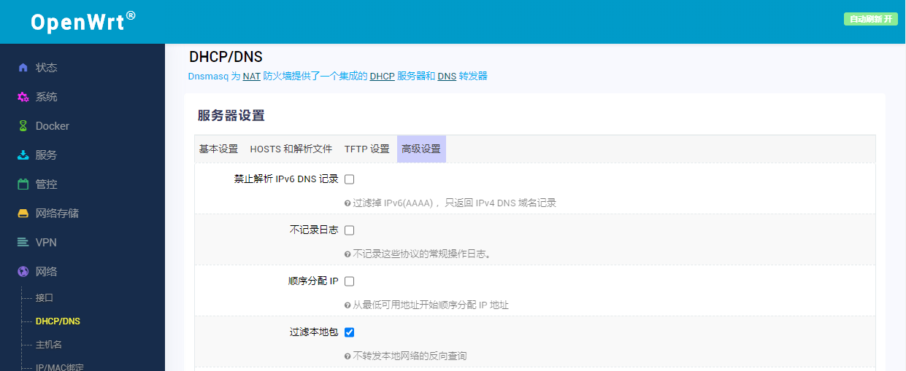
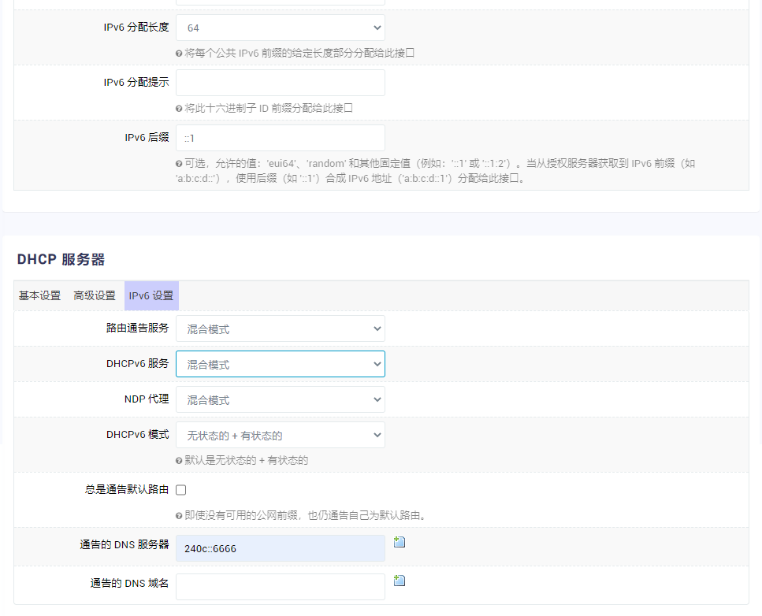
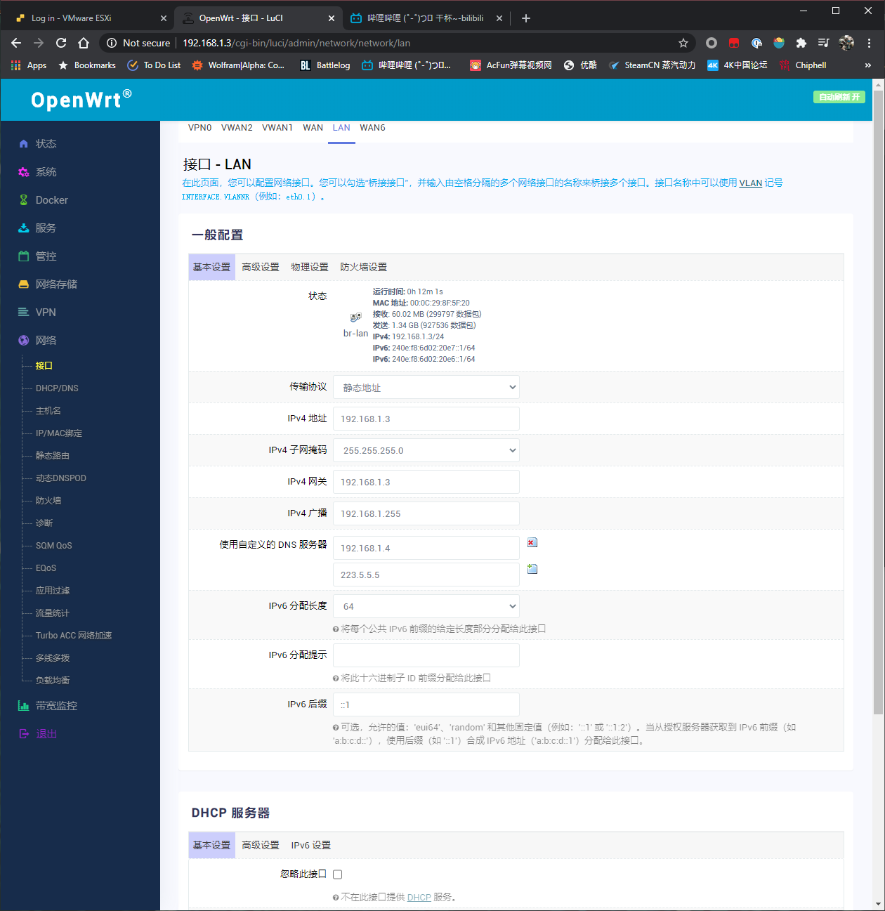
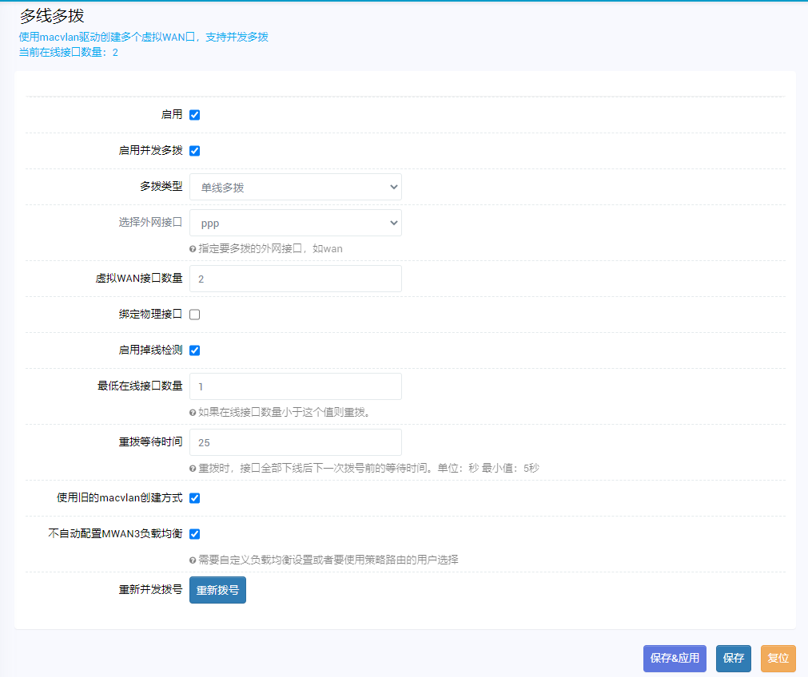
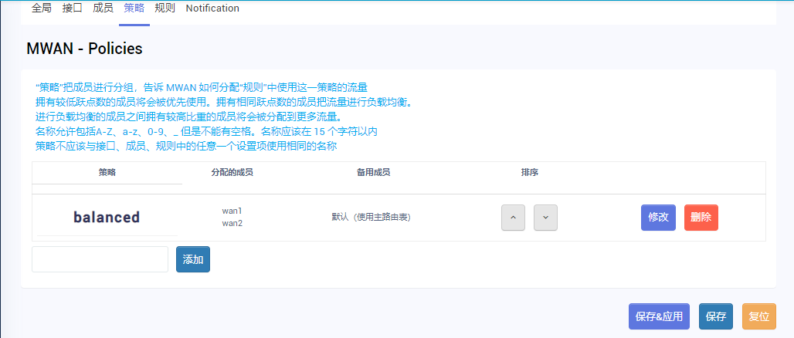
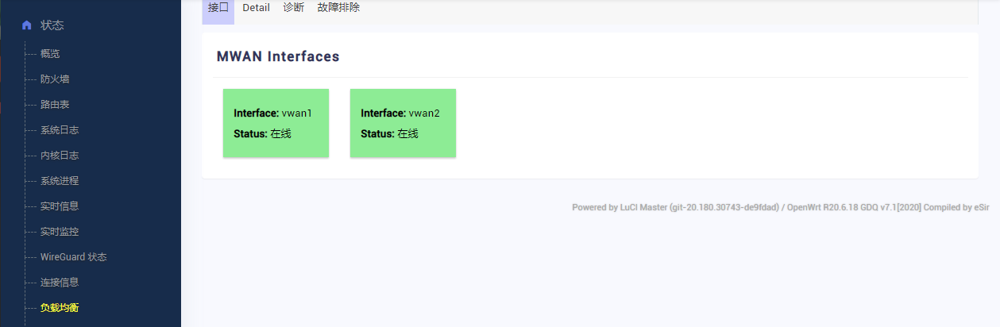

@Eason99 

## 开启或关闭IPv6地址分配

在此之前请确保你的运营商分配了IPv6地址

欲启用IPv6地址分配：

- IPv6 ULA前缀全部删掉

- 进入接口 - LAN，IPv6分配长度选择64（或其他数字，除停用外的其它选项）
- DHCP服务器 - IPv6设置：路由通告服务，DHCPv6服务，NDP代理选择混合，DHCPv6选择有状态+无状态，通告的DNS服务器自己填入IPv6的DNS
- 网络 - DHCP/DNS - 高级设置 - 取消“禁止解析 IPv6 DNS 记录”

- 重新插拔网线刷新DHCP
- 如下图

欲停用IPv6地址分配：

- 进入接口 - LAN，IPv6分配长度选择停用
- DHCP服务器 - IPv6设置：路由通告服务，DHCPv6服务，NDP代理选择停用，通告的DNS服务器清空
- 重新插拔网线刷新DHCP

## MWAN3多拨与IPv6共存

首先确认你已通过多线多拨插件配置好macvlan和mwan3（图中不自动配置MWAN3负载均衡请取消勾选）

MWAN3负载均衡 - 策略 - balanced中备用成员由“不可达”改为“默认（使用主路由表）”

重启软路由

PS. MWAN3检测链路状态需时要几分钟，在此期间MWAN Interfaces显示禁用，请耐心等待

## 其它问题

建议自己琢磨

## 参考资料

[1]**11-3补充，LEDE不能访问IPv6网络，求助！已查明原因。** https://koolshare.cn/thread-148156-3-1.html