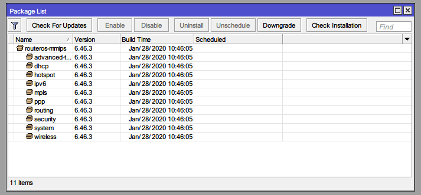
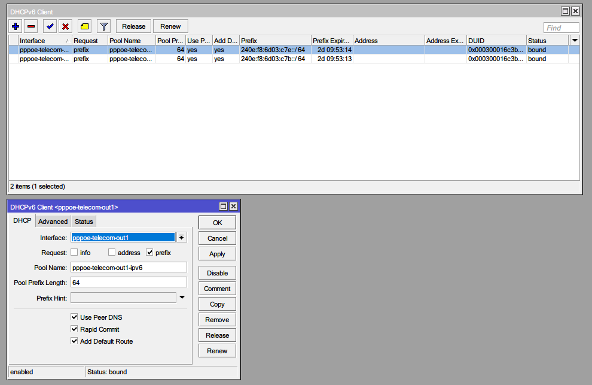
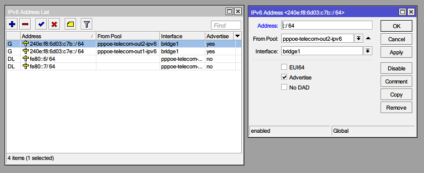
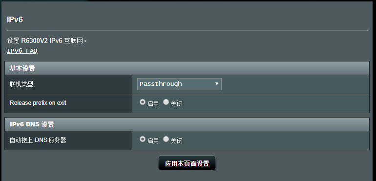
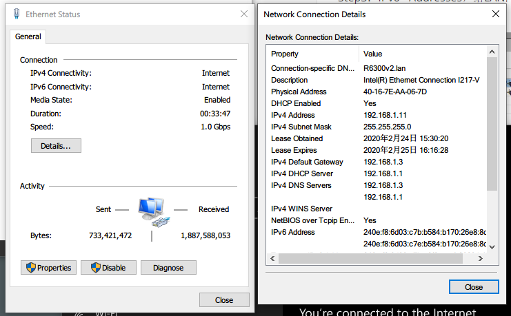
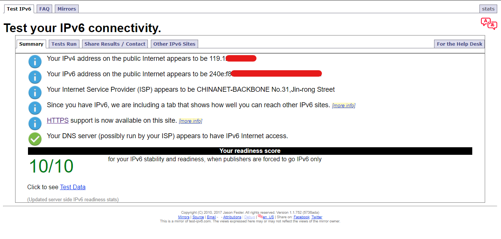

# ROS获取电信原生ipv6

Step1：System - Packages确认ipv6已经安装并启用

Step2：IPv6 - DHCP Client新增Client，request选择prefix，Pool Name自定义，Prefix Length选64

Step3：IPv6 - Addresses，给LAN网桥分配IPv6地址，Address除输入“::/64”，Interface选择bridge1（LAN网桥）

Step4：二级路由中，IPv6设置为Passthrough

Step5：重新获取DHCP

Enjoy！

## Credit：

- RouterOS 配置电信双栈原生IPv6 及IPv6公网地址分配 https://blog.ich8.com/post/6015