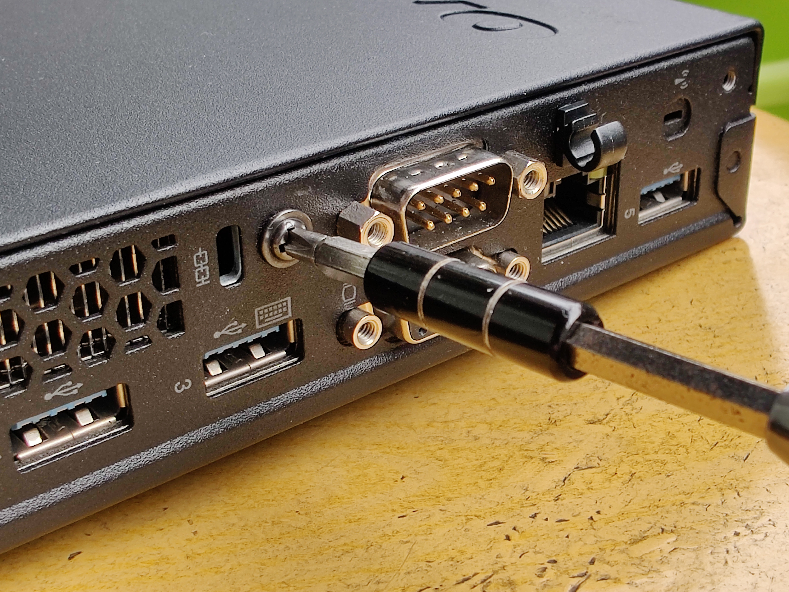
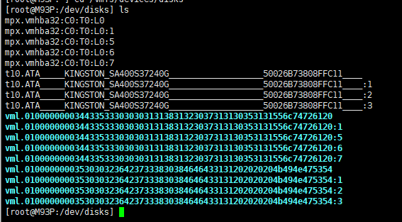
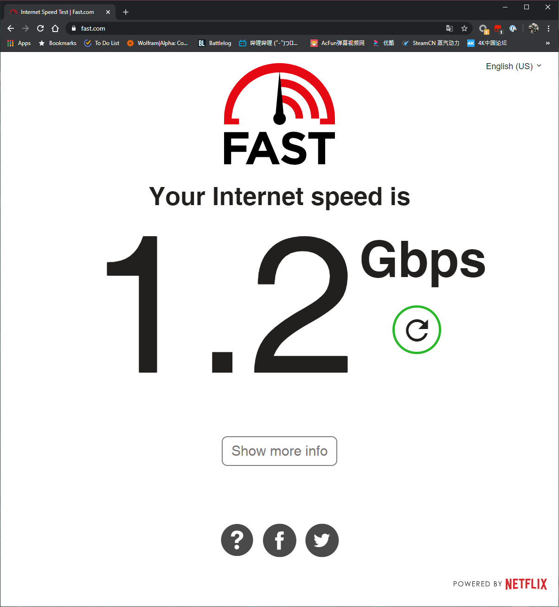

# 千兆下行达成！家庭网络再升级

## 前言


氦，各位亲爱的观众姥爷们早上好、中午好、下午好、晚上好和凌晨好。

这里是鸽了好久的小唐，原本呢，草稿箱里有一堆写完还没来得及发的原创，可是因为学校上课忙，外加我懒，就一直没有发，眼看着几个月就过去了。

如果你还没见过我之前的原创


这段时间宅在家，手痒将家里的网络升级为了500M，这样算上冗余出来的100M后，双拨大约能达到1.2G的下行带宽，原来的ROS转发性能已经带不动这么大的带宽了，因此决定进行最后一次升级，直接升级到1G的网络。

那么有人可能会问了，唉你不是1.2G么，怎么到1G就不搞了呢？还请继续往下看

那么本次为各位带来的应该是笔者家庭网络的最终形态了，请看

- 中国电信500M宽带公网双拨（单线500M+100M冗余，双拨后理论1.2G下行，但是因为软路由只有G口所以实测大概960Mbps左右，上行实测120Mbps）
- 双公网IP
- M93P软路由+i5-4590T+8G+改双网口

因为篇幅太长所以本文会分为上下两篇，上篇主要为软路由主机的开箱以及ESXi的安装，有关OpenWRT的设定之类的还请期待下篇（不想错过的可以趁机关注一波哟）

## 软路由主机选择

需求：

- 性能足够跑虚拟机，最起码也要能带OpenWRT+Ubuntu
- 需要跑满千兆的WAN带宽（负载均衡）

其实，淘宝是有成品软路由主机的，不过价格嘛3865U 1k，7500U 2k，7700U 3k的价格也超出我的预算了。

如果不算成本的话，最好的选择当然是Lenovo的M920x，支持最新的9代CPU，同时官方有提供I350-T4的选配，加起来就是5口的软路由了，不过动辄3000多的价格，算了。

也有考虑过Dell Wyse 5070之类的瘦客户机，CPU是J4105，ummmmm。

后来看见X鱼有卖家在卖M93P准系统￥300，配上i5-4590T￥300，最后配上电源600出头搞定，Mini-PCIE网卡￥130，算上家里之前换下来的硬盘内存，1000左右搞定，我个人还是比较满意的。（没有算翻车买多出来的硬件）


## M93P开箱


准系统我是在闲鱼上淘的，卖家应该也是电脑城那种专卖小主机的店铺，有专门的泡沫做缓冲，好评。


背部接口如下：第一排，防盗锁，COM口，天线（图中空置）；第二排，方口的电源，DP，两个USB3.0，VGA，千兆网口，再加一个USB3.0


前方接口如下：电源，USB3.0，麦克风，耳机，USB3.0（支援关机充电）


要打开机身非常简单，只需要拧下背部螺丝即可


机箱内部


另外准备的8G内存和一条SSD


安装好后的全家福


成功点亮

## 改装双网口

在准备改装之前，怕了几篇贴文，确定了主要改装的方式有两种：

一种为Mini-PCIE网卡然后将RJ45接口放在原来的COM口位置

一种为Mini-PCIE转PCI-E然后用FPC软排线引到机箱外，在外接一个盒子放4口的PCI-E网卡

值得一提的是

作为不折腾会死星人那当然是选择方案二（虽然最后...

### Plan A.四口网卡方案



改装双网卡首先我们需要打开机箱


将原机的COM口拆下


由于PCI-E需要12V的供电，因此我们需要在主板上找一个位置拉12V出来，最后发现这个电感是12V的


最后完成图


然后就翻车了...正当我兴高采烈装好ESXi并且准备安装OpenWRT的时候发现，不对，我只插了一条线怎么四个网口都全双工了？


本来我怀疑是供电问题，后来用万用表量了12V的供电是有出的，不过供电电感靠光量电压可能还不行，需要上示波器，但是我家里并没有示波器（谁家里会常备示波器？？？？），只能等回学校再看。

在这后来也更换了另一块Intel I350T4，也买过新的FPC软排线，故障依旧。

在折腾途中也有看见值友的文章：https://post.smzdm.com/p/av7zvk94/

中间有提到一家ADT的店也有专门生产Mini-PCIE转PCI-E的连接线，但是有两个问题

1. 转接线中间线缆焊死，虽然对可靠性应该有帮助，但是没办法穿过COM口，M93P机箱内也没有空间给你放网卡


2. 转接线要从SATA取电，而M93P SATA只有一个，并且被硬盘占用，虽然看见值友通过外接供电的方式成功驱动，但这显然不能算是无损了，遂弃用

### Plan B.双网卡方案


PlanB选用的是单口的I211网卡，由于直接是Mini-PCIE接口的所以插上就能用，也有适用于COM口的RJ45套件。PS：如果要选择这种建议在Mini-PCIE上的排针要选择弯头的款式，不然可能会顶硬盘。


至于结果么，那当然是好了的，虽然只有双千兆对于1.2G的宽带来说还是有点损失。

### 千兆？就这？

至于为什么我对1.2G的带宽只上了两个千兆网卡：

不过嘛，考虑到如果要榨干这200M的带宽，比较经济实惠的办法是购买2.5G的USB3.0网卡，用板载+Mini-PCIE的网卡做WAN，LAN的部分用2.5G的USB网卡提供。

如果要家里主干网达成10G的速率，需要额外购买万兆的电口交换机，这种交换机往往非常昂贵，不值得。光口的万兆虽然比较便宜，但是M93P没办法通过USB拓展出万兆光口，所以也不能用。

在放弃了将家里主干网升级成10G的想法后，剩下的想法是将M93P和电脑单独连接一路，另外拉一路千兆到AP作为Wifi供全家使用，但是这样要采购2个2.5G的网卡（1USB3.0给M93P，立个给台式电脑），1个1G的网卡（USB3.0给M93P用于连接AP），感觉也非常臃肿，最后作罢，当做千兆使用好了。


## ESXi安装及配置

### 特别提醒

本文所有安装及配置均以ESXi 7.0版本为准，ESXi 6.7及其他版本未做测试。

### 全新安装

自从ESXi升级到7.0后，在安装时会自动多出来一个ESX-OSData分区做coredump和其他杂七杂八的存储，这个分区最高可以占用138G，这就导致了你用138G以下的磁盘或者U盘安装后进入ESXi会发现**没有可用空间**，因此建议在全新安装时对ESX-OSData分区大小进行限制，以免后续调整造成不必要的麻烦。


开机进入ESXi引导的跑码后按Shift+O，在原有的启动参数后面加入一个空格，然后，autoPartitionOSDataSize=4096。这里的4096以MB为单位，用处为限制自动分区时ESX-OSData分区的大小，个人推荐为8192MB


随后照常安装便可。

安装完成后，按F2，进入Management Network，为管理网口设置静态IP地址，网关设置为你软路由的IP

因为没有图，所以我就使用了ESXi官方的文档了

```
从控制台配置静态 IP 设置
要从控制台配置静态 IP 设置，请执行以下操作：
按 F2 检查默认配置。
按下箭头键以选择配置管理网络，然后按 Enter。
按下箭头键以选择 IP 配置，然后按 Enter。
按下箭头键以选择设置静态 IP 地址和网络配置，然后按空格键。
按下箭头键以选择 IP 地址。
按退格键以清除当前 IP 地址，然后输入新的 IP 地址。
按下箭头键以选择子网掩码。
按退格键以删除当前子网掩码。
输入新的子网掩码。
按下箭头键以选择默认网关。
删除现有默认网关。
输入新的默认网关。
```

安装完成启动后，就可以使用之前设置好的IP进入ESXi的网络管理界面了。

### 已经安装完成后如何缩小ESX-OSData分区

PS. 如果执行了上文提到的全新安装操作，则可以跳过这部分

使用U盘作为存储空间的解决办法

原分区表：


可以看到原分区表很大一部分空间被VMFSL占据，而这个分区是不能用于数据存储的，因此在这个情况下你需要外接一块硬盘或调整分区

打开ESXi的ssh并以Root登录

停止USB检查，并且不让其开机启动

```bash
/etc/init.d/usbarbitrator stop
chkconfig usbarbitrator off
```

进入/vmfs/devices/disks目录

```bash
cd /vmfs/devices/disks
```

列出磁盘分区，可以看到vmhba32的字样，这里每个人可能会不一样，你可能会出现vmhba34 35 36的情况，所以在输入命令的时候不要无脑抄作业，请自行替换。

```bash
ls
```



列出分区信息，你会看到1 5 6 7的字样，ESXI 7.0已经自动帮你做好减34步骤了，把图中下面那个已经减去34的数值（60063710）复制一下，然后替换到f步骤的X位置。

```bash
partedUtil getptbl mpx.vmhba32:C0:T0:L0
```


稍微对分区做一点修改

```bash
partedUtil setptbl mpx.vmhba32:C0:T0:L0 gpt \
"1 64 204863 C12A7328F81F11D2BA4B00A0C93EC93B 128" \
"5 208896 2306047 EBD0A0A2B9E5443387C068B6B72699C7 0" \
"6 2308096 4405247 EBD0A0A2B9E5443387C068B6B72699C7 0" \
"7 4407296 19087353 4EB2EA3978554790A79EFAE495E21F8D 0" \
"8 19087402 60063710 AA31E02A400F11DB9590000C2911D1B8 0"
```

PS：这里linuxNative分区刚好是1G，也就是2306047-208896=2097151个区块，可以用这个区块作为基准单位设定其他分区

PSS：注意空格


更新后的分区表：


新建VMFS6分区，作为数据存储

```bash
vmkfstools -C vmfs6 -b 1m -S UsbDatastore mpx.vmhba32:C0:T0:L0:8
```


使用硬盘作为存储空间的解决办法


使用上面提到的U盘操作办法，但是发现如果在设置分区表的时候会存在Read-only filesystem的问题，后来直接进PE把两个最后的分区删了进ESXi重新设置分区表就可以。**但其实我还是推荐重新安装。**


### 转换硬盘镜像文件

从网上加载的OpenWRT的IMG文件是不能直接用在ESXi上面的，需要经过StarWind V2V Converter的转换。

这里采用的是eSir的OpenWRT镜像GDQ版本


选择Local File


这里选择下载的IMG文件


目标也选择Local File


如果你是用的是ESXi就选VMDK，Hyper-V选择VHD，QEMU选择QCOW2，下面都有注解。


VMDK格式选择ESXi Server image


选择保存位置


保存出来会得到一个300M左右的文件和一个1KB的文件，留下来备用。

### ESXi设置

### 网络部分


首先在物理网卡那里看是不是所有网卡都有出现


添加虚拟交换机，需要注意的是安全选项内3个设置都需要选择“允许“


所有网卡都依次添加上虚拟交换机


同样的操作，每个网卡都设置好虚拟端口组

### 新建数据存储

历史遗留章节，现在ESXi应该会自动新建数据端口组。


### 创建虚拟机


创建类型选择新建虚拟机，名称自定，兼容性选择ESXi7.0虚拟机，客户机操作系统选择Linux，操作系统版本选择其他4.0（64位）


选择存储，默认就好


在这个界面，首先我们现将原有的16GB新硬盘删除，然后选择添加硬盘-现有硬盘


上传我们刚刚制作好的两个文件，先上传1k的，再上传大的文件


当两个文件都上传好后，你应该可以看见新增的虚拟磁盘


选择虚拟磁盘并添加


然后，别忘了把网络中新增的虚拟端口组也添加上去


然后就可以看见我们创建的虚拟机了


在开机前，检查虚拟机选项-引导选项固件是否为EFI，并且将启用EFI安全引导的勾去掉。

## OpenWRT设置


OpenWRT上我们使用

引导成功后，按回车可以打开控制台


OpenWRT默认的lan口IP为192.168.5.1，我们首先设置lan口IP地址192.168.1.3

```bash
nano /etc/config/network
```


在这里我们修改

```
config interface 'lan'
	option ipaddr '192.168.1.3'
```

Ctrl+X保存退出，然后重启网络服务

```bash
service network restart
```

然后这个时候一般你是不知道哪个口是哪个口的，这里用蠢方法全部插一次就能看见OpenWRT的界面了


### 网络设置


点击WAN


修改WAN为PPPoE协议，填入用户名密码，然后就可以上网了

### 设置ssh密码


### overlay


### 网络加速


### 单线多拨


### 负载均衡


### ADGuard Home搭建


### IPv6搭建


## 测速





## 参考资料

1. Changing the default size of the ESX-OSData volume in ESXi 7.0, https://www.virtuallyghetto.com/2020/05/changing-the-default-size-of-the-esx-osdata-volume-in-esxi-7-0.html
2. ESXI 7.0 使用系统U盘做存储教程, https://koolshare.cn/thread-180336-1-1.html

## 后记

好的，那么到这里就是上篇的全部内容了。

由于篇幅很长，请允许分为上下篇发布~笔者再次感谢各位的理解！

好的以上就是本文的全部内容了，如果各位看官姥爷看了之后觉得还可以，就请赏个**留言、收藏、点赞、关注**一条龙吧～拜托啦，各位看官的支持是我更新的动力 好那我们下次再见。（下次一定，嘿嘿 ）