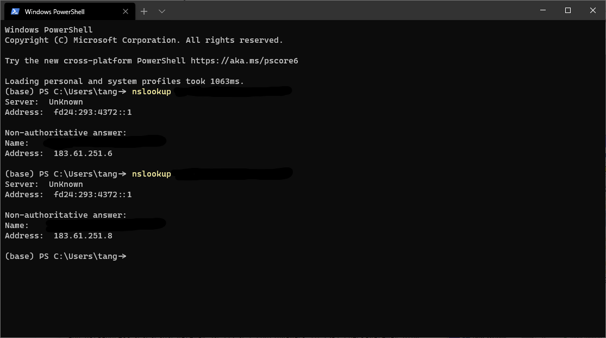

# RouterOS指定IP出口

## 前言

之前用RouterOS对多线路进行负载均衡，出口IP随机，这种情况下对于一些安全性要求较高的程序（例如：网上银行）可能会报错，因此需要对指定的数据指定出口。

## 网络环境


上面China Telecom共分得两个IP Address

## 多线路负载均衡


在开始之前，先假定你已经配置好了双线路的Mangle规则以及PCC负载均衡。指定IP出口需要在此基础上再添加两条prerouting和一条output规则

## 指定出口

首先我们要查明目的IP地址或者IP段



例如在这种情况，看到所有的服务器都在183.61.251.0/24这个C段

我们的LAN口已经用网桥进行桥接，名称为bridge1

根据ROS的Wiki，开始添加规则


```shell
/ ip firewall mangle
add chain=prerouting connection-mark=no-mark action=mark-connection new-connection-mark=mark1
```


## Reference

[1]. https://help.mikrotik.com/docs/

[2]. https://wiki.mikrotik.com/wiki/Main_Page