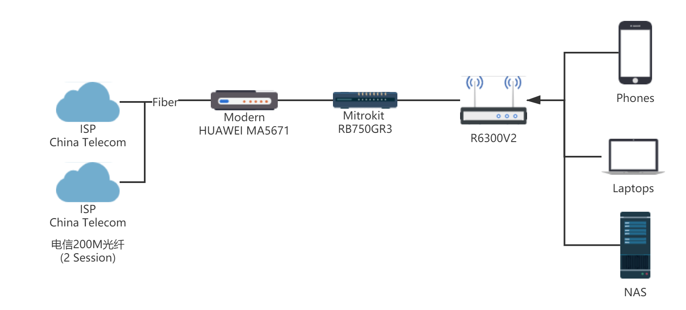
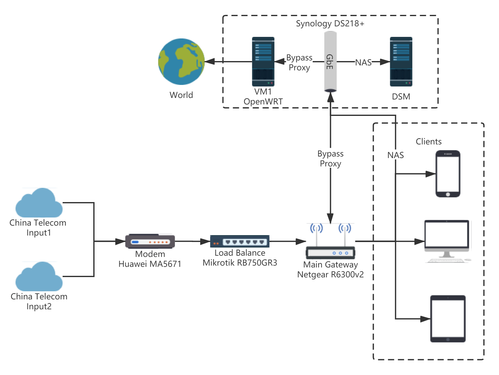
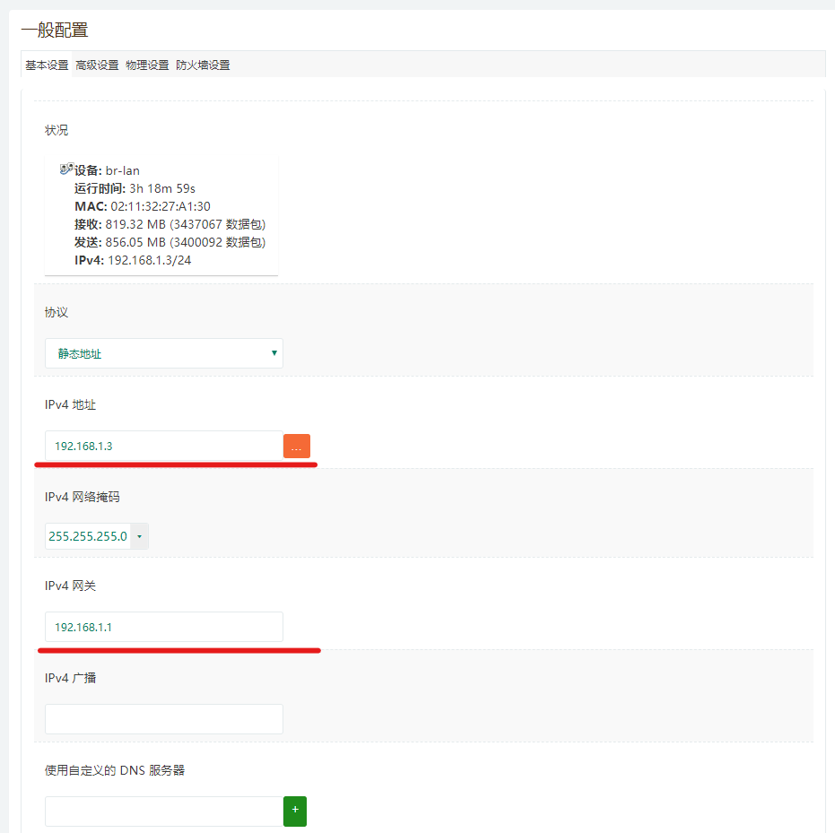
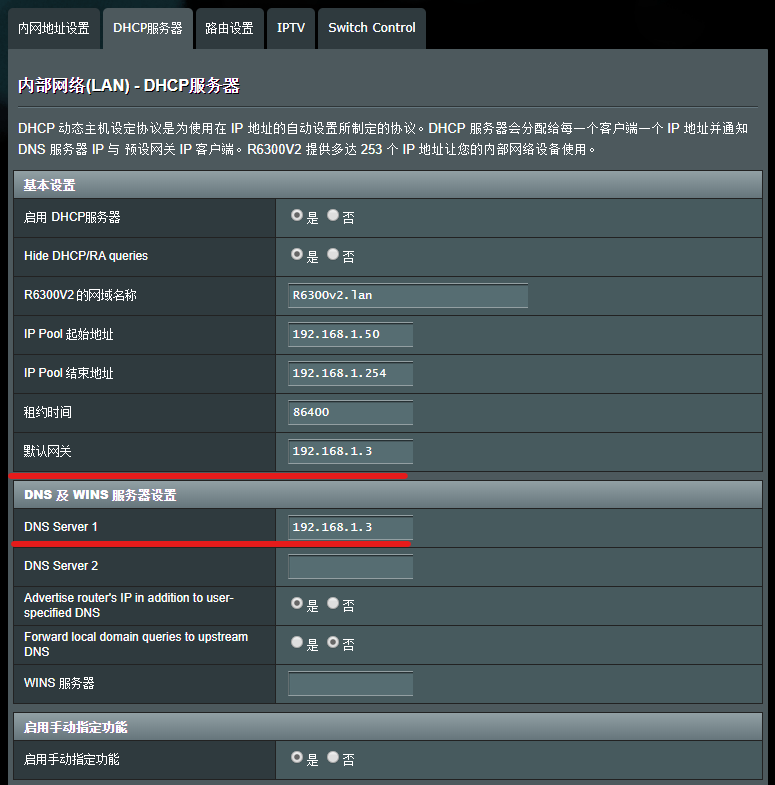
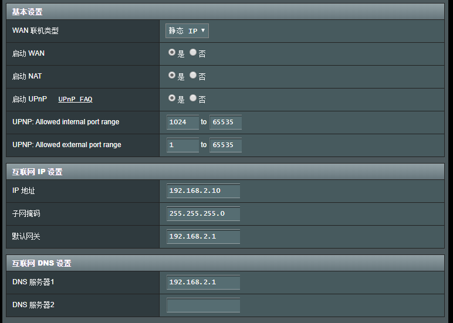
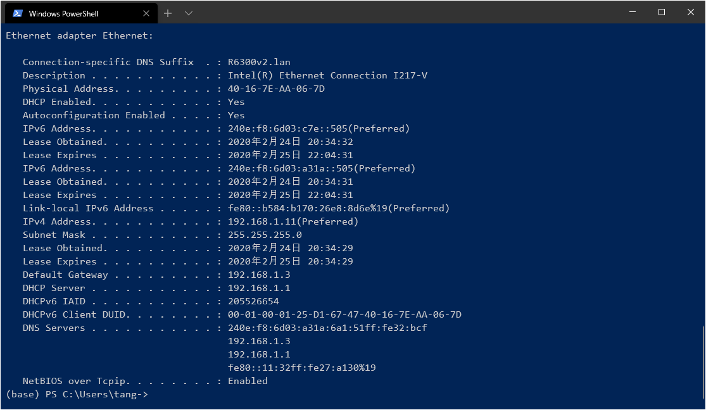

# 家庭网络升级

## 目的

原来的拓扑图由R6300v2负责DHCP，扶墙，AP一条龙，但是BCM4709扶墙真的是扶着扶着就不知道扶到哪去了，具体表现为打开网页慢，打不开网页等等，重启网页解决。

## 成品拓扑

改进后的拓扑主要将扶墙和其他花里胡哨的功能移动到了OpenWRT的旁路由上，主路由只负责AP和DHCP，同时主旁路由同时作为RB750GR3的二级路由。

RB750GR3作为软路由对两路PPPoE做负载均衡。

Netgear作为主路由，负责无线和DHCP功能。

OpenWRT作为旁路由，负责各种花里胡哨的功能。

|          | IP                               |
| -------- | -------------------------------- |
| 光猫     | 192.168.100.1/24                 |
| RB750GR3 | 192.168.100.1/24, 192.168.2.1/24 |
| Negear   | 192.168.1.1/24                   |
| OpenWRT  | 192.168.1.3/24                   |

## 旁路由设置

首先安装好LEDE（安装步骤略）

登入控制网页，接口处除LAN外全部删除

进入LAN设置，IPv4地址天读写旁路由IP，网关填写主路由IP，并且关闭DHCP

## 主路由设置

在R6300v2的LAN设置中，指定默认网关和DNS为OpenWRT的IP

WAN设置中按照正常设置即可

## Windows下获取的信息

