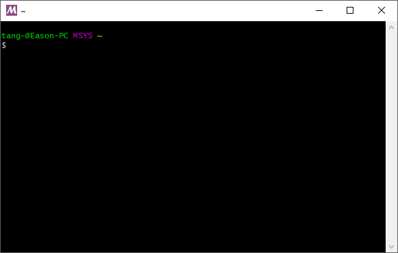
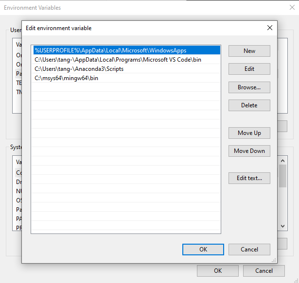
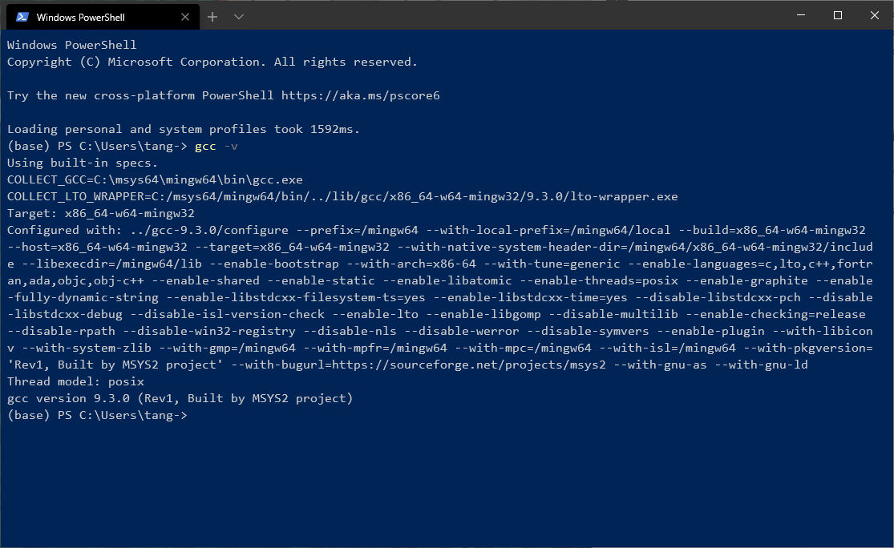
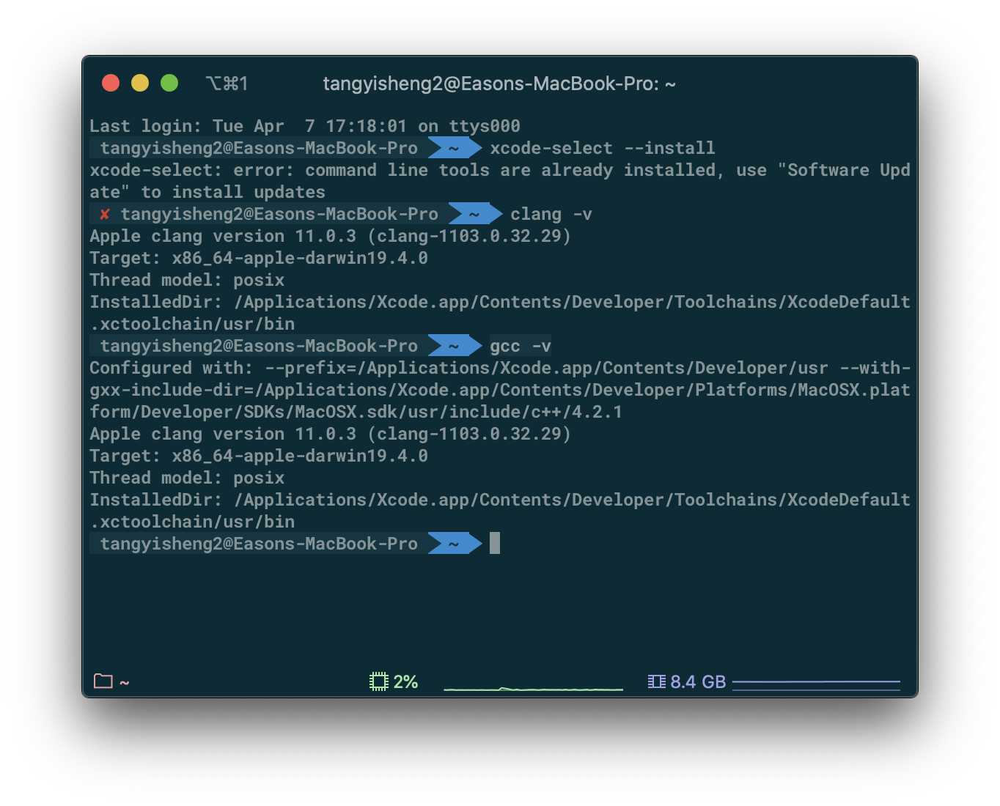
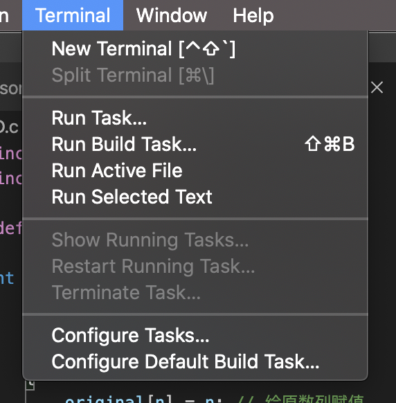
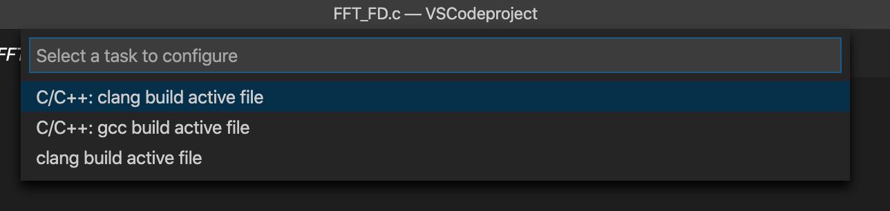
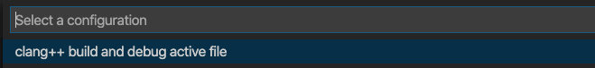
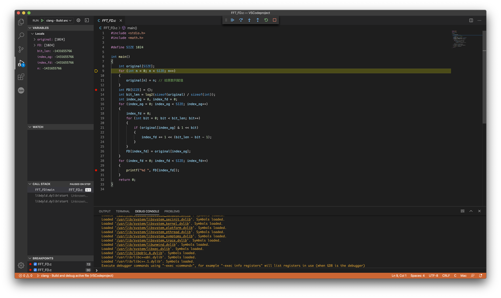

Win/Mac VScode使用配置使用C语言编写环境

# 前言

因为博客炸掉了所以慢慢补坑，加上最近因为学校课程的原因还是要用回C语言编程，所以还是记录一下VSCode的配置。

因为是笔记性质的所以不会写到特别详细，只会记录重要的步骤

Win下使用gcc + gdb环境

Mac下使用clang + llvm环境

# Windows配置

Windows配置下我们使用gcc进行编译，gdb进行debug

先下载Msys2：[msys2.org](https://www.msys2.org/)

然后换源：[USTC-Mirror](https://mirrors.ustc.edu.cn/)（三网+CERNET），[Tuna.Tsinghua-Mirror](https://mirrors.tuna.tsinghua.edu.cn/)（CERNET）



## 安装软件

```shell
pacman -Sy # 更新软件源
pacman -S mingw64/mingw-w64-x86_64-gcc # 安装GCC
pacman -S mingw64/mingw-w64-x86_64-gdb # 安装GDB
```

## 配置环境变量

在系统属性 - 高级 - 环境变量 - PATH中新增下面行

```
C:\msys64\mingw64\bin
```



## 检查环境变量配置

打开Terminal输入

```powershell
gcc -v
```

如果有输出则说明配置成功



# MacOS 配置

## 安装developer tools

打开terminal，输入

```shell
xcode-select --install
clang -v
gcc -v
```

有输出即表示安装完成



# 配置Vscode

此部分Mac和Windows操作顺序相同，只是配置文件内容略有修改。

## 创建编译配置

在 Terminal - Configure Tasks…下面的弹出窗口选择gcc build active file，随后程序





随后会在当前目录的.vscode文件夹中自动生成tasks.json，这里贴入配置如下，前两个tasks适用于windows，后面的task适用于MacOS

```json
// Available variables which can be used inside of strings.
// ${workspaceRoot}: the root folder of the team        
// ${file}: the current opened file                     
// ${fileBasename}: the current opened file's basename 
// ${fileDirname}: the current opened file's dirname    
// ${fileExtname}: the current opened file's extension  
// ${cwd}: the current working directory of the spawned process
{
    "version": "2.0.0",
    "tasks": [
        {
            "label": "build",
            "type": "shell",
            "group": {
                "kind": "build",
                "isDefault": true
            },
            "presentation": {
                "echo": true,
                "reveal": "always",
                "focus": false,
                "panel": "shared"
            },
            "windows": {
                "command": "g++",
                "args": [
                    "-ggdb",
                    "\"${file}\"",
                    "--std=c++11",
                    "-o",
                    "\"${fileDirname}\\bin\\${fileBasenameNoExtension}.exe\""
                ]
            }
        },
        {
            "label": "build_OJ",
            "type": "shell",
            "group": {
                "kind": "build",
                "isDefault": true
            },
            "presentation": {
                "echo": true,
                "reveal": "always",
                "focus": false,
                "panel": "shared"
            },
            "windows": {
                "command": "gcc",
                "args": [
                    "-ggdb",
                    "-DONLINE_JUDGE",
                    "-w",
                    "-fmax-errors=3",
                    "-std=c11",
                    "\"${file}\"",
                    "-o",
                    "\"${fileDirname}\\bin\\${fileBasenameNoExtension}.exe\""
                ]
            }
        },
        {
            "type": "shell",
            "label": "clang build active file",
            "command": "/usr/bin/gcc",
            "args": [
                "-std=c11",
                "-g",
                "${file}",
                "-o",
                "${fileDirname}/${fileBasenameNoExtension}"
            ],
            "options": {
                "cwd": "${workspaceFolder}"
            },
            "problemMatcher": [
                "$gcc"
            ],
            "group": {
                "kind": "build",
                "isDefault": true
            }
        }
    ]
}
```

## 创建调试配置

选择Run - Add configuration…，选择build and debug active file



随后会在当前目录的.vscode文件夹中自动生成launch.json，这里贴入配置如下：

```json
// Available variables which can be used inside of strings.
// ${workspaceRoot}: the root folder of the team        
// ${file}: the current opened file                     
// ${fileBasename}: the current opened file's basename 
// ${fileDirname}: the current opened file's dirname    
// ${fileExtname}: the current opened file's extension  
// ${cwd}: the current working directory of the spawned process
{
    "version": "0.2.0",
    "configurations": [
        {
            "name": "(gdb) Launch",
            "preLaunchTask": "build",
            "type": "cppdbg",
            "request": "launch",
            "program": "${fileDirname}/bin/${fileBasenameNoExtension}.exe",
            "args": [],
            "stopAtEntry": true,
            "cwd": "${workspaceFolder}",
            "environment": [],
            "externalConsole": false, //Debug时打开新的控制台
            "MIMode": "gdb",
            "miDebuggerPath": "C:/msys64/mingw64/bin/gdb.exe", // GDB的路径，注意替换成自己的路径
            "setupCommands": [
                {
                    "description": "Enable pretty-printing for gdb",
                    "text": "-enable-pretty-printing",
                    "ignoreFailures": true
                }
            ]
        },
        {
            "name": "(gdb) Launch for OJ",
            "preLaunchTask": "build_OJ",
            "type": "cppdbg",
            "request": "launch",
            "program": "${fileDirname}/bin/${fileBasenameNoExtension}.exe",
            "args": [],
            "stopAtEntry": true,
            "cwd": "${workspaceFolder}",
            "environment": [],
            "externalConsole": false, //Debug时打开新的控制台
            "MIMode": "gdb",
            "miDebuggerPath": "C:/msys64/mingw64/bin/gdb.exe", // GDB的路径，注意替换成自己的路径
            "setupCommands": [
                {
                    "description": "Enable pretty-printing for gdb",
                    "text": "-enable-pretty-printing",
                    "ignoreFailures": true
                }
            ]
        },
        {
            "name": "clang - Build and debug active file",
            "type": "cppdbg",
            "request": "launch",
            "program": "${fileDirname}/${fileBasenameNoExtension}",
            "args": [],
            "stopAtEntry": true,
            "cwd": "${workspaceFolder}",
            "environment": [],
            "externalConsole": false,
            "MIMode": "lldb",
            "preLaunchTask": "clang build active file"
        }
    ]
}
```

# Enjoy

随后即可进行正常的debug操作



# Referrence：

1. [Using Clang in Visual Studio Code](https://code.visualstudio.com/docs/cpp/config-clang-mac)
2. [Using GCC with MinGW](https://code.visualstudio.com/docs/cpp/config-mingw)
3. [本人以前的github repo]([VSCode-config](https://github.com/tangyisheng2/VSCode-config))