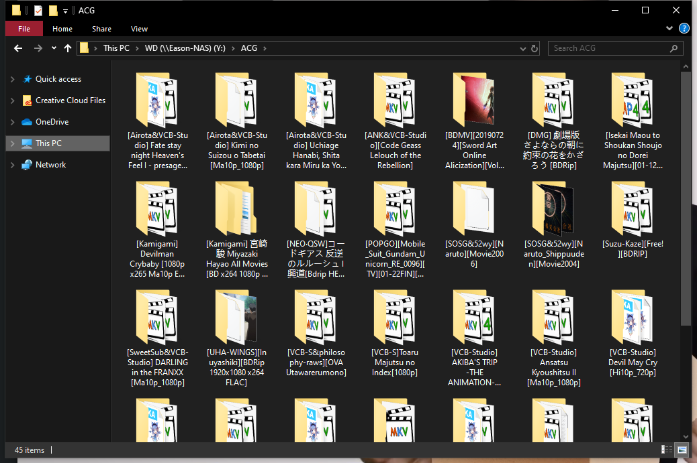
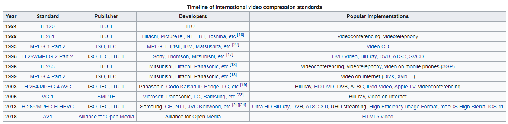
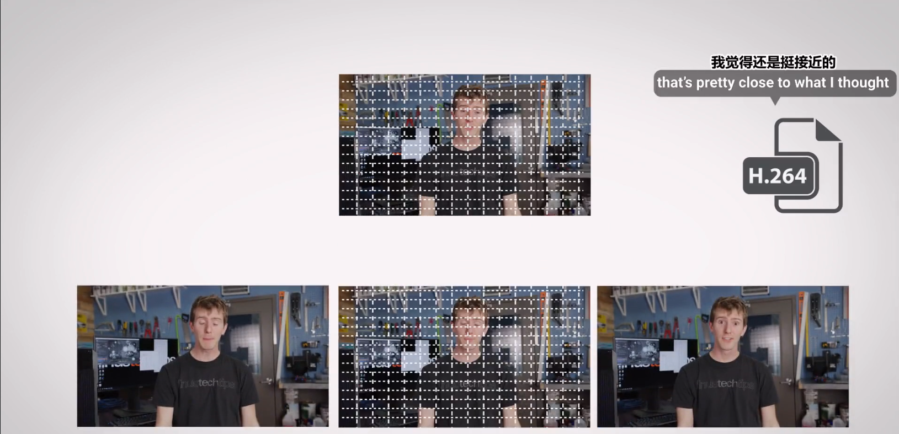
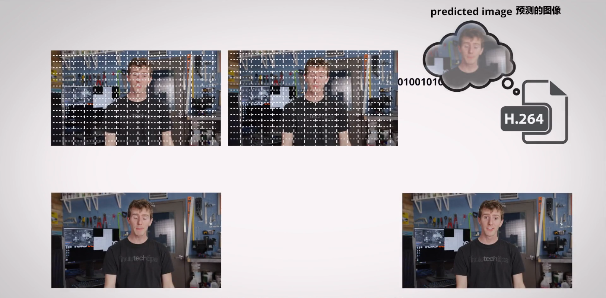
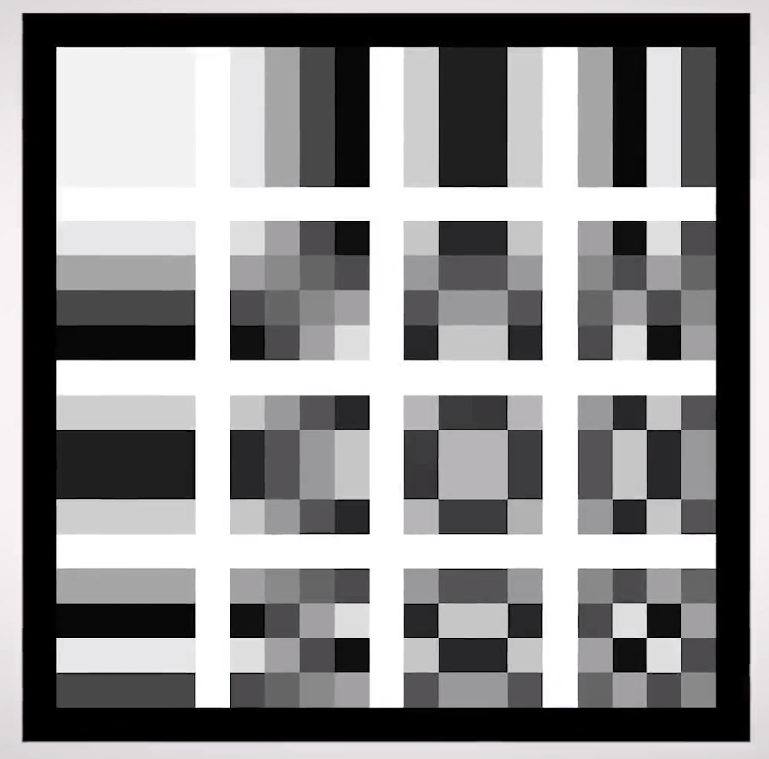
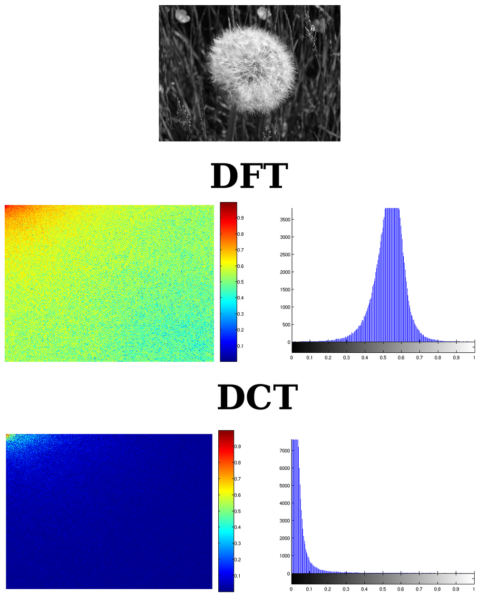
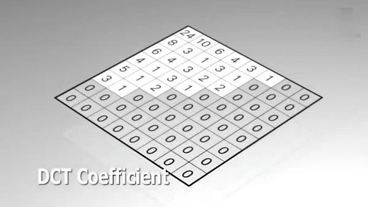
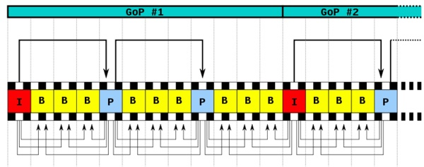

# 走进视频格式

经常看在电脑看欧美大片或者二刺螈动画的你，肯定下载过不少视频文件，那么你知道这些.MP4, .MOV, .MKV, .AV I 后缀名的的前世今生吗？

首先为了避免混淆，需要提醒的是你在文件名后面见到的拓展名（如.MP4, .MKV)，通常是指定这些文件的封装容器格式(container format) [1]，事实上编码格式(coding format) 比容器格式多得多得多[2]，同样的封装格式中可能用到不同的视频解编码器(codec) 。

那么视频解编码器(codec)又是什么呢？

事实上大多数的数字视频都或多或少的被压缩了。视频解编码器(codec) 便是将源文件通过特定的算法压缩成可以存储在数字介质中的含有特定编码格式(Video coding format) 的数据，或者反其道而行之将压缩过后的源文件回复成（近似）原始的视频进行播放。

这里需要在强调一下，虽然视频编码格式(Video coding format) 有时候被指代成视频解编码器(codec) 但是两者之间其实是有概念上的不同的。视频编码格式(Video coding format) 通常以规格(specifications) 来进行描述，而编码器(codec) 是指硬件或软件上的对数据以给定的规格(specifications)进行编码或解码的实现(implementation)。

看起来就有点像C语言和GCC之间的区别。

# H.264

### H.264简述

H.264不再将视频中的每一帧单独储存，而是将视频分成256像素的一个个宏块，通过其他宏块或者前几帧图片对随后的每个宏块图像进行预测。

将预测出的宏块图像和实际的宏块图像进行对比，计算出差值，作为残差。

随后将残差与16个棋盘式的标准图像进行对比，计算每个标准图形对残差锁贡献的权重并存储起来。至于右下角的比较高频（码率较高）的图形，由于占用的存储空间较多则会被抛弃。

当然，这还没完，H.264对残差数据做DCT以进一步压缩数据。

DCT-II的公式
$$
X_{k}=\sum_{n=0}^{N-1} x_{n} \cos \left[\frac{\pi}{N}\left(n+\frac{1}{2}\right) k\right] \quad k=0, \ldots, N-1
$$

DCT是与傅里叶变换相关的一种变换（赞美傅里叶），相比DFT，经过DCT变换后的信号能量多数分布在变换后的低频部分。而且当信号具有接近马尔可夫过程的统计特性时，离散余弦变换的去相关性接近于K-L变换（Karhunen-Loève变换——它具有最优的去相关性）的性能。[4]

去掉关联数据后，我们就可以进一步进行压缩了。

### CABAC

事实上，H.264非常善于预测，并且包含一个滤波器减少辣鸡视频中出现的色块。

H.264中许多参数是可以由使用者自行设置的，码率越高，能保留的细节（高频）部分也就越多，下面会稍微展开讲一下。

### Encoding Mode（rc，ratecontrol，码率控制方法）:

ABR: Average Bit Rate,指定一个平均码率。x264 会试图让整部视频的平均码率达到你的给定值。如果视频前后编码复杂度相差很大，那么码率的时间分配效果就很差，尤其是到了结尾，为了达到预定的码率值，x264 经常不得不采用过高/过低的码率。所以一般不推荐这个模式。Const quantizer：cq 模式，固定量化模式。所有 P 帧（下文有讲）采用一个固定的Quantizer。Quantizer, 量化，是一种衡量图像压缩程度的方法，用 0-69 的浮点数表示，0 为无损。图像被压缩的越多，量化值越大，码率越低，注意量化值不一定代表目视质量，比如说一个纯色的图像可以以很高的量化值被量化，占用的体积很小，而一个很复杂的图像就算量化值不高，但是压缩后观感也可能很差。如下图左上角的纯色方块和右下角的含很多高频分量的方块，前者可以在保证目视质量的情况下使用很高的量化值，而后者即便是使用较低的量化值也可能造成目视质量的显著下降。

I 帧和 B 帧的平均 quantizer 由 ipratio 和 pbratio 决定，这个后续会说。因为 quantizer 不能够较好的体现质量，所以这个模式一般由下文的 Const Quality 模式替代。就算不用 cqp 模式，quantizer（量化）这个概念依旧在编码中存在，只不过编码器可以智能的浮动 qp 值。
Const Quality/Const Ratefactor，crf 模式，固定质量模式。x264 用一种结合人心理学，估算出来的值，来衡量视频的目测质量，这就是 rf（ratefactor），用浮点数表示，0 为无损，越高质量越差。crf 就是在视频前后采
用恒定的 rf，从而使得视频前后的目测质量几乎一致。crf 模式下，码率的时间分配效果是最理想的，也是最常用的模式。
2pass/3pass 模式：也是指定平均码率，不过通过多次编码（第一次预编码一般是以很快的速度）来先衡量视频前后编码复杂度，从而优化码率的时间分配。前面编码输出 stats 文件表示记录，后面编码读取 stats 文件以得
知前后编码复杂度。如果对码率/体积有要求，一般更推荐花更多时间走 2pass 模式，而不是直接用 abr，也不要去用 crf 碰运气希望出来的体积正好达到要求。 Npass 的终极目的是，让出来的视频接近 crf 模式。所以对体积没有要求的前提下，优先使用 crf 模式而不是 Npass。[3]

上文也有提到IBP帧，而这又引出了IDR帧和GOP区间，下面稍微做展开说明

### IBP帧相关知识

视频压缩的过程中，对于一段时间内相似的帧，采用记录第一张，后续几张只记录和第一张的区别，这种想法是很自然的。由此引申出两种帧：
I 帧(Independent Frame)，独立编码的帧。I 帧相当于记录一张 jpg；一般常见于一个场景开头。后续的帧就需要依赖 I 帧；
P 帧(Predictive Frame)，需要依赖其他帧来编码的类型。P 帧需要参照在它之前的 I 帧或者其他的 P 帧，因为它只记录差别，所以对于那种前后差别很小甚至没有的帧，使用 P 帧编码能极大地减少体积。
MPEG2 之后，引入了第三种帧：
B 帧(Bi-directional Frame)，双向预测帧。B 帧跟 P 帧类似，都是需要参照别的帧，区别在于 B 帧需要参照它后面的帧，B 帧的记录和预测方式也做了调整，使得 B 帧的预测方式更灵活，对付高度静态规律的场景可以更有效的降低体积。

下图是一种IBP帧的排列方式

视频开头一定是I帧。

I 帧中，有一类特殊的 I 帧，叫做 IDR 帧。IDR 帧的性质是，比如第 1000 帧是 IDR 帧，那么这一帧相当于一个分水岭，从 1001 帧开始，所有的帧都不能再参照 1000 帧之前的帧。在 closed GOP 规定下，0~999 帧也不允许参照这个 IDR 帧以及之后的帧。等于说 IDR 帧将视频分割成两个独立的部分：前面的（closed GOP 规定下）不能参照后面的，后面的不能参照前面的。
这个性质在播放的时候额外有用：如果我直接从第 1000 帧开始播放，我可以毫无问题的播放下去，因为我不需要参照 1000 帧之前的内容完成解码。我从开头播放，直到 999 帧的时候，我都不需要参照 1000 帧及它后面的东西；1000 帧之后的数据都损坏了，0~999 帧也能正常播放。
IDR 的全称叫做 Instantaneous Decoder Refresh，意思是，解码到当前帧，解码器就可以把缓存全清了——之前的所有帧信息都没用了；后续帧不会再去参照它们。
视频开头的 I 帧一定是 IDR 帧。
有时候，我们用 I 帧表示 IDR 帧，i 帧表示非 IDR 的 I 帧。这种场合下，I 帧和 i 帧都是 independent frame，区别在是否是 IDR。
两个 IDR 帧之间的区间，从一个 IDR 帧开始，到下一个 IDR 前的帧结束，叫做 IDR 区间，又叫做 GOP 区间。closedGOP 设定下，GOP 区间可以看做是独立的一段视频：它里面的所有帧，都不需要参照任何区间之外的东西，只要一个 GOP 区间是齐全的，区间里面所有的帧都能被解码。我们平时看的视频就是多段 GOP 区间连接起来的。
在我们拖动进度条的时候，为啥有时候会卡顿，或者拖不准呢？其实是播放器干了这些事：

1. 计算你拖动进度条的时间，找出它应该是哪一帧，假设为 N；
2. 通过搜索视频索引信息，找出 N 帧前面最近的一个 IDR 帧，假设为 M(M<=N)。很显然，M 和 N 同属于一个GOP 区间，这个区间开头的帧是 M；
3. 如果你的播放器设置了快速索引，视频将直接从 M 帧开始播放，因为 M 帧是 IDR，它不需要参照任何帧，所以立刻可以开始播放。这是为啥你会发现开始的地方总是在之前一点；
4. 否则，如果你的播放器设置了精确索引，解码器会从 M 帧一直开始解码，解码到 N 帧，然后显示 N 帧的画面，并继续播放。
当 N-M 比较大的时候，播放器可能需要先解码几百甚至上千帧，才能继续播放。如果视频允许很长的 GOP 区间，这个视频在播放的时候，拖动进度条就特容易卡顿。

# X264的后续

HEVC

VP8/VP9：版权专利

## 视频容器

MP4/M4V

MKV

MOV

FLV/F4V

# Reference

1. https://en.wikipedia.org/wiki/Audio_Video_Interleave

2. https://en.wikipedia.org/wiki/Video_coding_format#History
3. [https://vcb-s.nmm-hd.org/Dark%20Shrine/%5BVCB-Studio%5D%5B%E6%95%99%E7%A8%8B09%5Dx264%E5%8F%82%E6%95%B0%E8%AE%BE%E7%BD%AE/%5BVCB-Studio%5D%5B%E6%95%99%E7%A8%8B09%5Dx264%E5%8F%82%E6%95%B0%E8%AE%BE%E7%BD%AE.pdf](https://vcb-s.nmm-hd.org/Dark Shrine/[VCB-Studio][教程09]x264参数设置/[VCB-Studio][教程09]x264参数设置.pdf)
4. https://en.wikipedia.org/wiki/Discrete_cosine_transform