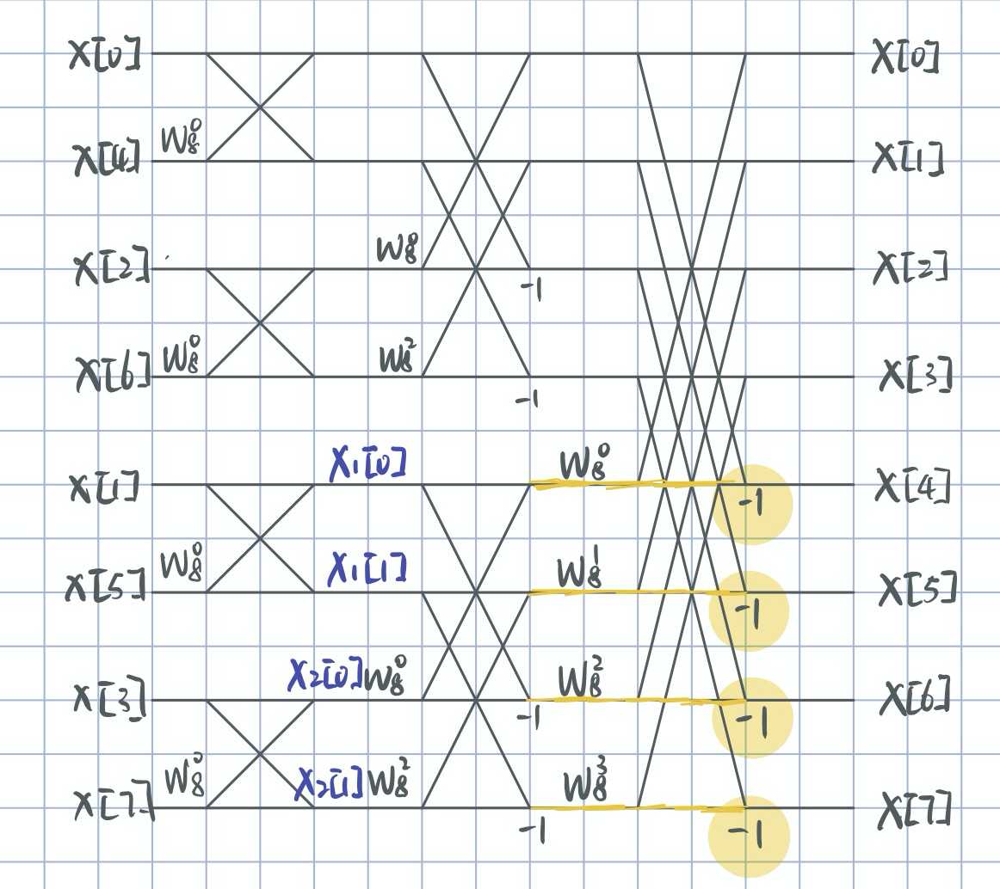

# FFT逆序算法

## 前言

最近在DSP的课程学习中接触到FFT算法，因此做简单的笔记

## FFT算法

FFT算法利用蝶形运算显著降低了运算的次数，其流程图如下。在FFT中，我们需要确定两个东西，一个是旋转因子$W^m_ん$，一个是左边输入的序列



## 旋转因子$W^n_N$

同样以上图为例，求$X_1[0]$到$X_2[1]$的4条支路的旋转因子。

根据书本上的推导，对于$X_2[m]$的支路，在计算时我们要乘一个旋转因子$W^m_N$，旋转因子$W^m_N$的确定：

- m为奇子序列中的index
- N为当前子序列的输入个数
- 最后m，N同乘系数，使得N等于原序列的输入个数

## FFT逆序算法

为了进行蝶形运算，左边的输入我们进行倒位序排列。

| 倒位序 | 二进制表示 | 二进制表示 | 原序 |
| ------ | ---------- | ---------- | ---- |
| 0      | 000        | 000        | 0    |
| 4      | 100        | 001        | 1    |
| 2      | 010        | 010        | 2    |
| 6      | 110        | 011        | 3    |
| 1      | 001        | 100        | 4    |
| 5      | 101        | 101        | 5    |
| 3      | 011        | 110        | 6    |
| 7      | 111        | 111        | 7    |

算法本质上是将原序的以二进制表示的index从又向左进行重写。

### 原理以及步骤：

1. 获取程序的相关参数

   bit_len：表示元素个数说需要使用的二进制位数 $len=log_2^{arraylen}$并对结果向上取整

2. 对每个元素按位和1的移位（$1 << bit，bit = 0,1,2…bitlen-1$）相与
3. 对相与结果为真的，从最高位开始给倒序index加权重，也即是$1<<(bitlen -bit-1)$

###  事例：

$0=(000)_2$：按位相与结果全为0，所以0的倒序是0

$1=(001)_2$：按位相与在bit等于0时为真，其他时候为假，所以
$$
倒序index=(1<<3-0-1)\\
=2^2\\
=4
$$
$4=(100)_2$：按位相与在$bit=2$时为真，其他时候为假，所以
$$
倒序index=(1<<3-2-1)\\
=2^0\\
=1
$$

### 代码：

Clang：

```c
#include <stdio.h>
#include <math.h>

#define SIZE 16

int main()
{
    int original[SIZE] = {0, 1, 2, 3, 4, 5, 6, 7, 8, 9, 10, 11, 12, 13, 14, 15};
    int FD[SIZE] = {};
    int bit_len = log2(sizeof(original) / sizeof(int));
    int index_og = 0, index_fd = 0;
    for (index_og = 0; index_og < SIZE; index_og++)
    {
        index_fd = 0;
        for (int bit = 0; bit < bit_len; bit++)
        {
            if (original[index_og] & 1 << bit)
            {
                index_fd += 1 << (bit_len - bit - 1);
            }
        }
        FD[index_fd] = original[index_og];
    }
    for (index_fd = 0; index_fd < SIZE; index_fd++)
    {
        printf("%d ", FD[index_fd]);
    }
    return 0;
}

```

Another Version:

```c
	//求逆序数
	for (i = 0; i < SAMPLENUMBER; i++)
	{

		int reverse_seq = 0;
		for (int bit = 0; bit < bit_len; bit++)
		{
			dataI[0] = dataR[0];
			if (bit > 0)
				reverse_seq += ((i / (int)pow(2, bit)) & 0x01) * pow(2, bit_len - bit - 1);
			else
				reverse_seq += (i & 0x01) * pow(2, bit_len - 1);
		}
		dataI[reverse_seq] = dataR[i];
	}
```


Python3：

```python
#!/usr/bin/env python
# -*- encoding: utf-8 -*-
"""
@File    :   FFT_FD.py
@Contact :   tangyisheng2@sina.com
@License :   (C)Copyright 1999-2020, Tang Yisheng

@Modify Time        @Author     @Version        @Desciption
------------        -------     --------        -----------
2020/4/6 10:09     Tang        1.0             None
"""

import numpy
import math


def solve():
    original = list(range(0, 16))
    bit_len = math.ceil(math.log(len(original), 2))
    fd = numpy.zeros(len(original), dtype=int)
    for number in original:
        fd_index = 0
        for bit in range(0, bit_len):

            if number & 1 << bit:
                fd_index += 1 << (bit_len - bit - 1)
        fd[fd_index] = number
    print(fd)


if __name__ == "__main__":
    solve()

```

## 特别提醒：

1. -1的系数对应技术子序列的上一个节点的值，不要弄混（图片黄色highlight部分）

## Credits

1. 快速傅里叶变换和雷德算法：https://littleclown.github.io/study/math/number-theory/fft/fft/
2. FFT中的倒位序原理：http://blog.sina.com.cn/s/blog_154d272c90102x98p.html