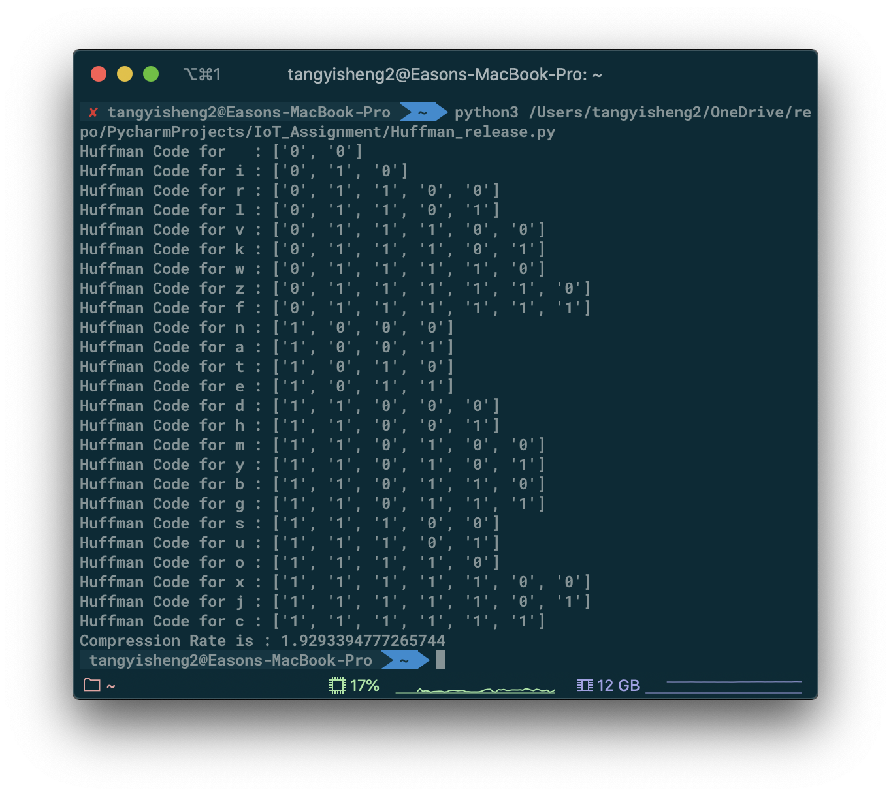

# 前言
自己真的是太菜了，连个哈夫曼树都写不好
写了一晚，原本也有参考csdn的代码，但是感觉看起来不是很看得懂，于是决定自己造轮子
轮子也造不是太好，将就看吧，日后完善

Update：代码已经更新，现在能输出哈夫曼编码了.



<!--more-->

# 代码（Updated）
```python
#!/usr/bin/env python
# -*- encoding: utf-8 -*-
"""
@File    :   Huffman_release.py
@Contact :   tangyisheng2@sina.com
@License :   (C)Copyright 1999-2020, Tang Yisheng

@Modify Time        @Author     @Version        @Desciption
------------        -------     --------        -----------
2020/4/16 0:36     Tang        1.0             Release
"""

import collections
class Cluster:

    def __init__(self):
        """
        : 初始化类
        """
        self.count = collections.Counter()  # 词频
        self.data = str()
        self.cluster = {}  # cluster
        self.tree = {}  # 哈夫曼树

    def input_data(self, string):
        """
        输入数据处理
        :param string: 輸入
        :return: 词频输出以dict格式
        """
        self.data = "i am a student i study iot subject in guangzhou university i like the subject and will work hard " \
                    "and do my best to achieve a high score in final examination "
        self.count = self.get_letter_freq()

    def get_letter_freq(self):
        """
        获取词频
        :return: 词频dict
        """
        count = collections.Counter()
        for letter in self.data:
            count[letter] += 1
        for letter in count:
            tmp_node = Node()
            tmp_node.name = letter
            tmp_node.weight = count[letter]
            self.cluster.update({tmp_node.name: tmp_node})
        return count

    def get_min_node(self):
        """
        获取weight最小的节点
        :return: dict 最小节点的key, value, 以及node本身
        """
        min_key = min(self.count, key=self.count.get)
        min_value = self.count.pop(min_key)
        temp = self.cluster.pop(min_key)  # 将cluster中相同元素排除
        return {"key": min_key, "value": min_value, "poped_node": temp}

    def add_to_cluster(self, node_to_add):
        """
        添加Node到cluster中
        :param node_to_add: 要添加的节点
        :return:
        """

        self.count.update({node_to_add.name: node_to_add.weight})
        self.tree.update({node_to_add.name: node_to_add})
        pass

    def combine_once(self):
        """
        合并最小的两个节点
        :return:
        """
        node_left = Node()
        data = self.get_min_node()
        node_left.create_node(data)
        node_right = Node()
        data = self.get_min_node()
        node_right.create_node(data)
        combined_node = Node()
        combined_node.combine_node(node_left, node_right)
        self.count.update({combined_node.name: combined_node.weight})
        return combined_node


class Node:
    def __init__(self):
        """
        类初始化
        """
        self.lchild = None
        self.rchild = None
        self.name = str()
        self.weight = 0
        self.code = None

    def combine_node(self, node_a, node_b):
        """
        左右孩子合并成一个大节点
        :param node_a: 左孩子
        :param node_b: 有孩子
        :return:
        """
        self.lchild = node_a
        self.rchild = node_b
        self.weight = node_a.weight + node_b.weight
        self.name = f'{node_a.name}{node_b.name}'
        # return self

    def create_node(self, node_data: dict):
        """
        创建节点
        :param node_data:
        :return:
        """
        self.name = node_data['key']
        self.weight = node_data['value']
        self.lchild = node_data['poped_node'].lchild  # 传递孩子
        self.rchild = node_data['poped_node'].rchild


def make_codec(cur_node: Node, encode):
    """
    深度优先遍历分配编码
    :param cur_node: 当前节点
    :param encode: 当前节点的编码值
    :return:
    """
    if cur_node is not None:
        # stack.append(str(direction))

        if encode is None:
            encode = []
        else:
            cur_node.code = encode

        make_codec(cur_node.lchild, encode + ['0'])
        make_codec(cur_node.rchild, encode + ['1'])


def print_codec(cur_node: Node, encode: dict):
    """
    打印哈夫曼编码
    :param encode:
    :param cur_node:
    :return:
    """

    if cur_node is not None:
        if cur_node.name.__len__() == 1:
            print(f'{"Huffman Code for "}{cur_node.name}{" : "}{cur_node.code}')
            encode.update({cur_node.name: cur_node})
        print_codec(cur_node.lchild, encode)
        print_codec(cur_node.rchild, encode)
    return encode


def caculate_rate(cluster: Cluster, codec: dict):
    single_bit_len = 8
    before_codec_len = single_bit_len * cluster.data.__len__()

    after_codec_len = 0
    for letter in cluster.data:
        after_codec_len += codec[letter].code.__len__()
    rate = before_codec_len / after_codec_len
    return rate


if __name__ == "__main__":
    cluster1 = Cluster()
    cluster1.input_data(None)
    tree = Node()
    while cluster1.cluster.__len__() > 1:
        node = cluster1.combine_once()
        cluster1.cluster.update({node.name: node})

    key = list(cluster1.cluster.keys())
    tree = cluster1.cluster[key[0]]
    make_codec(tree, [])  # 从左边节点开始遍历
    huffman_codec = print_codec(tree, {})
    print(f'{"Compression Rate is : "}{caculate_rate(cluster1,huffman_codec)}')

```