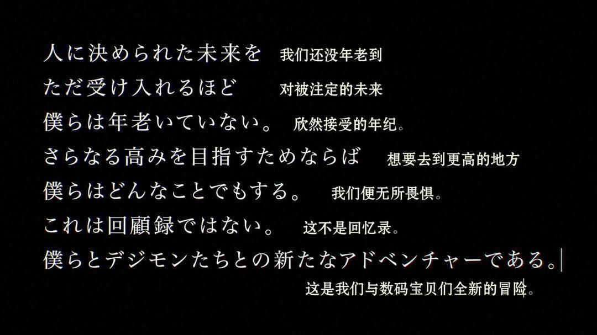
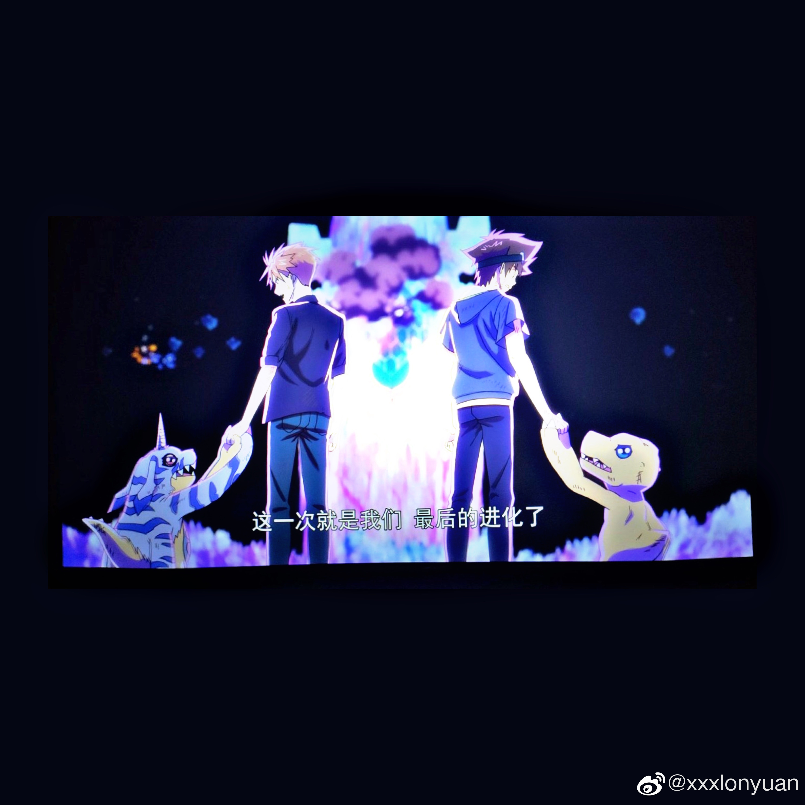
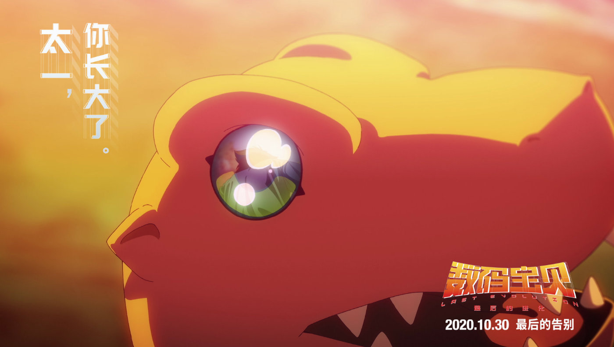
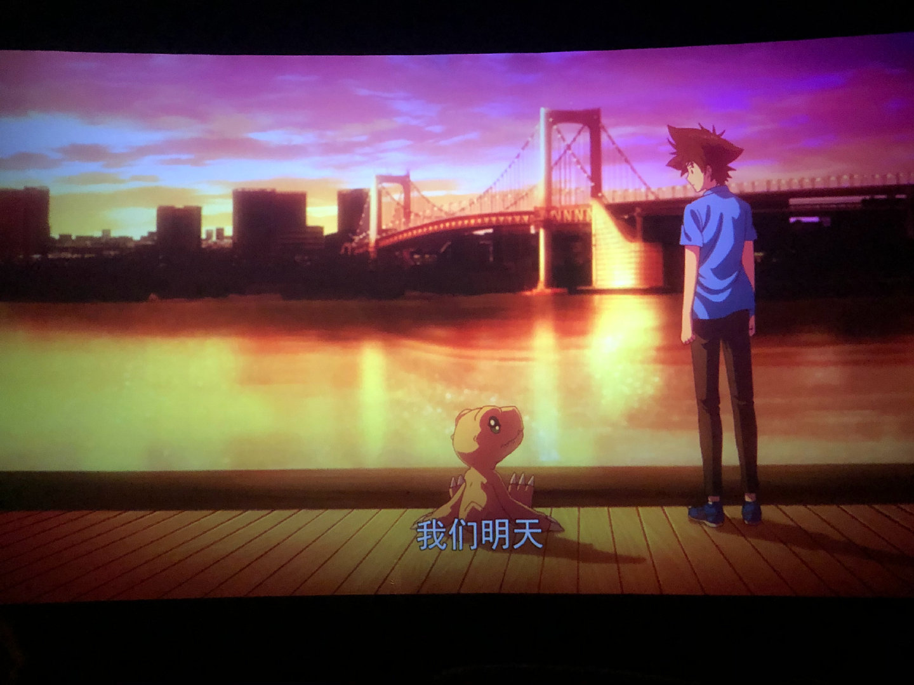
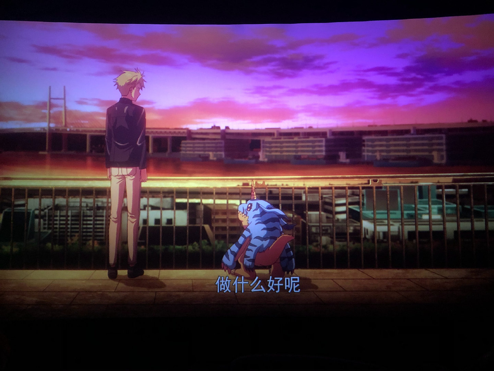

# Digimon Last Evolution——高兴买票，「失望」而归

今天是10月30号，《数码宝贝》20周年纪念作大陆上映的日子，为了情怀，第一天上映就去去电影院买了票，不得不说现在以一个即将毕业的大四老狗的身份来看这部剧场版，虽然制作，音乐都非常满意（剧情一般般吧），看完内心却是有点五味杂陈。

Last Evolution作为一款情怀向的作品，卖情怀卖的倒是简单直接，非常爽快：开场简单交代背景，在世界各地都看到了极光，紧接着一只鹦鹉兽闯入了三次元，主角登场。随后，一段炫酷的战斗，《brave heart》出来了，战斗过后紧接着是光叔的《butter-fly》OP。虽然我已经许久没有看过《数码宝贝》，也没办法快速叫出每一只数码宝贝的名字，但是音乐一响，嗯，对味儿了。

OP过后太一和大和回到了大学，太一在为他的毕业论文发愁，太和则是考虑读研的事情。Umm？这不就是我正在考虑的事情么？每天在思考毕业设计怎么写，一边在担心申请学校的事情。请问大四老狗究竟做错了什么？？？脚本为什么要把大四老狗拉出来杀？？？？

说回剧中，太一和大和在面临毕业以及人生的选择的时候，得知数码宝贝选择和他们在一起是因为儿童时期他们拥有着无限的可能性，然而随着年龄增长，数码宝贝将不得不最终与他们分开，而此时分别的倒计时已经开始了。

反派制造了人工数码宝贝，打算将被选召的孩子的意识封印在数码空间中，因为只要不长大，孩子们就能永远的与数码宝贝在一起了。尽管让数码宝贝战斗只会加快分别时刻的来临，太一和大和还是决定战斗。最后大战中，太一吹响嘉尔身上的哨来唤醒迷失的*众人，这时候闪过了一个光丘事件*的*镜头，小太一搂着嘉尔，随后许多蝴蝶布满屏幕，应该是致敬光叔吧。

最后孩子们被拯救了，亚古兽和加布兽消失了。

Last Evolution虽然是动画片，但是看下来却挺现实的，现实的有点沉重。

每个人都会成长，成长可能会失去许多东西，也伴随着许多困难：可能是小时候的童真，可能是面对抉择的时候不能“我全都要”的无奈，也有可能是论文写不出，项目没进展的无能狂怒，但是人不能将自己围蔽在“不想长大”的“舒适圈”中，唯一能做的，可能也就只有接受自己的平庸，然后再重新迈步向前吧。

「太一，已经长大了呢」

「我们明天，做什么好呢？」

「…...」

虽然已经有预感是Bad Ending了，但是真正看到的时候心里还是咯噔一下，希望有反转，直到staff表放完之后，在场许多人和我一样，坐在座位上静静等了半分钟，然而并没有彩蛋。这一刻，爷的青春结束了，デジモンアドベンチャー（1999-2020）感谢陪伴。

“Making a big life change is pretty scary. But, know what’s scarier? Regret.”  

『要做重大的改變都會令人畏懼。但，你知道什麼更令人畏懼嗎？後悔。』

-Zig Ziglar

无限大な梦のあとの　やるせない世の中じゃ

そうさ常识　はずれも悪くはないかな

Stayしそうなイメージを染めた　ぎこちない翼でも

きっと飞べるさ　On My Love