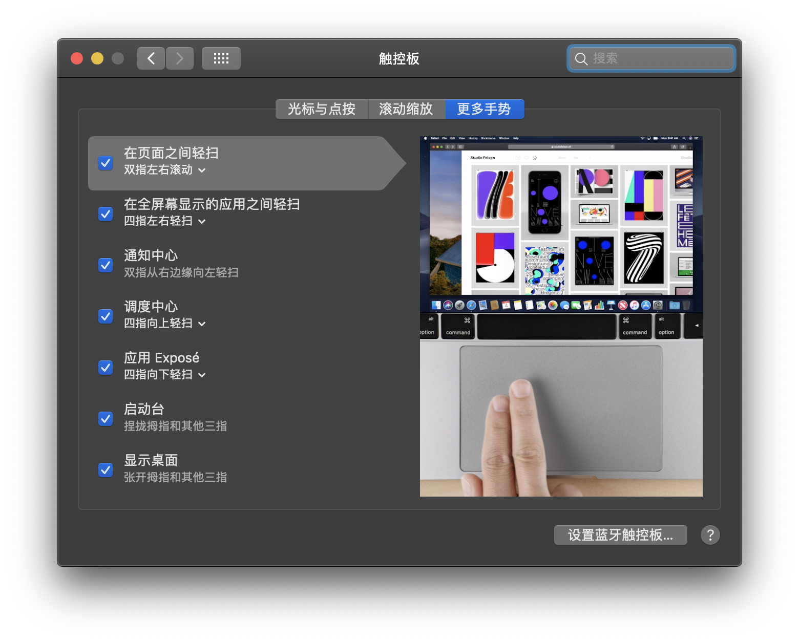

来自10年WIndows用户的MacBook Pro使用一周体验

## 前言

不知不觉间，使用电脑已经有10多年了。家里第一台电脑购于1998年，当时对配置啥的都不懂，只记得运行的是Windows98，64MB的RAM，电话线拨号上网，仅此而已，它陪伴我度过了小学的美好的童年时光，仍然记得我玩的第一个第一个游戏便是冰封王座，之后便是Half-Life。虽然电脑配置烂，但是确实是童年的一段美好时光。

后来应该是初中的时候，家里又买了联想的品牌机，自己也开始对电脑开始感兴趣，开始每周开始追电脑报的报纸。这台电脑的配置我记得很清楚是AMD 羿龙X4 9150e，ATI HD 2600 Pro，2G RAM，500G西数蓝盘。这台机子后来加成了HD 6670还是6770，内存4G。原本配的是Windows Vista，后来自己升级成了Windows 7。

高考完，在用平时积攒下来的存款换了台式电脑，原来的配置是i7-4790k+8G+GTX 780ti，后来折腾着折腾着把内存加到了16G，显卡在过保后英勇牺牲，升级成了1070。

大学后，通过二手弄来一台i7-6700k+16G+1063主机，当时正值矿热，就把1063二手卖了，过了大概几个月之后，又捡到一个便宜的狗东在保1070，感觉还行。

笔记本的部分是2016年双11在狗东购入的ThinkPad S2 (2016)丐版，4500块钱，i5-6200U+4G RAM+192G三星CM871SSD算是真丐中丐了；但是惊喜的部分也有很多，首先是支持USB-C充电，另外配了一个Think Plus口红电源，其次是使用DDR4内存（我记得当初京东给的参数是DDR3来着），最后就是ThinkPad一致的强项键盘啦。后期花了总共700多升级了500G WD Blue SSD，额外加了条8G内存，当成上网本使用。

算着算着也快用了十多年Windows电脑了，然而Mac一直存在于我的购物单中，最近上了大学，换了iPhone XR和iPad Pro，从一位好友那里借到了一台MacBook Pro 15’短暂体验，和大家分享~

本体验纯我个人不客观主观体验，体验时间不长，很多部分体验不全，还请见谅~

## 硬件篇

先来看看机器的配置吧~18年Macbook Pro 15非定制高配

### 外观部分

MacBook Pro的外观相信各位已经在其他地方见识过了，个人觉得还是非常好看的，一体式铝合金切割，坚固的同时也非常的耐用~这里就不做过多赘述了（我的ThinkPad S2的塑料机身用久了已经有一点点的弯曲了）。

配色方面，本直男一直是挚爱深空灰，有质感，好评。

### 屏幕

MacBook Pro有着我看过最好的屏幕，Retina无论是精细度和色彩的观感都好于ThinkPad S2甚至家里的Dell U2719DS。也有试过MacBook Pro外接Dell的U2719DS使用，但是不是高分屏看字体总觉得是糊糊的，差点感觉。

Dell U2719DS

Retina显示器

### 键盘及触控板

从屏幕部分往下看是Touch Bar以及苹果每年都迭代但是每年都在键盘维修计划中的蝶式键盘以及巨无霸的触控板。

先说Touch Bar，Touch Bar部分我觉得是聊胜于无，在上面能放一些快捷键是好的，如上图就是Typora在Touch Bar上的一些快捷键，但是其中的一个问题是Touch Bar没有物理反馈，不能盲按，用一段时间之后就直接用键盘快键键了。其次这玩意简直是太容易误触了，有时候打着打着字收不自觉的放在上面就直接发生误触了，特别是Backspace按着按着就把Siri按出来了。能想到Touch Bar比较好的应用就是Final Cut Pro X拖时间轴和其他视频类软件拖进度条了。

而Touch Bar右边的Touch ID非常好用，解锁电脑，钥匙串认证，在Mac App Store氪金都可以直接Touch ID，非常好评。

接下来说说键盘，自从16款MacBook Pro苹果改模具以来，为了将MBP做薄便一直采用了蝶式键盘。从ThinkPad优秀的键盘换到苹果的蝶式键盘，对于这个蝶式键盘怎么说呢，我是觉得挺“firm”的，键程虽然短，但是按键回馈清晰，不会有一种打字软绵绵的感觉，有人敲看说敲键盘就像在敲钢板，我觉得还OK，毕竟萝卜青菜各有所爱。另外这个键盘貌似还挺容易打油的，在拍上面的照片的时候我并没有刻意的去清洁键盘，还是能看到一点点的的油光。

键盘两边是扬声器开孔，音量巨大，非常恐怖，日常用基本40%的音量就已经非常清楚了。扬声器素质在我用过的笔记本中非常不错，就算开最大音量也没有破音。据油管主Everything App Pro测试音量可以轻松达到100dB（搜索关键词Will Charging All 4 Ports Destroy the MacBook Pro?，无论从音质和音量比ThinkPad S2好出几个银河系）

再往下，触控板。巴掌大的触控板用的简直 不 要 太 爽。除了PS等对精确度要求比较高的工作，已经可以完全抛弃鼠标了。触摸板的宽度可以让你轻松够到整个屏幕区域，双指滚动、呼出通知中心，三指拖动文件，四指呼出Launcher和在不同全屏窗口之间切换都非常的好用。笔者用的ThinkPad S2触摸板比较小而且没有Windows Precision Touchpad驱动的支持所以最多只能做到三指的拖动和四指点按而已，，再加上面积所限，日常使用还是有一点点束缚的感觉。虽然MacBook Pro的触摸板很大，但是打字的时候可以安心的将你的手掌靠在触摸板上而不会发生误触。

Tip.三指拖动的开启方法:系统偏好设置-辅助功能-鼠标与触控板-右下角触控板选项-启用拖移。

真的要吹爆三指拖移，以前Windows移动文件要一只手按住触摸板然后另外一只手指小心翼翼的移动，害怕没按住松手移到别处去了。macOS没有这种问题，像手机一样直接用三根手指拖动目标就可以，不需要用一只手指按住，中途就算手离开触控板也不怕，拖移状态并不会取消，可以换个姿势接着拖。

Tip2.Mac的键盘布局和Windows的稍有出入，自己摸出来的对应大概如下所示（不全，也不完全正确）

command-alt

control-ctrl

option-windows键（显示更多选项/更详细信息）

用回Windows笔记本之后无数次想念Mac的触控板。

### 性能

MacBook Pro为了做薄，散热方面有所妥协。

CinebenchR20测试，最初冲上了Boost频率然后瞬间降频，频率基本维持在2.6G的基础频率，温度毫无意外的来到了100°大关，风扇开始全速运转。最后结果为2047pts。

硬盘速度非常不错。

### IO

IO部分是老样子了，只有4个Thunderbolt3 USB-C接口，和一个耳机孔。全部支持充电。

首先任意一个口都能充电是必须给予好评的，充电线终于不用再弯来弯去了~虽然说现在外设已经在快步向USB-C接口迈进，但是一些老式的U盘和插转换器的鼠标就无法使用了。转接线成为了必备。

但是如果你用的是苹果全家桶的话，因为有iCloud和handoff接力在，基本不需要使用数据线。传文件？AirDrop了解一下？

## 软件篇

### 系统界面

软件部分，电脑运行的是macOS Mojave，没有能吃到macOS Catalina的螃蟹还是稍有遗憾。

这是macOS的系统。上方是是一个系统级的菜单和状态栏，下方是dock，存放App快捷方式，最近打开应用程序和窗口，之间以竖线分割。dock最右边是一个“全局”的垃圾桶，不管是删App还是文件都往里面扔就对了。

最小化的窗口会放在dock的最右边（橙色框框）

最大化的窗口会直接撑满屏幕，同时状态栏和dock都会自动隐藏，相比起Windows的全屏，可以让我更加专注的工作。

双击窗口标题，则会根据窗口的内容自动调整大小，这一点和Windows的直接最大化倒是挺不一样的。

四指上划可以看到每个程序的预览窗口，左右四指滑动可以快速切换。

在触摸板上四指往里收就可以呼出Launcher，基本上你在iOS上看到的系统App都有电脑端的版本。

当然你也可以在Finder里面的应用程序找。

### 文件管理

macOS的Finder就相当于Windows下的资源管理器了，但是因为macOS和Unix以及Linux的千丝万缕般的联系，macOS的文件管理和他们也非常相似。

macOS没有Windows下面的CDE盘，打开Finder默认进入到的是用户文件夹。

如果你想进入电脑的根目录（类似Linux下的/），要在左上角菜单选择电脑才可以。

macOS是一个App导向的系统，也就是说你在Finder里面不能像windows一样新建一个word文档，而是需要打开Microsoft Word，新建文本文档，然后保存，也算是和Windows一个不同的点吧。

### 空格全局预览

特 别 好 评！

对于大部分文件，你可以直接按空格键预览内容，PPT，DOC，PDF都亲测可行。

对于无法预览的文件则会显示文件属性信息。

### Spotlight搜索

特 别 好 评！

无论是在任何界面，按下command+空格就可以启动Spotlight搜索，相当于是一个全局的搜索，非常好用。

现在Windows上也继承了相似功能，但是对于一些简单的汇率换算还是不如Spotlight来得方便。

### 截图

macOS的截图周边会带留白的透明图层，相比Windows的有窗口阴影，好评。

### 吐槽

上文说了macOS的好，那我们就来吐槽一下macOS那些蛋疼的设计。

1.macOS特有的星巴克式的“幽默”：来自Pages文稿-文件-导出为PDF（实际选项为：好、更好、最好）

（图片源自网络）

2.以及文件右键菜单中“复制”、“拷贝”及“制作替身”的选项。

第一次看到我是傻傻分不清楚

3.Finder中按回车是重命名文件而不是打开，但明明打开文件比重命名的频率高很多啊喂。（打开文件快捷键为command+O，虽然可以在设置中修改，但是这默认设置就很意义不明）。我更喜欢Windows方向键选择文件，然后回车打开的交互逻辑。

4.多屏逻辑：我实在是想不出为什么macOS在多屏状态下两个屏幕之间居然还有焦点的区分，而且有时候下方的docker并不能很好的跟随焦点的屏幕，经常要在底部乱划鼠标才能呼出。而Windows是两个屏幕都可以随时交互，也默认是两个屏幕都有任务栏可以直接打开程序，这点感觉macOS就不如Windows了。

5.苹果的中文翻译真的有点雷：访达、雷劈网桥、妙触键盘。

## 生态篇

苹果一直以优良的生态系统著称，集齐了苹果全家桶就可以召唤龙珠了（才不是）。虽然只用的短短的5天，也确实感受到了苹果全家桶的便利。

### 基础级别：iCloud云同步

首先就是苹果全家桶的云同步了，基本上数据都能无缝转移，好评。

缺点就是iCloud的￥68块2TB的订阅相比Office365贵好多（Office365家庭版找人合买一年50多还送1TB Onedrive），而且就我个人而言很难用到2TB的空间，但是200G又不够用…

因此Shut up and take me money

### 进阶版本：Handoff、AirDrop

进阶版本分享两个我最近用的很多的功能~

Handoff：Apple自家的应用大部分都支持Handoff功能，可以把苹果设备备忘录等的系统自带App中页面无缝地在其他设备打开。这个功能不一定非得有Mac，iPhone和iPad之间也可以使用。

除了“接力”页面，还可以“接力”剪切板哦~只需要在Mac上正常复制，然后到iPad中粘贴就可以了，不需要其他额外的操作。这个功能对于要截取网课上课件图片或者网页中的内容传送到iPad上面做批注都非常的有用而且好用，终于不用经其他App中转了。

同时，我们也可以直接通过macOS，直接收发短信和接听电话，不过目前对于iPhone XR/Xs/Xs Max还没有办法指定使用哪张卡发送短信，算是一个小槽点。

AirDrop

不用多说了，无线传送文件。苹果设备之间分享文件最便捷的方式了。无需WiFi链接，打开蓝牙，点开分享-隔空投送就能看到自己的设备了，对于自己的设为无需二次确认，如果是别人的设备，则需要对方进行二次确认。

### 接入其他云服务

Google Account：

首先，不知为何，Google Account一直提示鉴定失败，而iOS是没有这个问题的，非常疑惑。

登陆上Google Account之后就可以同步邮件通讯录，日历和备忘录了。至于照片可以另外下载Google Photos进行同步。

其次就是Onedrive，作为Office 365的订阅用户，附送的1TB Onedrive 空间怎么可以浪费。从Windows转到macOS一直担心Onedrive没有办法很好的兼容macOS，事实是我多虑了。幸运的是OneDrive在macOS上可以得到Windows大部分的体验~同样支持按需同步，可以节省Mac的磁盘空间。唯一的遗憾就是Office必须要在App内打开文件才可以经由OneDrive自动保存，若是直接从Finder中打开的话自动保存是关闭的。

## One more thing:

自己记录的一些最常用的快捷键

文件操作类：

复制：command-c,command-v

移动：command-c,command-option-v

删除：command-delete

应用类：

全屏幕应用：command-control-f

最小化应用：command-h

关闭窗口：command-w

删除（也就是windows下面的del）：Fn+delete（注意del和backspace的区别）

截图：

全屏幕截图：command-shift-3

高级截图：command-shift-4/5（一个选项在Touch Bar上一个在屏幕上）

截取TouchBar：command-shift-6

## 总结和碎碎念

### 优点

- Space Gray真的对我胃口
- 优秀的屏幕，巨型的触控板（点名表扬macOS的手势）
- 优秀的iCloud生态

### 缺点

- 接口只有type-c
- 发热比较严重（日常使用70°，有负载基本就上100°）
- 贵（是我本人的缺点）

### Apple Store的线下课程

前两天去Apple Store体验了一下苹果的线下课程——Today at Apple（其实是去吹空调）。参加的课程为产品技巧：Mac (第 2 部分)。
本来以为门槛会挺高，但其实Apple给每一个预约参加的客人都配了一台Macbook Pro，降低参加门槛之余也给「非专业的客人」更深入的体验产品的机会，加分。
说回课程本身，内容上以基础为主，讲师会照顾所有人特别是新入门（坑）用户的进度，基本讲完一个小点就会停下来问一下是不是了解，同时也会「手把手」教学，整个过程气氛非常愉悦。期间我有问一两个比较偏门的问题来试试讲师的水平，不出意料只能达到「老Mac用户」的水准，谈不上专业或者Genius（苹果喜欢这样叫），不过对于入门技巧教学算是足够了。
令我比较惊讶的是居然没有说Spotlight这一个神器，后来课后和讲师稍微聊了聊得知是由于超时了所以作罢。
谈回Today at Apple的存在意义，个人认为，Apple Store作为Apple线下一个非常重要的体验以及销售渠道，苹果希望通过Today at Apple更多的吸引用户来到Apple Store，通过产品体验使客人更多接触苹果的生态以及产品的使用方式。其实换种说法，就是给你进行一个半小时的推销种草以及打造用户社群，正所谓，给人种草的最好方式就是让TA试一试，TA觉得好用，就成功种草。
最后，Apple Store的空调真舒服。

（图片文字取自我当天参加完活动的朋友圈）

### 会不会买？

使用过程中，我一直在思考：MacBook Pro够Pro嘛？咱们先撇开散热不谈，几天使用下来，我觉得MacBook Pro无论从外观硬件设计，以及macOS带给我的整体体验来说，还有他（这么贵的）定价来说，都不愧对自己Pro的称号。

但是俗话说，人无完人，机器也是同理。

硬件部分，为了机身能够做的更加轻薄，妥协了散热部分。CinebenchR20烤鸡温度直接上百，然后随之而来的就是降频了，广告宣称的Turbo Boost 5.0Ghz（此处为Core i9版本）更是非常难以达成，在绝大多数高负载的情况下，CPU只能在Base Clock附近徘徊。我个人倒是觉得可以把机身稍微做厚一点以增加散热规模来让CPU运行在更高频率（帅不过3秒的Turbo Boost有啥用哦，摔）。拿我自己的ThinkPad稍作个跨级对比，CPU为i5-6200U，同样是跑CinebenchR20，温度基本维持在60°左右，全程都能达到Turbo Boost 2.7G的频率，虽然只是一台轻薄本，也没有任何Pro的名头，但是起码他的散热是OK的，CPU能正常Turbo Boost发挥它全部的性能。无它，按照苹果4年换一次模具的规律，衷心希望MacBook Pro 2020的磨具可以提升散热性能。

软件部分，macOS在我看来也是一个非常“美观”的操作系统，和Windows相比没有谁更优越之分，个人认为操作系统只是工具，无优劣之分，用的顺手就是好的操作系统。macOS好在它美观，对触控板手势支持非常好，接入了苹果的生态，字体渲染在Retina的高分屏下面看得很舒服。而Windows这边，鉴于平常的游戏需求，完全抛弃也是不可能的。Anyway，各有所长~

短短5天时间体验并没有能深挖到macOS的很多功能包括Final Cut Pro，XCode，Garage Band等等，文章中我对macOS还是非常好评的，但是我仅仅体验了5天时间，算是浅尝辄止，可能一些深层次的蛋疼之处还没有发现。但是，还是被种草了，恩~

会不会买？会，他仍然在我的愿望单里面，但不是现在，其一是因为囊中羞涩，其二是按照苹果的更新规律，明年就该更新新的模具了，对新模具还是充满期待的，等等党永不为奴。xD