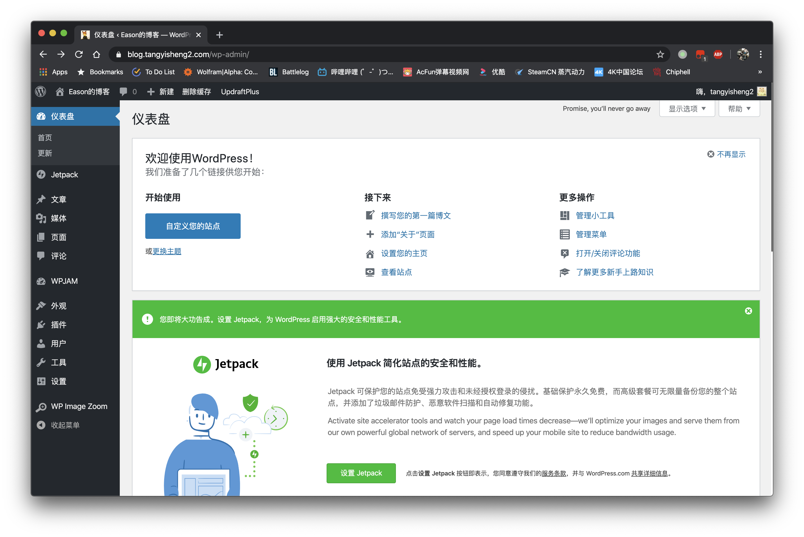
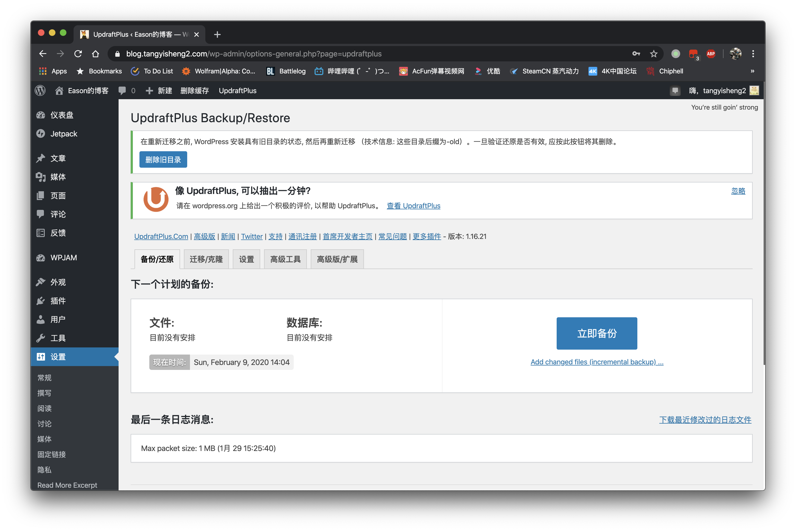
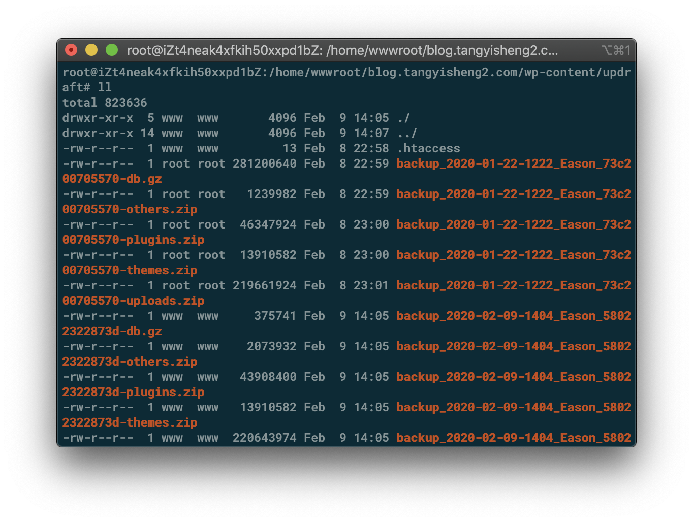
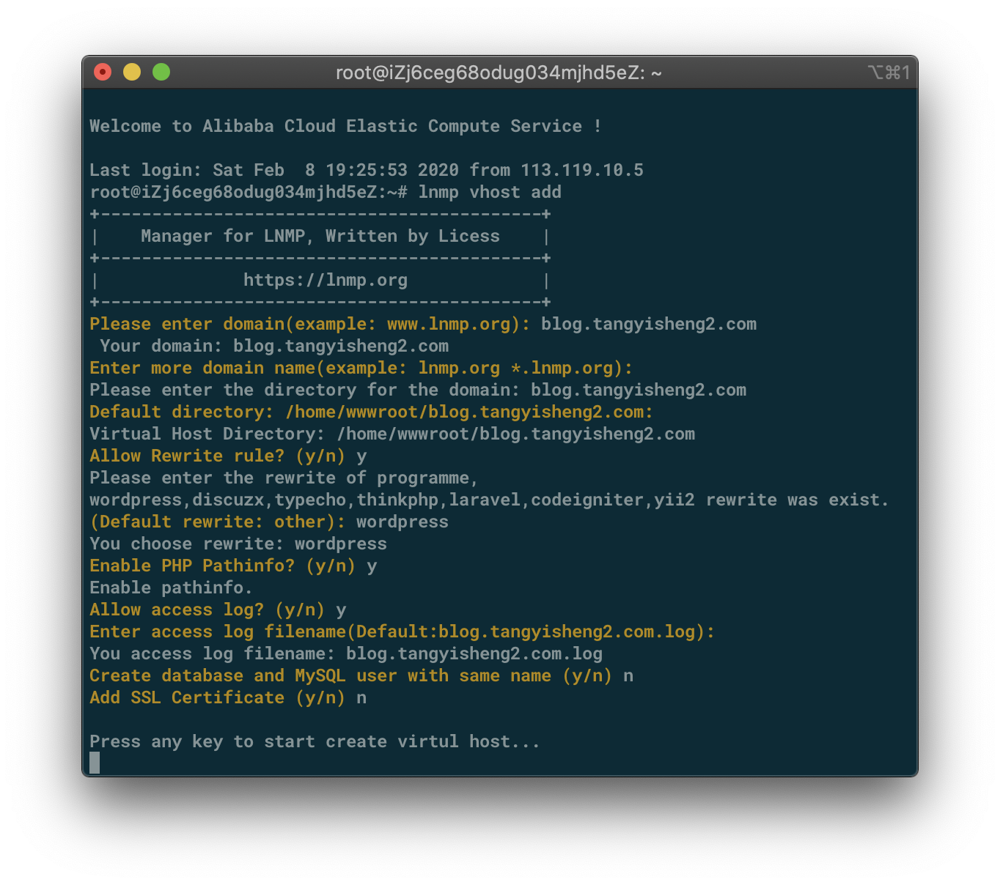

# WordPress迁移教程

## 0x01：准备工作：



登陆仪表板，安装Updraft-Plus插件



选择立即备份并备份



登陆服务器把备份文件下载下来保存

```shell
cd cd /home/wwwroot/blog.tangyisheng2.com/wp-content/updraft/
tar -cvf wp.tar *. # 打包所有文件
scp root@blog.tangyisheng2.com:/home/wwwroot/blog.tangyisheng2.com/wp-content/updraft/wp.tar . # 把文件下载到本地

```

## 0x02：服务器新建环境

我们这里已经默认你安装了完整的lnmp环境，并且配置好了各种网络设定



登陆服务器新建lnmp环境

