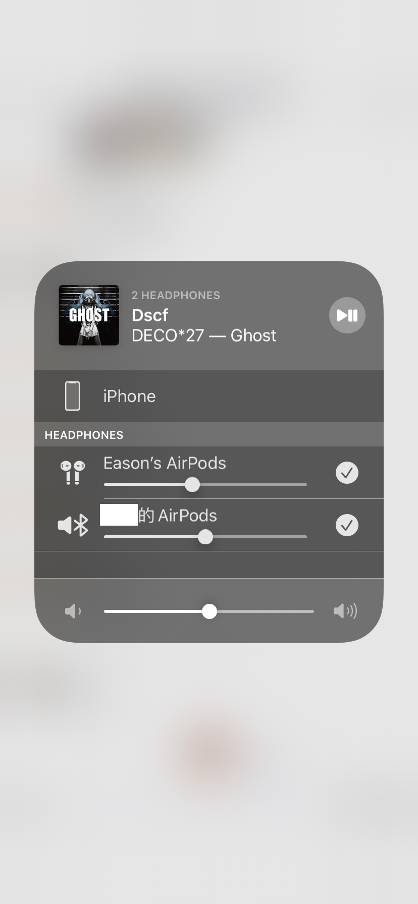

# TechLife SP

## 前言

好，刚发完MacBook的体验，结果就来“**金秋发文挑战赛**”，这是要我爆肝嘛？一时间实在想不到要些什么产品，正巧9月20号也就屎前几天iOS 13正式推送更新，那么我们就来写个SP找不同吧~

机器型号为iPhone XR，系统版本为iOS 13.0

对照设备是iPhone 6s Plus，系统版本为iOS 12.4.1

因为是一个人无聊找的，所以难免会有不全，其中某些资料有参考国外youtuber的影片，我把连接放在最下面。

PS.如果你还没有看过MacBook Pro的体验的话，请点这里：

## 官网有写的

下面是一些官网有写的改变~

1. 黑暗模式 Dark Mode

   

   

   

   
   
   

2. 相机新增了新的人像光效模式

   

3. 全新的相册界面

   
   
4. 更强大的图片编辑功能
  
   
   
5. 更强大的视频编辑功能（iOS 12 只能裁剪）

   

6. 苹果登陆

   

   

   

7. 新的地图上拉菜单，新增常用地点和收藏，以及车道路口视图

   

8. Airpods共享音频

   

9. Memoji添加倒键盘中了，也可以在短信界面和将你的memoji设置为头像

   

10. 全键盘现在支持滑动输入（九宫格暂时不行）

    

11. 新的提醒事项App，更改了UI，时间可以根据输入内容预测。同时宣布了一个升级，因为iPad还没更新iPad OS，所以就先暂时不升级。

    

    

12. 性能，FaceID有肉眼可见提高

    

13. 邮件App新增了字体样式工具

14. 健康App换了新UI、新增了经期检测

    

15. 文件App可以直接接U盘了，也可以直接连接SMB服务器

    

16. 字体管理

    

17. 改版备忘录，新的layout，加强版本搜索

    

    

18. 优化的Safari起始页，字体加粗，图标变大，首页图标新增阴影，同时下方的按钮重绘

    

19. Safari支持全屏幕截图，新增了下载中心，可以通过长按链接打开预览，并且如果链接是视频的话可以直接下载（苹果官网测试）

    

    

20. 文本编辑和浏览，三指点击屏幕出现菜单栏，光标新的拖拽方式，三指复制粘贴手势

    

21. 分享页面改版，可以快速分享到iMessage，AirDrop图标和页面改版

    

22. 非3DTouch机型也支持长按呼出菜单了，相比iOS 12 项目间距减少

    

23. App Store更新移到了右上角头像里

    

24. Apple Music终于终于有滚动歌词了！

    

25. 新的音量HUD，现在可以显示调整的设备了（扬声器，耳机还是Airpods）

    

26. 新的静音HUD

    

27. Widget的动画小改动，现在有向后淡出（不知道怎么说）的动画了。

    

28. Widget最下方编辑从圆形变为圆角矩形

    

29. 时钟App闹钟部分现在可以显示睡眠闹钟了，同时睡眠项有新UI

    

30. 定时器有新UI了

    

31. App 下载现在支持超过200M的App了

    

32. WiFi里面可以自动连接个人热点，同时针对已经连接过的网络会专门有一个我的网络标识

    

33. 电池健康里面有设置根据使用习惯自动优化电池充电

    

34. 设置里面可以单独为不同App设置语言

    

35. Find my iPhone和Find my Friends App整合成一个Find My

    

36. 控制中心内可以选择快速连接蓝牙以及wifi

    

37. App Store更新可以显示App大小

      

      

    

