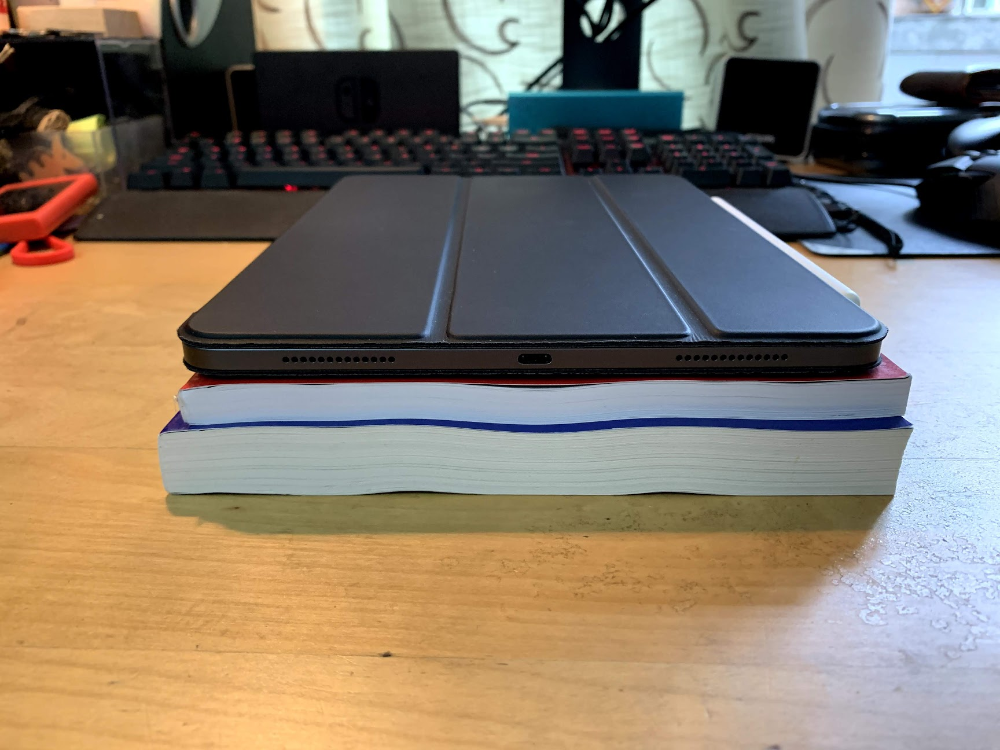
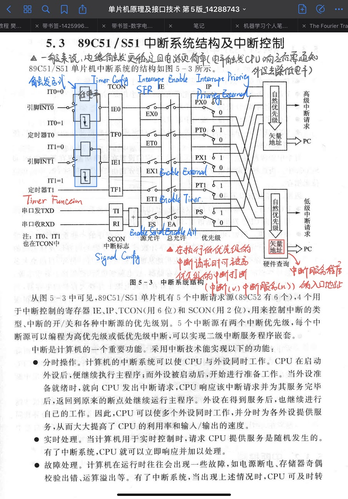

# iPad Pro再体验

## 前言

之前曾经写过一篇iPad Pro 11'的评测，得到了广大值友的支持，其中1.4k收藏加上200+的评论数实在是让笔者受宠若惊，在这里先谢谢各位值友的支持。

转眼间一年过去了，iOS也升级成为iPadOS，宣传上看，生产力有了明显的加强，包括增强的截图UI，新的应用多开功能，新的文件管理等等，那么一年过去了，仍然还是这几个问题：

- iPad Pro 2018它够Pro嘛？
- 买了iPad Pro 2018后，我的学习生活有什么改变？
- 我后悔喷这么多钱买iPad Pro 2018嘛？

本文依旧会是从学习、娱乐、生产力和日常生活中的碎碎念四个方面谈谈我对iPad Pro 2018的体验，如果你还没有看过我之前的iPad Pro体验，请务必去看一下，本文的内容将在之前文章的内容上继续延伸。

## 学习篇

之前购买iPad Pro，最主要的剁手理由还是学习用，主要是记笔记、看课本，使用的APP为Goodnotes以及Notability。

首先使用了iPad Pro作为上学的主力之后，最主要的改变就是书包真的变轻了，以往带一堆书上课，现在带一台iPad就能完全搞定了，下图是iPad Pro与计算机三级考试资料的对比，这还只是一科的书本量，正常上学来说一天有3科，减负的效果还是非常可观的。

第二，做笔记时候，不得不提的就是Apple Pencil 2代。相较于一代，基础的握持手感和充电连接方式有所提升，初次的体验我在一年前的文章中有提到过，这里就不再赘述了（没有看的赶快去看啊）。更新iPadOS后新增的功能中有几个我是很推的：一个是用Apple Pencil在左下角内滑截图

另一个是使用Apple Pencil在浮动键盘上可以通过滑动快速输入，虽然用手指也可以滑，但是最主要是用笔滑比较精确外加用笔滑就可以把笔一直拿在手上了，不需要打几个字就把笔放下。

至于说写惯了Apple Pencil之后，字体会不会变丑呢？其实还好，下面是一个学渣的笔记。

其次要提的，便是iOS升级成iPadOS之后最有感的升级就是应用双开，悬浮以及同屏多窗口了。

应用多开：好用。相信在读书的各位都有遇到过文字与图刚好在一页纸的正反两面需要来回翻的窘境，之前iOS也出现过这个问题，当你的内容在一页显示不全的时候，有两种方法，一个是缩小页面但这样字体太小看得辛苦书写体验也不佳；二是来回滚动页面，这样稍微比第一种好一点，但是也很不爽。现在有了应用多开，可以同时看两个版面的内容了，非常舒适！目前测试下来Goodnotes支持应用多开，Notability不支持系统的应用多开而APP内置了不同笔记的同时浏览，但是有个小缺点就是不能打开两个相同的笔记。

应用悬浮窗：好用。在课上如果需要临时查找一些资料的话还是非常舒适的，iPadOS相比之前的iOS悬浮窗口支持了多个程序，切换更方便。

## 娱乐篇

## 生产力篇

## 碎碎念篇

## 总结和iPad Pro 2020展望？