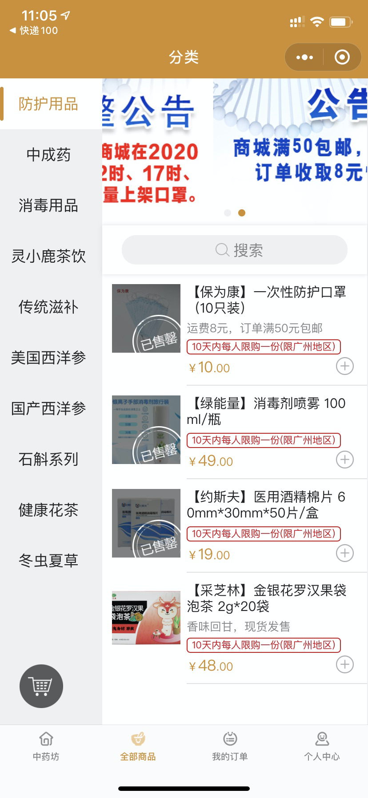
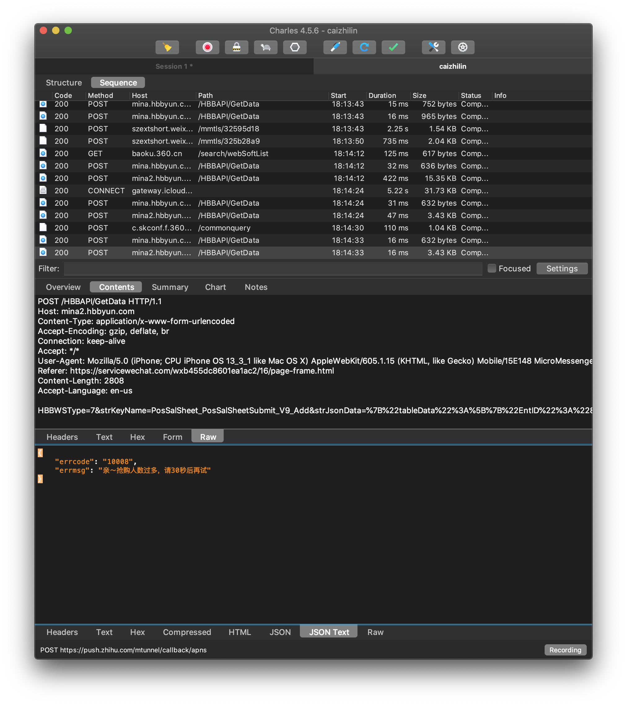
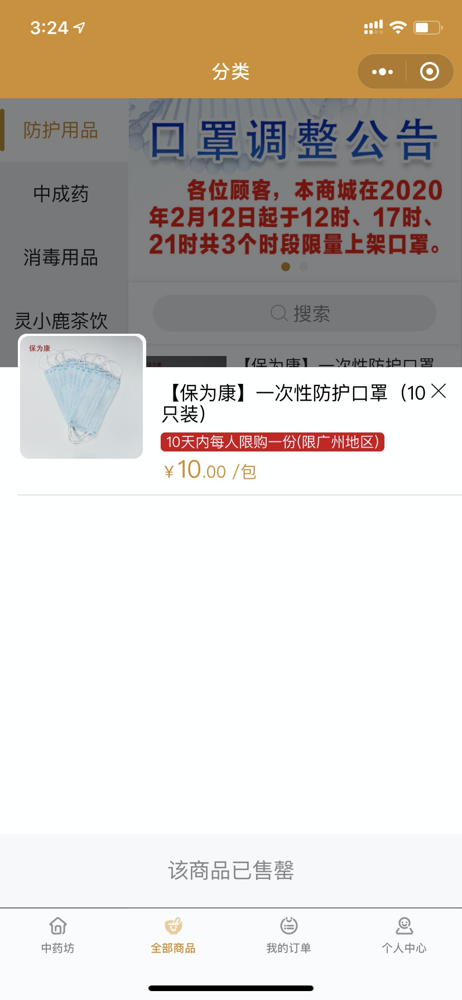
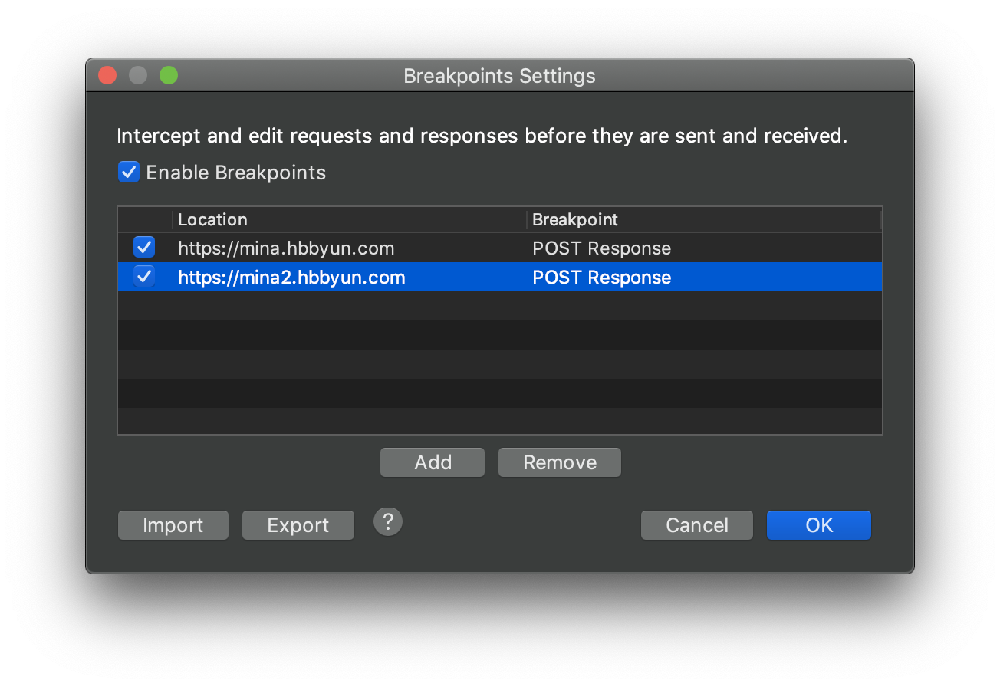
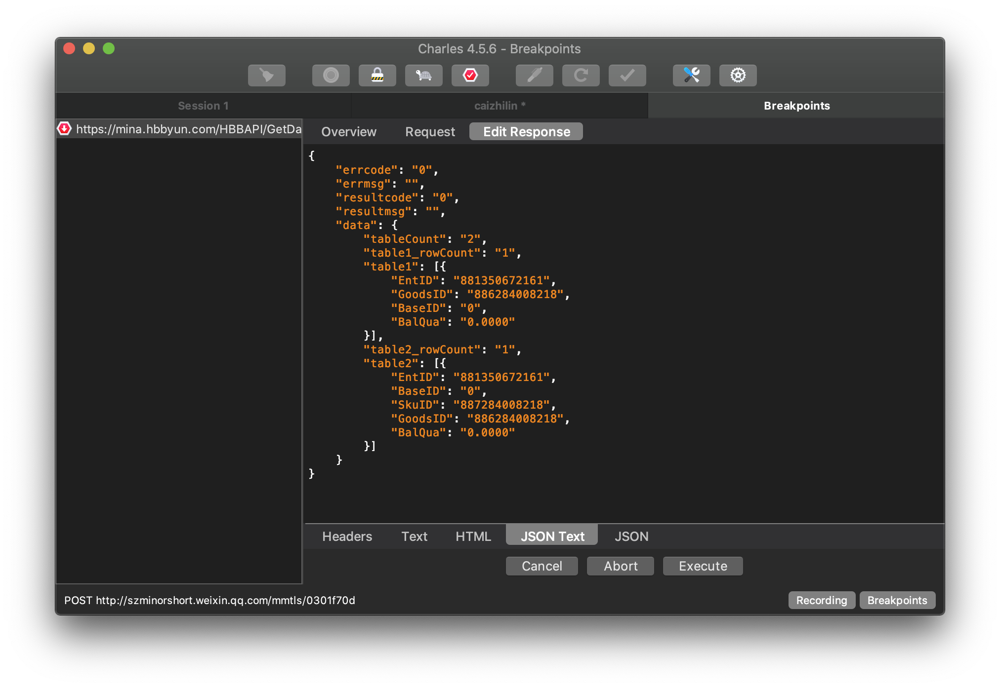
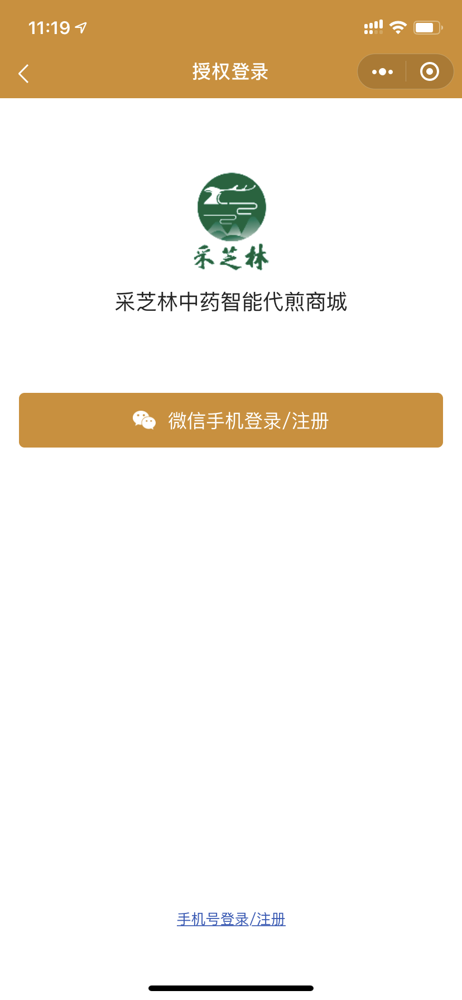

# 口罩平台的接口挖掘

## 前言

最近因为武汉疫情的关系，广州市也是一罩难求，然后广州市包括市政府和各间大型药店都有上线在线的口罩预约平台，既然闲着也是闲着，就无聊挖了一下各个口罩平台的API

## 采芝林

首先来说说采芝林，因为这个平台我挖的最深。

### Version1：抓包下单



采芝林的预约方式是小程序的商城，每天不定时放货，起手先用Charles对小程序的网络流量进行抓包。



第一部先是抓到Charles的购买请求，数据包body部分是使用URLencode编码的报文（换句话说，报文除了套了一层TLS之外就是明文传输）

下一步是对上面的报文做URLdecode，得出下面结果（关键部分打码）

```http
POST /HBBAPI/GetData HTTP/1.1
Host: mina2.hbbyun.com
Content-Type: application/x-www-form-urlencoded
Accept-Encoding: gzip, deflate, br
Connection: keep-alive
Accept: */*
User-Agent: Mozilla/5.0 (iPhone; CPU iPhone OS 13_3_1 like Mac OS X) AppleWebKit/605.1.15 (KHTML, like Gecko) Mobile/15E148 MicroMessenger/7.0.10(0x17000a21) NetType/WIFI Language/en
Referer: https://servicewechat.com/wxb455dc8601ea1ac2/17/page-frame.html
Content-Length: 2839
Accept-Language: en-us

HBBWSType=7&strKeyName=PosSalSheet_PosSalSheetSubmit_V9_Add&strJsonData={"tableData":[{"EntID":"881350672161","UserID":"888420198324","AppID":"@AppID","Secret":"@Secret","BSN":"@BSN","UserName":"采芝林电商","UserCode":"13611468273","DtbCYTypeID":"2","VipID":"VIP350672161******","VipName":"Anita","ShopID":"889089848428","ShopName":"采芝林中药智能代煎商城","BaseID":"005058867","BaseCode":"1","BaseName":"采芝林药业有限公司","DepID":"613468883","DepName":"广州采芝林药业连锁店","SalesManID":"888420198324","SalesManCode":"13611468273","SalesManName":"采芝林电商","CustCountry":"","CustProvince":"广东省","CustCity":"广州市","CustDistrict":"越秀区","CustMainAddress":"文*****","CustZip":"","CustPhone":"139****","CustName":"梁****","Remark":"","Count":1,"Qua":1,"SalesAmo":10,"Amo":10,"DisAmo":0,"FeeAmo":8,"CouponAmo":0,"TotalAmo":18,"LocalSheetID":"20200210130059466301297","FollowUserID":"888420198324","SheetFile":"","AppName":"HBB_MinaMall","PosType":"3"}],"Item1":[{"GoodsID":"886284008218","GoodsCode":"020","GoodsCoverImg":"881350672161/Goods/1581041033000_308191621.jpg","GoodsName":"【保为康】一次性防护口罩（10只装）","GoodsTypeID":"0","IsInventory":"1","Unit":"包","PUnit":"","SkuID":"887284008218","SkuCode":"020","SkuItems":"","PSalesPrice":10,"SalesPrice":10,"PUnitPrice":10,"Price":10,"SalesAmo":10,"Amo":10,"DisAmo":0,"CostPrice":0,"Qua":1,"PQua":0,"MQua":1,"Ref":1,"ItemID":1,"SalType":"2","PromotePlanSheetID":"133759694"}]}&strAuthorizationCode=hbb&IsRSA=0 
```

简单格式化之后如下

```json
HBBWSType=7&strKeyName=PosSalSheet_PosSalSheetSubmit_V9_Add&strJsonData={
	"tableData": [
		{
			"EntID": "881350672161",
			"UserID": "888420198324",
			"AppID": "@AppID",
			"Secret": "@Secret",
			"BSN": "@BSN",
			"UserName": "采芝林电商",
			"UserCode": "13611468273",
			"DtbCYTypeID": "2",
			"VipID": "VIP35067216*****", //账户UID
			"VipName": "Anita(梁惠玲)",
			"ShopID": "889089848428",
			"ShopName": "采芝林中药智能代煎商城",
			"BaseID": "005058867",
			"BaseCode": "1",
			"BaseName": "采芝林药业有限公司",
			"DepID": "613468883",
			"DepName": "广州采芝林药业连锁店",
			"SalesManID": "888420198324",
			"SalesManCode": "13611468273",
			"SalesManName": "采芝林电商",
			"CustCountry": "",
			"CustProvince": "广东省", //省份
			"CustCity": "广州市", //城市
			"CustDistrict": "越秀区", //地区
			"CustMainAddress": "文*****", //地址
			"CustZip": "",
			"CustPhone": "139****", //电话
			"CustName": "梁****", //姓名
			"Remark": "",
			"Count": 1,
			"Qua": 1,
			"SalesAmo": 10,
			"Amo": 10,
			"DisAmo": 0,
			"FeeAmo": 8,
			"CouponAmo": 0,
			"TotalAmo": 18,
			"LocalSheetID": "20200210130059466301297", //作用未知
			"FollowUserID": "888420198324",
			"SheetFile": "",
			"AppName": "HBB_MinaMall",
			"PosType": "3"
		}
	],
	"Item1": [
		{
			"GoodsID": "886284008218",
			"GoodsCode": "020",
			"GoodsCoverImg": "881350672161/Goods/1581041033000_308191621.jpg",
			"GoodsName": "【保为康】一次性防护口罩（10只装）",
			"GoodsTypeID": "0",
			"IsInventory": "1",
			"Unit": "包",
			"PUnit": "",
			"SkuID": "887284008218",
			"SkuCode": "020",
			"SkuItems": "",
			"PSalesPrice": 10,
			"SalesPrice": 10,
			"PUnitPrice": 10,
			"Price": 10,
			"SalesAmo": 10,
			"Amo": 10,
			"DisAmo": 0,
			"CostPrice": 0,
			"Qua": 1,
			"PQua": 0,
			"MQua": 1,
			"Ref": 1,
			"ItemID": 1,
			"SalType": "2",
			"PromotePlanSheetID": "133759694"
		}
	]
}&strAuthorizationCode=hbb&IsRSA=0 
```

除了LocalSheetID为日期+一串数字的组合暂时不知道是什么作用，其他的作用都比较明确了尝试构造数据包，header照抄如下：

```http
POST /HBBAPI/GetData HTTP/1.1
Host: mina2.hbbyun.com
Content-Type: application/x-www-form-urlencoded
Accept-Encoding: gzip, deflate, br
Connection: keep-alive
Accept: */*
User-Agent: Mozilla/5.0 (iPhone; CPU iPhone OS 13_3_1 like Mac OS X) AppleWebKit/605.1.15 (KHTML, like Gecko) Mobile/15E148 MicroMessenger/7.0.10(0x17000a21) NetType/WIFI Language/en
Referer: https://servicewechat.com/wxb455dc8601ea1ac2/16/page-frame.html
Content-Length: 2808
Accept-Language: en-us
```

使用requests模块爬虫，return以下两种

```http
HTTP/1.1 200 OK
Cache-Control: private
Content-Type: text/html; charset=utf-8
Content-Encoding: gzip
Vary: Accept-Encoding
Server: Microsoft-IIS/8.5
X-AspNetMvc-Version: 5.2
X-AspNet-Version: 4.0.30319
Access-Control-Allow-Methods: OPTIONS,POST,GET
Access-Control-Allow-Origin: *
Date: Fri, 14 Feb 2020 14:12:27 GMT
Content-Length: 223
Connection: keep-alive

{"errcode":"10008","errmsg":"亲～抢购人数过多，请30秒后再试"}
```

```http
HTTP/1.1 200 OK
Cache-Control: private
Content-Type: text/html; charset=utf-8
Content-Encoding: gzip
Vary: Accept-Encoding
Server: Microsoft-IIS/8.5
X-AspNetMvc-Version: 5.2
X-AspNet-Version: 4.0.30319
Access-Control-Allow-Methods: OPTIONS,POST,GET
Access-Control-Allow-Origin: *
Date: Fri, 14 Feb 2020 14:12:27 GMT
Content-Length: 223
Connection: keep-alive

{"errcode": "69007",	"errmsg": "XXX库存不足"}
```

至此只要用requests循环发包就好了

### Version 1 Source Code：

```python
def autosubmit(auto_stop):
    url = "http://mina2.hbbyun.com/HBBAPI/GetData"

    # payload 贴上抓包的内容
    payload = {}
    headers = {
        "Content-Type": "application/x-www-form-urlencoded",
        "Accept-Encoding": "gzip,deflate,br",
        "Connection": "keep-alive",
        "Accept": "*/*",
        "User-Agent": "Mozilla/5.0 (iPhone; CPU iPhone OS 10_3_3 like Mac OS X) AppleWebKit/603.3.8 (KHTML, "
                      "like Gecko) Mobile/14G60 MicroMessenger/6.7.0 NetType/WIFI Language/zh_CN",
        "Referer": "https://servicewechat.com/wxb455dc8601ea1ac2/16/page-frame.html",
        "Content-Length": "2797"
    }
    count = 0
    while True:
        response = requests.request("POST", url, data=payload2.encode(encoding='utf-8'), headers=headers)
        print_output = f"{'第'}{count}{'次运行-'}{time.strftime('%Y-%m-%d %H:%M:%S : ', time.localtime(time.time()))}" \
                       f"{response.content.decode('utf-8')} "
        print(print_output)
        logging.info(print_output)
        time.sleep(1 + 0.1 * random.randrange(-5, 10))
        count += 1
        try:
            err_code = json.loads(response.content)["errcode"]
        except json.decoder.JSONDecodeError:
            continue
        if err_code != "10008" and err_code != "69007":
            push_notification(print_output)
            break
        if count == 50000 and auto_stop:
            break
```


### Version 1-SP：检测库存

其实通常来说我们一般是直接抓购买的数据包，但是有时候因为库存不足抓不到购买的数据包，这个时候可以用Charles的breakpoint功能修改respone让小程序认为有货，从而构建出购买的请求。



在Charles的breakpoint setting，对mina.hbbyun.com和mina2.hbbyun.com的response设置breakpoint



在response的数据包中其中有一个是BalQua即库存



此时小程序就显示有货了，直接下单就可以抓包了。

后来转念一想，其实可以通过这种方式检测库存。

构造请求：

```http
:method: POST
:scheme: https
:path: /HBBAPI/GetData
:authority: mina.hbbyun.com
accept: */*
content-type: application/x-www-form-urlencoded
content-length: 451
accept-language: en-us
user-agent: Mozilla/5.0 (iPhone; CPU iPhone OS 13_3_1 like Mac OS X) AppleWebKit/605.1.15 (KHTML, like Gecko) Mobile/15E148 MicroMessenger/7.0.10(0x17000a21) NetType/WIFI Language/en
referer: https://servicewechat.com/wxb455dc8601ea1ac2/17/page-frame.html
accept-encoding: gzip, deflate, br

HBBWSType=1&strKeyName=Goods_GoodsBaseStockGet_V3_Get&strJsonData={"tableData":[{"EntID":"881350672161","UserID":"888420198324","ShopID":"889089848428","GoodsID":"886749945750","AppID":"@AppID","Secret":"@Secret","BSN":"@BSN","SourceType":"Shop","IsSale":"2","IsGetSku":"0"}]}&strAuthorizationCode=hbb&IsRSA=0
```

Response:

```http
:status: 200
server: Tengine
date: Fri, 14 Feb 2020 04:05:44 GMT
content-type: text/html; charset=utf-8
content-length: 203
cache-control: private
x-aspnetmvc-version: 5.2
x-aspnet-version: 4.0.30319
access-control-allow-methods: OPTIONS,POST,GET
access-control-allow-origin: *


{"errcode":"0","errmsg":"","resultcode":"0","resultmsg":"","data":{"tableCount":"1","table1_rowCount":"1","table1":[{"EntID":"881350672161","GoodsID":"886749945750","BaseID":"0","BalQua":"772.0000"}]}}
```

response中的BalQua即是库存。

### Version 1-SP src：

```python
def check_bal_stock():
    """
    检查库存
    :return: 是否有库存 :bool
    """
    global count
    url = "http://mina.hbbyun.com/HBBAPI/GetData"

    headers = {
        "Content-Type": "application/x-www-form-urlencoded",
        "Accept-Encoding": "gzip,deflate,br",
        "Connection": "keep-alive",
        "Accept": "*/*",
        "User-Agent": "Mozilla/5.0 (iPhone; CPU iPhone OS 10_3_3 like Mac OS X) AppleWebKit/603.3.8 (KHTML, "
                      "like Gecko) Mobile/14G60 MicroMessenger/6.7.0 NetType/WIFI Language/zh_CN",
        "Referer": "https://servicewechat.com/wxb455dc8601ea1ac2/16/page-frame.html",
        "Content-Length": "2797"
    }
    payload = 'HBBWSType=1&strKeyName=Goods_GoodsBaseStockGet_V3_Get&strJsonData=%7B%22tableData%22%3A%5B%7B%22EntID' \
              '%22%3A%22881350672161%22%2C%22UserID%22%3A%22888420198324%22%2C%22ShopID%22%3A%22889089848428%22%2C' \
              '%22GoodsID%22%3A%22886284008218%22%2C%22AppID%22%3A%22%40AppID%22%2C%22Secret%22%3A%22%40Secret%22%2C' \
              '%22BSN%22%3A%22%40BSN%22%2C%22SourceType%22%3A%22Shop%22%2C%22IsSale%22%3A%222%22%2C%22IsGetSku%22%3A' \
              '%221%22%7D%5D%7D&strAuthorizationCode=hbb&IsRSA=0 '
    while True:
        count += 1
        response = requests.request("POST", url, data=payload.encode(encoding='utf-8'), headers=headers)
        response.encoding = "utf-8"
        try:
            table_0_bal = json.loads(response.content)['data']['table1'][0]['BalQua']
            table_1_bal = json.loads(response.content)['data']['table2'][0]['BalQua']
        except KeyError:
            continue
        print_output = f"{'-----------------------------------'}\n" \
                       f"{'Count:'}{count}\n " \
                       f"{'Time:'}{time.strftime('%Y-%m-%d %H:%M:%S : ', time.localtime(time.time()))}\n"
        if table_0_bal > "0.0000" or table_1_bal > "0.0000":
            print_output = f"{print_output}" \
                           f"{'有货啦，自动抢购...'}\n" \
                           f"{'-----------------------------------'}"
            # push_notification(print_output) #todo 缺了个参数
            return 1
        else:
            print_output = f"{print_output}" \
                           f"{'无货啦，继续检测...'}\n" \
                           f"{'-----------------------------------'}"
        print(print_output)
        logging.info(print_output)
        time.sleep(1)
```


### Version 2：直接爬取VipID

上面的Version 1中的VipID需要抓包，还是不太方便，然后我又研究了一下小程序有两种登陆方式，微信绑定登陆和手机号登陆。



分别抓包：

#### 微信登录：

```http
:method: POST
:scheme: https
:path: /HBBAPI/GetData
:authority: mina.hbbyun.com
accept: */*
content-type: application/x-www-form-urlencoded
content-length: 505
accept-language: en-us
user-agent: Mozilla/5.0 (iPhone; CPU iPhone OS 13_3_1 like Mac OS X) AppleWebKit/605.1.15 (KHTML, like Gecko) Mobile/15E148 MicroMessenger/7.0.10(0x17000a21) NetType/WIFI Language/en
referer: https://servicewechat.com/wxb455dc8601ea1ac2/17/page-frame.html
accept-encoding: gzip, deflate, br

HBBWSType=7&strKeyName=EntVip_EntVipLoginGet_Get&strJsonData={"tableData":[{"EntID":"881350672161","UserID":"888420198324","AppID":"@AppID","Secret":"@Secret","BSN":"@BSN","Phone":"18602020415","AreaNo":"86","Code":"","OpenID":"ojx0_5WRC0fv****oLUw40Zs","MinaID":"881350672161wxb455dc8601ea1ac2","LoginType":"1"}]}&strAuthorizationCode=hbb&IsRSA=0
```

response：

```http
:status: 200
date: Fri, 14 Feb 2020 03:24:06 GMT
content-type: text/html; charset=utf-8
Content-Length: 766
cache-control: private
vary: Accept-Encoding
x-aspnetmvc-version: 5.2
x-aspnet-version: 4.0.30319
access-control-allow-methods: OPTIONS,POST,GET
access-control-allow-origin: *


{"errcode":"0","errmsg":"","resultcode":"0","resultmsg":"","data":{"tableCount":"1","table1_rowCount":"1","table1":[{"EntID":"881350672161","VipID":"VIP35067216*****","VipCode":"186*****","VipName":"Eason Tong Yat-sing","HeadImg":"https://hbbcustomer.hbbyun.com/hbb/UserHeadImg/1581240057000_505927656.jpeg","Birthy":"","Sex":"0","IdCode":"","AreaNo":"86","Phone":"186****","Score":"18","TotalScore":"18","BalAmo":"0.00","TotalBalAmo":"0.00","SalCount":"2","SalAmo":"18.00","ShopID":"889089848428","ShopName":"采芝林中药智能代煎商城","BaseID":"005058867","BaseCode":"1","BaseName":"采芝林药业有限公司","VipClassID":"001","VipClassName":"普通会员"}]}}
```


#### 短信验证码登录：

发送验证码：

```http
:method: POST
:scheme: https
:path: /HBBAPI/GetData
:authority: mina.hbbyun.com
accept: */*
content-type: application/x-www-form-urlencoded
content-length: 495
accept-language: en-us
user-agent: Mozilla/5.0 (iPhone; CPU iPhone OS 13_3_1 like Mac OS X) AppleWebKit/605.1.15 (KHTML, like Gecko) Mobile/15E148 MicroMessenger/7.0.10(0x17000a21) NetType/WIFI Language/en
referer: https://servicewechat.com/wxb455dc8601ea1ac2/17/page-frame.html
accept-encoding: gzip, deflate, br

HBBWSType=7&strKeyName=Phone_VerificationGet_V1_Add&strJsonData={"tableData":[{"EntID":"0","UserID":"0","AppID":"@AppID","Secret":"@Secret","BSN":"@BSN","No":"186*****","AreaNo":"86","SourceType":"RegisterVip","PlatformName":"采芝林中药智能代煎商城"}]}&strAuthorizationCode=hbb&IsRSA=0
```

登陆：

```http
:method: POST
:scheme: https
:path: /HBBAPI/GetData
:authority: mina.hbbyun.com
accept: */*
content-type: application/x-www-form-urlencoded
content-length: 509
accept-language: en-us
user-agent: Mozilla/5.0 (iPhone; CPU iPhone OS 13_3_1 like Mac OS X) AppleWebKit/605.1.15 (KHTML, like Gecko) Mobile/15E148 MicroMessenger/7.0.10(0x17000a21) NetType/WIFI Language/en
referer: https://servicewechat.com/wxb455dc8601ea1ac2/17/page-frame.html
accept-encoding: gzip, deflate, br

HBBWSType=7&strKeyName=EntVip_EntVipLoginGet_Get&strJsonData={"tableData":[{"EntID":"881350672161","UserID":"888420198324","AppID":"@AppID","Secret":"@Secret","BSN":"@BSN","Phone":"186*****","AreaNo":"86","Code":"9107","OpenID":"ojx0_5WRC0fveAYXMP*****","MinaID":"881350672161wxb455dc8601ea1ac2","LoginType":"2"}]}&strAuthorizationCode=hbb&IsRSA=0
```

response：

```http
:status: 200
date: Fri, 14 Feb 2020 03:36:25 GMT
content-type: text/html; charset=utf-8
content-length: 602
cache-control: private
content-encoding: gzip
vary: Accept-Encoding
x-aspnetmvc-version: 5.2
x-aspnet-version: 4.0.30319
access-control-allow-methods: OPTIONS,POST,GET
access-control-allow-origin: *


:status: 200
date: Fri, 14 Feb 2020 14:04:29 GMT
content-type: text/html; charset=utf-8
content-length: 602
cache-control: private
content-encoding: gzip
vary: Accept-Encoding
x-aspnetmvc-version: 5.2
x-aspnet-version: 4.0.30319
access-control-allow-methods: OPTIONS,POST,GET
access-control-allow-origin: *


{"errcode":"0","errmsg":"","resultcode":"0","resultmsg":"","data":{"tableCount":"1","table1_rowCount":"1","table1":[{"EntID":"881350672161","VipID":"VIP35067216107*****","VipCode":"1860*****","VipName":"Eason Tong Yat-sing","HeadImg":"https://hbbcustomer.hbbyun.com/hbb/UserHeadImg/1581240057000_505927656.jpeg","Birthy":"","Sex":"0","IdCode":"","AreaNo":"86","Phone":"186*****","Score":"18","TotalScore":"18","BalAmo":"0.00","TotalBalAmo":"0.00","SalCount":"2","SalAmo":"18.00","ShopID":"889089848428","ShopName":"采芝林中药智能代煎商城","BaseID":"005058867","BaseCode":"1","BaseName":"采芝林药业有限公司","VipClassID":"001","VipClassName":"普通会员"}]}}
```

把response格式化一下：

```json
{
    "errcode": "0",
    "errmsg": "",
    "resultcode": "0",
    "resultmsg": "",
    "data": {
        "tableCount": "1",
        "table1_rowCount": "1",
        "table1": [
            {
                "EntID": "881350672161",
                "VipID": "VIP35067216107*******",
                "VipCode": "186******",
                "VipName": "Eason Tong Yat-sing",
                "HeadImg": "https://hbbcustomer.hbbyun.com/hbb/UserHeadImg/1581240057000_505927656.jpeg",
                "Birthy": "",
                "Sex": "0",
                "IdCode": "",
                "AreaNo": "86",
                "Phone": "186******",
                "Score": "18",
                "TotalScore": "18",
                "BalAmo": "0.00",
                "TotalBalAmo": "0.00",
                "SalCount": "2",
                "SalAmo": "18.00",
                "ShopID": "889089848428",
                "ShopName": "采芝林中药智能代煎商城",
                "BaseID": "005058867",
                "BaseCode": "1",
                "BaseName": "采芝林药业有限公司",
                "VipClassID": "001",
                "VipClassName": "普通会员"
            }
        ]
    }
}
```

可以直接从response中间提出VipName和VipID

### Version2 src：

```python
def get_code(phone):
    """
    获取手机验证码
    :param phone: 手机号（11位）
    :return: None
    """
    param = {
        "HBBWSType": 7,
        "strKeyName": "Phone_VerificationGet_V1_Add",
        "strJsonData": json.dumps({
            "tableData": [
                {
                    "EntID": "0",
                    "UserID": "0",
                    "AppID": "@AppID",
                    "Secret": "@Secret",
                    "BSN": "@BSN",
                    "No": phone,
                    "AreaNo": "86",
                    "SourceType": "RegisterVip",
                    "PlatformName": "采芝林中药智能代煎商城"
                }
            ]
        }),
        "strAuthorizationCode": "hbb",
        "IsRSA": 0
    }
    url = "http://mina.hbbyun.com/HBBAPI/GetData"
    headers = {
        'Content-Type': 'application/x-www-form-urlencoded'
    }
    response = requests.request("GET", url, headers=headers, params=param)
    print(response.text.encode('utf8'))
    if json.loads(response.content)['errcode'] == '0':
        print("发送成功")


def get_vip_information(bot, code):
    """
    获取单个bot的VipID和VipName的并且自动保存到对应文件
    :param bot: 单个bot的dict
    :param code: 短信验证码
    :return: VipID和VipName :dict
    """
    result = {}
    url = "http://mina.hbbyun.com/HBBAPI/GetData"
    headers = {
        'Content-Type': 'application/x-www-form-urlencoded'
    }
    payload = {
        "HBBWSType": 7,
        "strKeyName": "EntVip_EntVipLoginGet_Get",
        "strJsonData": json.dumps({
            "tableData": [
                {
                    "EntID": "881350672161",
                    "UserID": "888420198324",
                    "AppID": "@AppID",
                    "Secret": "@Secret",
                    "BSN": "@BSN",
                    "Phone": bot['CustPhone'],
                    "AreaNo": "86",
                    "Code": code,
                    "OpenID": "asdaasdasdasdasddsadasDE",
                    "MinaID": "1234566721611234ac2",
                    "LoginType": "2"
                }
            ]
        }),
        "strAuthorizationCode": "hbb",
        "IsRSA": 0
    }
    response = requests.request("POST", url, headers=headers, params=payload)
    print(response.text.encode('utf8'))
    try:
        response_json_encoded = json.loads(response.content)['data']['table1'][0]
        result = {
            "VipID": response_json_encoded['VipID'],
            "VipName": response_json_encoded['VipName']
        }
    except KeyError:
        print("参数不完整")
        logging.info(result)

    return result
```

### Version 3：一条龙bot

参考ArchiSteamFarm的形式，可以将每个账号写成bot，保存在json中，python内用for循环加载即可，其他部分同上。

```python
def get_bot_config():
    """
    获取所有bot配置
    :return: (dict) worker包含所有bot配置
    """
    worker = dict()
    bot_config = os.listdir(config_path)
    for config_name in bot_config:
        with open(file=f"{config_path}{config_name}", mode="r+", encoding="UTF-8") as load_f:
            try:
                worker[config_name] = json.load(load_f)
            except json.JSONDecodeError:
                print(f"{config_name}{'加载失败-跳过'}")
    worker_count = len(worker)
    print_ourput = f"-------------------------------------\n" \
                   f"{'Total worker count:'}{worker_count}\n" \
                   f"{'Worker config:'}{list(worker.keys())}\n" \
                   f"{'Press any key to confine...'}\n" \
                   f"-------------------------------------\n"
    print(print_ourput)
    input()
    return worker


def save_bot_config(bot_config, filename):
    """
    写入bot配置到文件
    :param bot_config: bot配置
    :param filename: 文件名
    :return: None
    """
    with open(file=f"{config_path}{filename}", mode="w+", encoding="UTF-8") as save_f:
        try:
            save_f.write(json.dumps(bot_config, ensure_ascii=False))
            save_f.close()
        except os.error:
            print("保存失败")
```

### 最后，一些安全问题

在抓包的时候，发现返回用户信息的请求中，API没有对VipID做任何的校验，只需要请求VipID就可以获取用户信息，属于巨大的安全隐患。

```http
:method: POST
:scheme: https
:path: /HBBAPI/GetData
:authority: mina.hbbyun.com
accept: */*
content-type: application/x-www-form-urlencoded
content-length: 334
accept-language: en-us
user-agent: Mozilla/5.0 (iPhone; CPU iPhone OS 13_3_1 like Mac OS X) AppleWebKit/605.1.15 (KHTML, like Gecko) Mobile/15E148 MicroMessenger/7.0.10(0x17000a21) NetType/WIFI Language/en
referer: https://servicewechat.com/wxb455dc8601ea1ac2/17/page-frame.html
accept-encoding: gzip, deflate, br

HBBWSType=7&strKeyName=EntVip_EntVipDetailGet_Get&strJsonData={"tableData":[{"EntID":"881350672161","UserID":"888420198324","AppID":"@AppID","Secret":"@Secret","BSN":"@BSN","VipID":"VIP3506721610*****"}]}&strAuthorizationCode=hbb&IsRSA=0
```

response：

```http
:status: 200
date: Fri, 14 Feb 2020 14:04:29 GMT
content-type: text/html; charset=utf-8
content-length: 950
cache-control: private
content-encoding: gzip
vary: Accept-Encoding
x-aspnetmvc-version: 5.2
x-aspnet-version: 4.0.30319
access-control-allow-methods: OPTIONS,POST,GET
access-control-allow-origin: *


{"errcode":"0","errmsg":"","resultcode":"0","resultmsg":"","data":{"tableCount":"2","table1_rowCount":"1","table1":[{"VipID":"VIP350672161********","VipCode":"186****","VipName":"Eason Tong Yat-sing","BalAmo":"0.0000","SalAmo":"18.00","Score":"18","TotalScore":"18","Phone":"186****","VipRebate":"0.00","DefPriceID":"6","VipDiscount":"1.0000","VipClassID":"001","VipClassCode":"001","VipClassName":"普通会员","Birthy":"","Sex":"0","IdCode":"","VipImMainAddress":"文德南路珠江园4号之一","InviteCode":"","HeadImg":"https://hbbcustomer.hbbyun.com/hbb/UserHeadImg/1581240057000_505927656.jpeg","RecommendVipID":"","RecommendVipName":"","VipImCountry":"","VipImProvince":"广东省","VipImCity":"广州市","VipImDistrict":"越秀区","VipImGPS_Lng":"0.000000","VipImGPS_Lat":"0.000000","VipImName":"唐****","VipImZip":"","VipImPhone":"186*****","FansCount":"0","Remark":"","CardCount":"0","ShopID":"889089848428","ShopName":"采芝林中药智能代煎商城","BaseID":"005058867","BaseCode":"1","BaseName":"采芝林药业有限公司","FollowUserName":"采芝林电商","CreatedName":"采芝林电商","FirstSalDate":"2020/2/10 12:07:05","LastSalDate":"2020/2/10 12:07:05","AppName":"HBB_MinaMall","EndDate":"","PayPWD":""}],"table2_rowCount":"0","table2":[]}}
```

## 建民

### Version 1：

建民直接是POST信息，值得称赞的是，USERNAME和USERID在提交前都有“本地打码”，然后本地进行MD5加密后提交服务器，服务器仅记录电话号码和MD5加密后的姓名，ID信息，安全系数较采芝林高上不少。

```http
POST /JmFMResrv/main/reser HTTP/1.1
Host: wechat.gzjmyy.com:8088
Content-Type: application/json;charset=utf-8
Origin: http://wechat.gzjmyy.com:8088
Accept-Encoding: gzip, deflate
Accept: */*
User-Agent: Mozilla/5.0 (iPhone; CPU iPhone OS 13_3_1 like Mac OS X) AppleWebKit/605.1.15 (KHTML, like Gecko) Mobile/15E148 MicroMessenger/7.0.10(0x17000a21) NetType/4G Language/en
Referer: http://wechat.gzjmyy.com:8088/?from=singlemessage&isappinstalled=0
Content-Length: 355
Accept-Language: en-us
Connection: keep-alive

{"PLACEPOINTID": "10515","USERNAME": "唐****","MOBILE": "180****","USERID": "4401**********2316","USERNAMEMD5": "c27360f9f0*******","USERMOBILEMD5": "1d702fe39991****","USERIDMD5": "7d111e9387c6*******"}
```

今天写博客的时候发现建民的post信息又改了。

```http
POST /JmFMResrv/main/reser HTTP/1.1
Host: wechat.gzjmyy.com:8088
Content-Type: application/json;charset=utf-8
Origin: http://wechat.gzjmyy.com:8088
Accept-Encoding: gzip, deflate
Accept: */*
User-Agent: Mozilla/5.0 (iPhone; CPU iPhone OS 13_3_1 like Mac OS X) AppleWebKit/605.1.15 (KHTML, like Gecko) Mobile/15E148 MicroMessenger/7.0.10(0x17000a21) NetType/4G Language/en
Referer: http://wechat.gzjmyy.com:8088/?from=singlemessage&isappinstalled=0
Content-Length: 355
Accept-Language: en-us
Connection: keep-alive

{"DATA":"eqrgZE6VC8MzIwKdAjXfmj8OneuyUzXX9l9cxk38xehgHEULVV/yw2rgbQafo2PehtdOAEJSp6zSOrZ6AGzif05GvGlUL+b3L1xDLifvcrB*********35+Is313PQpbk9qDUYBQ=="}
```

由结尾的两个"=="很明显可以看出是Base64加密后的编码，拿去解密后即得上面的json数据。

### Version 1 src：

```json
def autosubmit(auto_stop):
    url = "http://wechat.gzjmyy.com:8088/JmFMResrv/main/reser"

    person = {}

    payload = json.dumps(person)
    headers = {
        'User-Agent': "Mozilla/5.0 (iPhone; CPU iPhone OS 10_3_3 like Mac OS X) AppleWebKit/603.3.8 (KHTML, "
                      "like Gecko) Mobile/14G60 MicroMessenger/6.7.0 NetType/WIFI Language/zh_CN",
        'Content-Type': "application/json",
        'Accept': "*/*",
        'Cache-Control': "no-cache",
        'Postman-Token': "19d245ad-342c-4cbb-97aa-f9c2fe4920f9,c630659f-dfec-4d6d-b355-2ba198d13d39",
        'Host': "wechat.gzjmyy.com:8088",
        'Accept-Encoding': "gzip, deflate",
        'Content-Length': "288",
        'Connection': "keep-alive",
        'cache-control': "no-cache"
    }
    count = 0
    while True:
        try:
            response = requests.request("POST", url, data=payload.encode(encoding='utf-8'), headers=headers,
                                        timeout=1)
            response.encoding = "utf-8"
        except:
            print(f"{'第'}{count}{'次运行-尝试预约'}{time.strftime('%Y-%m-%d %H:%M:%S : ', time.localtime(time.time()))}"
                  f"{'连接失败'}")
            count += 1
            continue
        print_output = f"{'第'}{count}{'次运行-尝试预约'}{time.strftime('%Y-%m-%d %H:%M:%S : ', time.localtime(time.time()))}" \
                       f"{response.content.decode('utf-8')} "
        print(print_output)
        logging.info(print_output)
        count += 1
        try:
            rc = json.loads(response.content)["RC"]
        except json.decoder.JSONDecodeError:
            continue
        if rc != 3 and rc != 1:
            push_notification(print_output)
            if check_success(count) == 1:
                break
        time.sleep(1 + 0.1 * random.randrange(-5, 10))


def check_success(count):
    url = "http://wechat.gzjmyy.com:8088/JmFMResrv/main/queryReservStatus"

    person = {}}

    payload = json.dumps(person)
    headers = {
        'User-Agent': "Mozilla/5.0 (iPhone; CPU iPhone OS 10_3_3 like Mac OS X) AppleWebKit/603.3.8 (KHTML, "
                      "like Gecko) Mobile/14G60 MicroMessenger/6.7.0 NetType/WIFI Language/zh_CN",
        'Content-Type': "application/json",
        'Accept': "*/*",
        'Cache-Control': "no-cache",
        'Postman-Token': "19d245ad-342c-4cbb-97aa-f9c2fe4920f9,c630659f-dfec-4d6d-b355-2ba198d13d39",
        'Host': "wechat.gzjmyy.com:8088",
        'Accept-Encoding': "gzip, deflate",
        'Content-Length': "288",
        'Connection': "keep-alive",
        'cache-control': "no-cache"
    }

    response = requests.request("POST", url, data=payload.encode(encoding='utf-8'), headers=headers)
    response.encoding = "utf-8"
    json_encoded = json.loads(response.content)
    print_output = f"{'第'}{count}{'次运行-检查预约'}{time.strftime('%Y-%m-%d %H:%M:%S : ', time.localtime(time.time()))}" \
                   f"{json_encoded} "
    if json_encoded['RC'] == 1:
        print(print_output)
        push_notification(f"{'预约成功，预约号为下方PKID'}{print_output}")
    logging.info(print_output)
    return json_encoded['RC']
```

## 穗康

穗康可以算是最大台的口罩预约渠道了，由市政府和腾讯联合开发。POST的报文仍然是json，穗康加了sessionid的校验，报文为明文。

```http
POST /preorder/add HTTP/1.1
Host: skyy.gzonline.gov.cn
sessionid: 308312ba-1af9-****-3e83d93fcd32
Content-Type: application/json
Accept-Language: en-us
Accept-Encoding: gzip, deflate, br
Connection: keep-alive
Accept: */*
User-Agent: Mozilla/5.0 (iPhone; CPU iPhone OS 13_3_1 like Mac OS X) AppleWebKit/605.1.15 (KHTML, like Gecko) Mobile/15E148 MicroMessenger/7.0.10(0x17000a21) NetType/WIFI Language/en
Referer: https://servicewechat.com/wx2ac2313767a99df9/26/page-frame.html
appid: microService-GUANGZHOU
Content-Length: 311

{"mobile":"186**","name":"唐**","category":"普通防护口罩","commodity_id":"100006","number":10,"changeable":"yes","time_code":"0","wxmsg":2,"identity":"440102*****","mail_address":"","identityType":"身份证","zone":"广州市","shop_id":"GZ0001","idcard":"身份证,440102******"}
```

```http
HTTP/1.1 200 OK
Server: nginx
Date: Fri, 14 Feb 2020 12:04:45 GMT
Content-Type: application/json;charset=UTF-8
Transfer-Encoding: chunked
x-proxy-by: TIF-SmartGate
x-forwarded-for: 172.16.1.21
Connection: keep-alive

{"errcode":0,"errmsg":null,"detailErrMsg":null,"data":{"status":"success"},"hint":null}
```

关于sessionid的部分，继续抓包如下：

```http
GET /wll/account/login?js_code=033VRX851cIUNQ1**** HTTP/1.1
Host: wyjgz.govcloud.tencent.com
Content-Type: application/json
Accept-Encoding: gzip, deflate, br
Connection: keep-alive
Accept: */*
User-Agent: Mozilla/5.0 (iPhone; CPU iPhone OS 13_3_1 like Mac OS X) AppleWebKit/605.1.15 (KHTML, like Gecko) Mobile/15E148 MicroMessenger/7.0.10(0x17000a21) NetType/WIFI Language/en
Referer: https://servicewechat.com/wx2ac2313767a99df9/24/page-frame.html
appid: microService-GUANGZHOU
Accept-Language: en-us
```

```http
HTTP/1.1 200 OK
Server: nginx
Date: Sun, 09 Feb 2020 12:27:51 GMT
Content-Type: text/plain; charset=utf-8
Transfer-Encoding: chunked
x-proxy-by: TIF-SmartGate
x-forwarded-for: 172.16.3.140
Content-Encoding: gzip
Connection: keep-alive

{"errcode":0,"errmsg":"","data":{"openid":"oYecs5Gj5MSe9k*****E8DDC-g","sessionid":"2debd350-3194-****-2e82665d1042"}}
```

sessionid的返回又是由一个GET请求种的参数js_code决定的，查询微信小程序的文档后得知js_code是小程序调用wx.login()接口生成的，因此要逆向生成比较困难，所以将就一下每次登陆的时候抓包就可以了。


### src：

```python
def autosubmit():
    person = {}

    url = "http://wyjgzyy.govcloud.tencent.com/preorder/add"

    payload = json.dumps(person)

    headers = {
        "sessionid": "9d789fb0-ddb5-4542-9d11-a9c917cc5e72",  # 这里的session id要自己抓包
        "Content-Type": "application/json",
        "Accept-Language": "en-us",
        "Accept-Encoding": "gzip, deflate, br",
        "Connection": "keep-alive",
        "Accept": "*/*",
        "User-Agent": "Mozilla/5.0 (iPhone; CPU iPhone OS 13_3_1 like Mac OS X) AppleWebKit/605.1.15 (KHTML, "
                      "like Gecko) "
                      "Mobile/15E148 MicroMessenger/7.0.10(0x17000a21) NetType/WIFI Language/en",
        "Referer": "https://servicewechat.com/wx2ac2313767a99df9/24/page-frame.html",
        "appid": "microService-GUANGZHOU",
        "Content-Length": "311"
    }

    while True:
        response = requests.request("POST", url, data=payload.encode(encoding='utf-8'), headers=headers)
        response.encoding = "utf-8"
        print(f"{time.strftime('%Y-%m-%d %H:%M:%S : ', time.localtime(time.time()))}{response.content.decode('utf-8')}")
        time.sleep(0.5 + 0.1 * random.randrange(0, 5))
```

### 彩蛋

穗康的8点准时预约判定条件是基于本地手机设定的时间的，因为点击预约的时候无网络流量产生，所以只需要提前将手机时间调快便可以提前进入，但是又不能调的太快，否则SSL握手会失败。

## 总结

这个假期花了几天时间研究口罩预约的API，算是用一点技术力解决了约不到口罩的问题吧。

安全性总结上，穗康和建民都比较优，前者校验sessionid，后者在本地对报文进行MD5加密后在传输，并且最重要的是API不需要返回个人资料，避免了被间接脱裤的风险。

对于采芝林来说，只使用VipID并且在未进行校验的情况下就能查询到个人的姓名、电话、住址等信息非常危险，相当于可以无成本脱裤，并且因为有很多人都使用这个平台进行口罩的预约，所以一定程度上个人资料的真实性较高，希望不会给不法分子滥用。

最后祝武汉肺炎早日过去。