# ADGuard Home去广告，一次部署，全家享用。

## 前言

大家好，这里是Eason。

之前在群里有朋友安利ADGuard去广告，使用了一下效果确实很不错，去广告效果显著。一般来说我们都是选择下载APP到电脑或者手机上进行使用，其原理一般是在本地建立一条代理，将本机的流量经过代理过滤后在发出去，但是这样做有几个缺点：

- 耗电：因为你在后台开多了程序
- 会降低性能：因为你手机需要本地对流量进行过滤
- 无法与其他代理同时使用
- 对iOS用户来说国区无法下载ADGuard for iOS（商店搜ADGuard只有一个山寨的）

那么有没有一种简单粗暴一劳永逸的办法呢？隆重向各位看官老爷推荐ADGuard Home，相比软件版本的ADGuard，有以下好处：

- 局域网一次部署，所有客户端都生效
- 省下ADGuard APP的订阅费，能买瓶肥宅
- 与其他代理兼容，嘿嘿，你懂得

## 项目地址

下面是几条常用的连接：

ADGuard Home的主页：https://adguard.com/zh_cn/adguard-home/overview.html

ADGuard Home的Github地址：https://github.com/AdguardTeam/AdGuardHome/wiki/Getting-Started#installation

ADGuard Home的Docker安装教程地址：https://github.com/AdguardTeam/AdGuardHome/wiki/Docker

## 安装

本文以在群晖上安装Docker版本的ADGuard为例，其他NAS或者软路由只要能跑Docker的都可以参考本文或者更详细的教程在上面有。

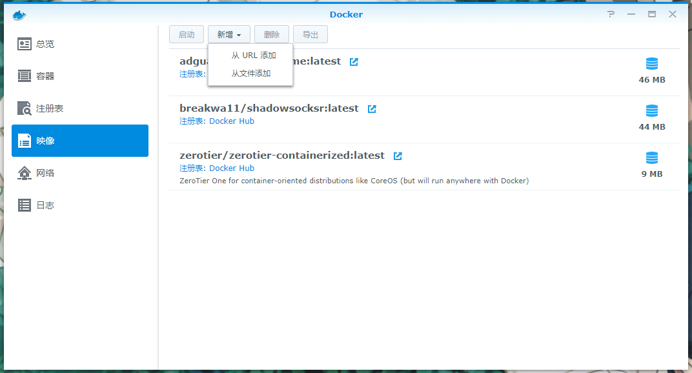

打开Docker应用，选择映像-新增-从URL添加

在Hub页面处填入：adguard/adguardhome

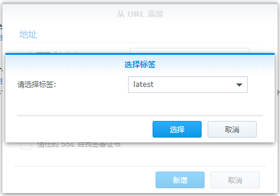

tag选择latest即可，确定

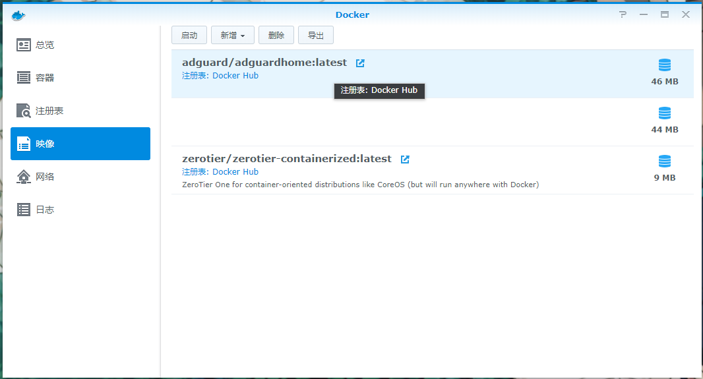

点击左上角启动

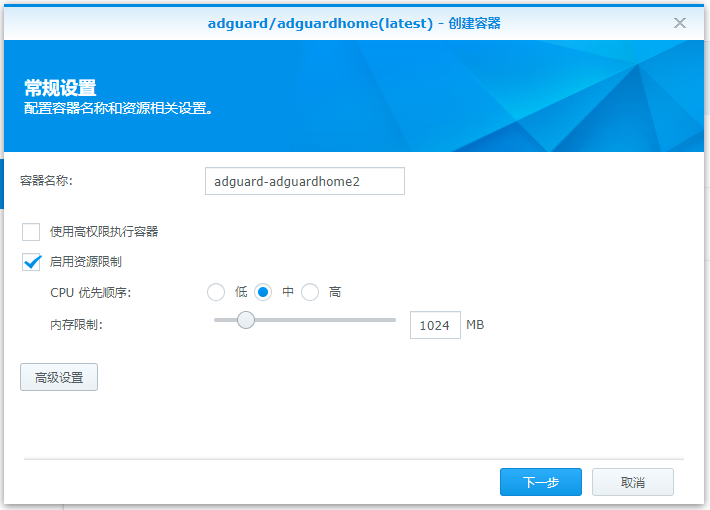

习惯性限制一下资源，然后点选高级设置

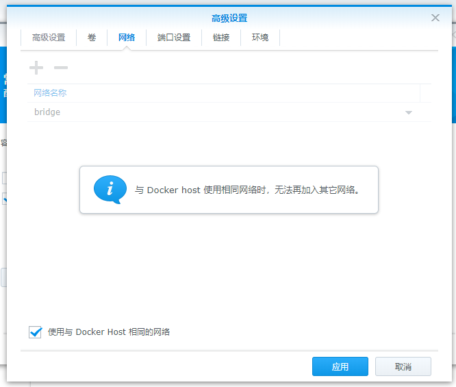

网络部分选择使用与Docker Host相同的网络

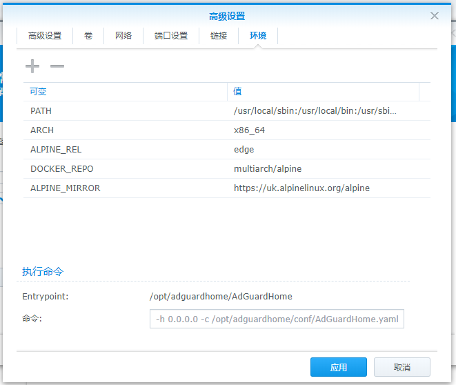

检查一下环境是不是有预设好，一般不用修改

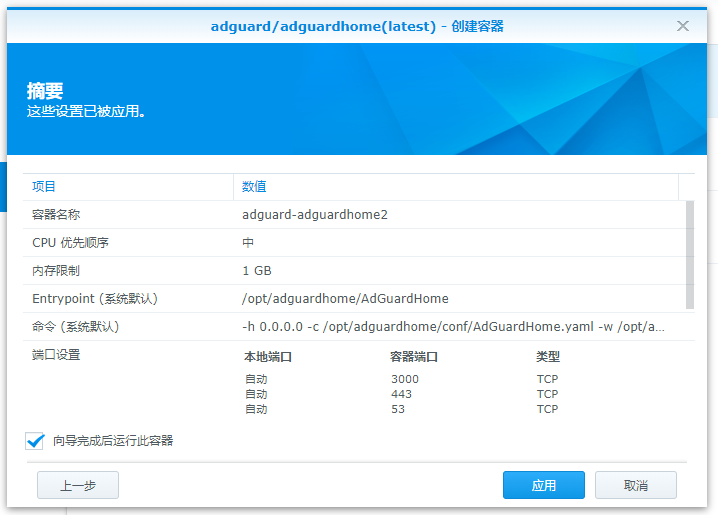

最后点击应用之后就可以启用了

至此安装完成

## ADGuard设置

|                          | IP          |
| ------------------------ | ----------- |
| 主路由（负责DHCP和拨号） | 192.168.1.1 |
| NAS（ADGuard）           | 192.168.1.2 |
| 旁路由（负责DNS解析）    | 192.168.1.3 |

PS：上面是网络中的IP对照，下方请自行替换

在浏览器输入http://192.168.1.2:3000，经过简单初始化之后就可以进入ADGuard Home的控制面板

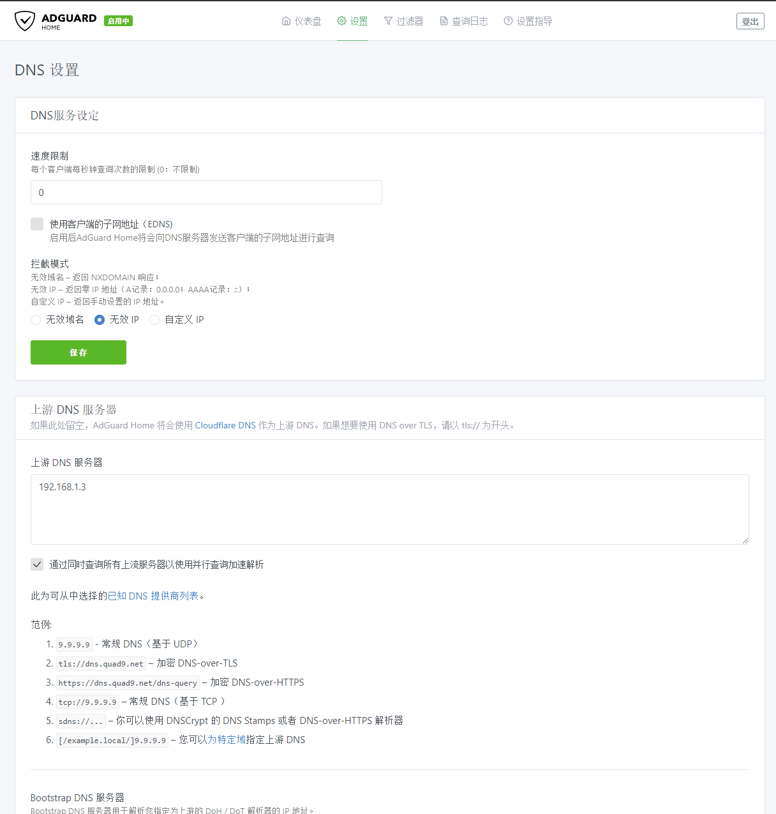

在设置-上游DNS服务器中设置好你的上游DNS即可。

PS：如果你内网有旁路由跑了一些奇奇怪怪花里胡哨的上网插件是带DNS解析的，请将上游DNS指定为旁路由的地址，否则可以随意指定即可，这里附上两个常用的DNS服务器

223.5.5.5

114.114.114.114

PSS. 因为ADGuard Home原生对中国的网站支持不太好，这里提供一个国人维护的ADGuard规则可以按需订阅。

Github地址：https://github.com/privacy-protection-tools/anti-AD

ADGuard规则地址：https://raw.githubusercontent.com/privacy-protection-tools/anti-AD/master/anti-ad-easylist.txt

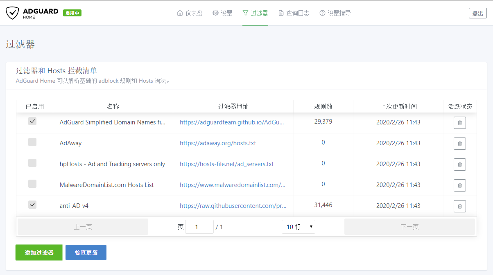

选择添加过滤器

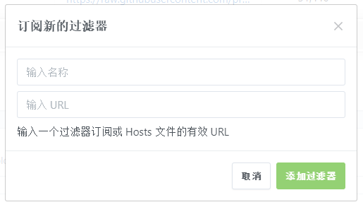

URL填入上面提供的ADGuard规则地址，名称随意

添加完成后别忘了在已启用处打钩

## DHCP设置

上面ADGuard Home配置完成后，我们还需要将设备的地址手动指定到ADGuard Home才行，一个个指定显然不现实，那么这里以梅林固件为例提供一种使用DHCP指定DNS的方法。

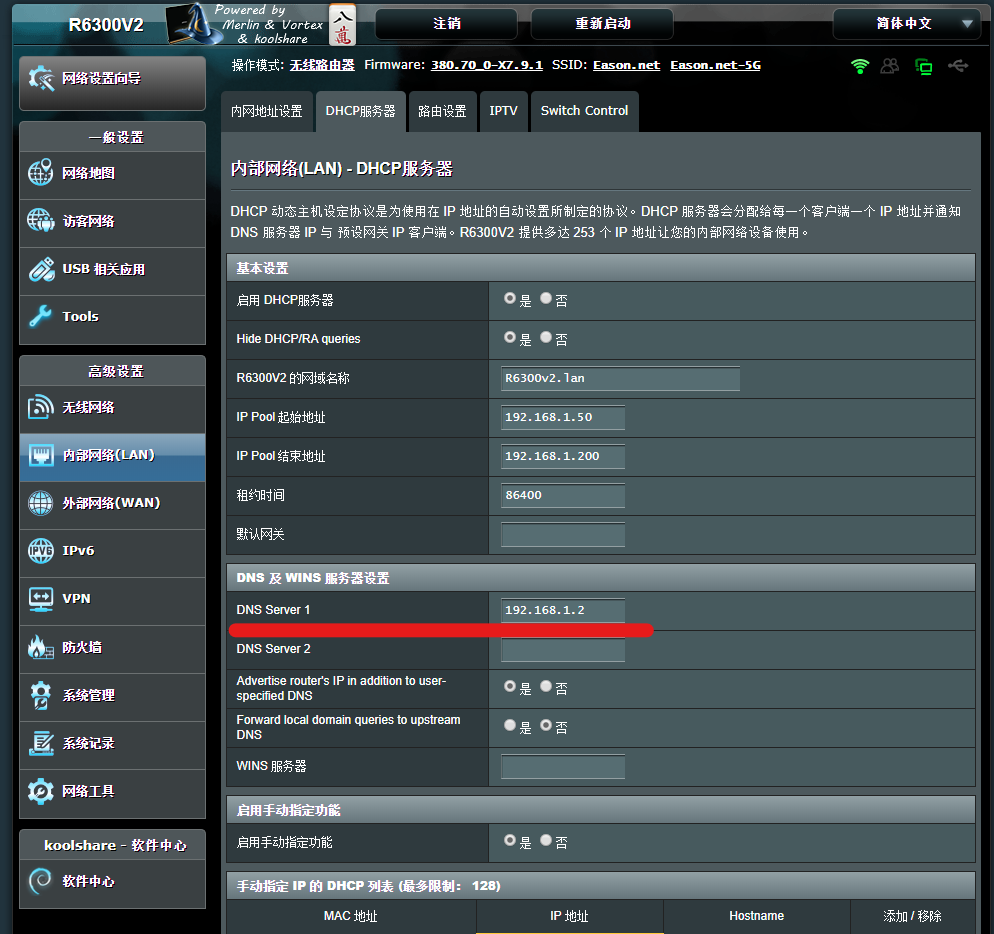

进入内部网络-DHCP服务器，将下面DNS Server 1填写为ADGuard Home的地址

重启路由器

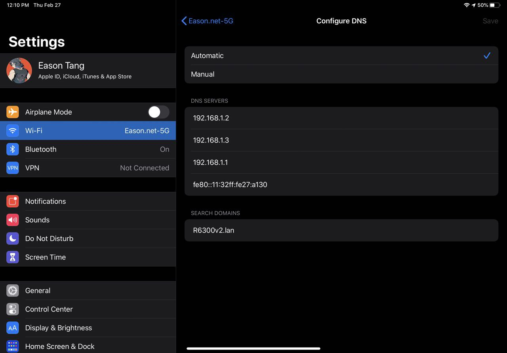

可以看到，现在iPad已经自动分配到ADGuard Home的IP作为DNS了

Enjoy

## 过滤效果 以及 总结

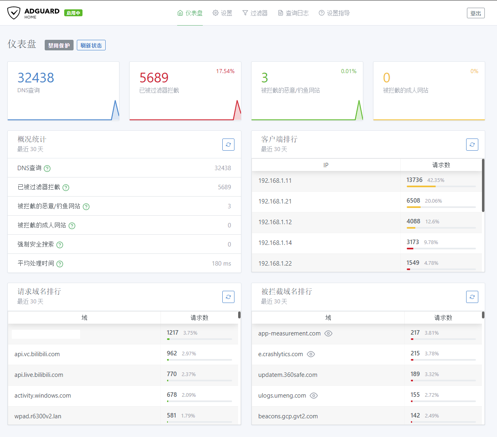

上图是运行一天后的效果，可以看到效果还是非常显著的

接下来我们打开新浪网看看过滤效果

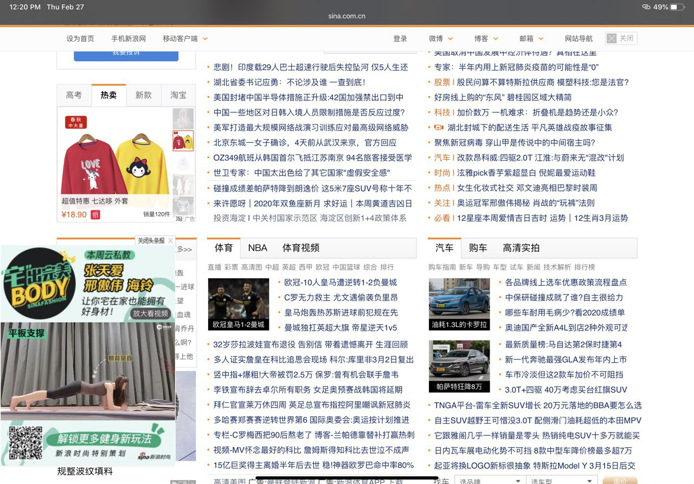

启用前

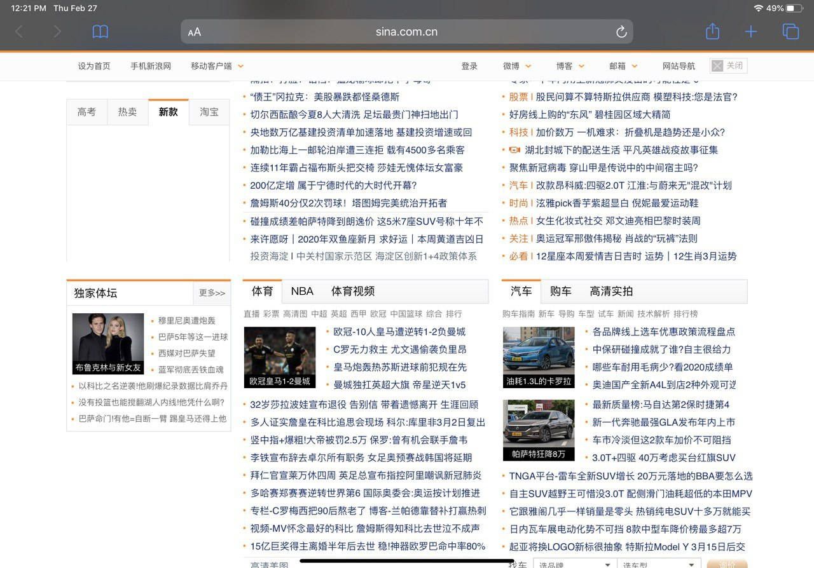

启用后

